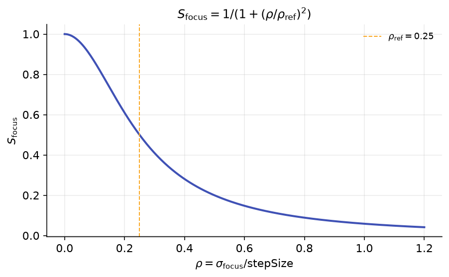
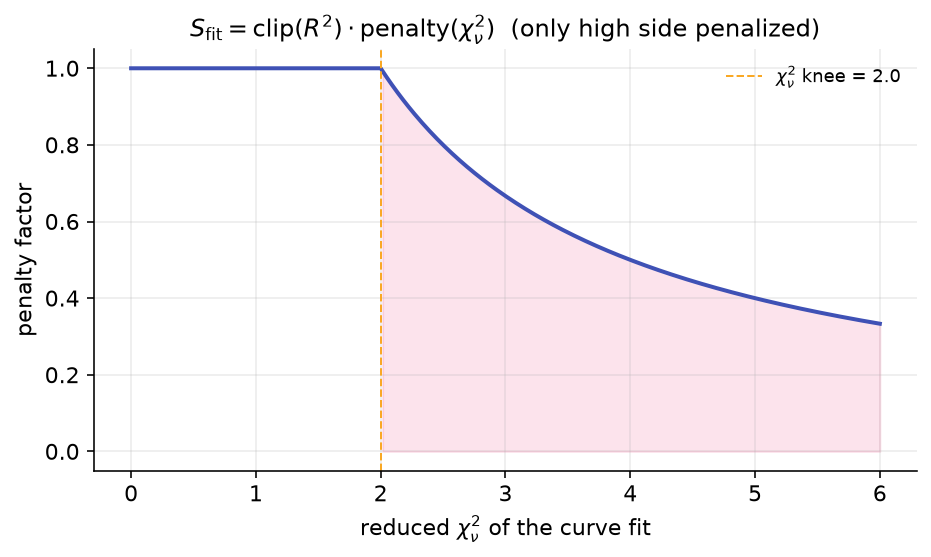

# From Focus Frames to a Score

The optimization wizard does not score your settings on a single image. It scores them on a whole
**auto-focus run**, a sweep of frames taken across a range of focuser positions. For each candidate
set of detection parameters, the wizard detects stars on every frame, rebuilds the HFR-vs-focuser
curve those frames imply, fits it, and reads how *sharp and trustworthy* the resulting best-focus
estimate is. That single number is what the search maximizes.

This page walks the pipeline end to end: detect → aggregate per frame → pool by focuser position →
fit the curve → read \(\sigma_{\text{focus}}\), \(R^2\), reduced \(\chi^2\) → fold those into the
objective's focus and curve-fit terms. For the full objective (all sub-scores and weights) see
[the objective function](objective-function.md); for how the search moves through the parameter space
see [the search algorithm](search-algorithm.md).

## The pipeline at a glance

The work for one candidate parameter bundle, on one run, is done by `RunEvaluationData`:

1. **Detect every frame.** Run the real HocusFocus star detector on each saved exposure with the
   candidate parameters, producing for that frame an average HFR, an HFR standard deviation, and an
   accepted-star count.
2. **Pool frames that share a focuser position.** AF runs often capture more than one exposure at the
   same focuser step; those are merged into a single curve point with a pooled error bar.
3. **Fit the focus curve.** With at least 3 distinct focuser positions, fit the best of several
   models and read the minimum (best focus), its standard error \(\sigma_{\text{focus}}\), \(R^2\),
   and reduced \(\chi^2\).
4. **Score it.** Feed \(\sigma_{\text{focus}}\), the star counts, \(R^2\), and reduced \(\chi^2\)
   into the objective's sub-scores.

{ width=620 }

*A run's pooled HFR points (one per focuser position, with error bars) and the fitted curve. The
fit's minimum is the estimated best-focus position; the shaded band is \(\sigma_{\text{focus}}\), the
standard error of that minimum. Better detection settings make the points tighter and the band
narrower.*

!!! note
    The wizard loads each saved exposure once (rendered, no detection), then re-runs detection on the
    already-loaded frames for every candidate. The fit configuration (step size, weighting,
    outlier-rejection count and confidence) is taken from the run's own auto-focus options, so the
    wizard's curve fit matches the auto-focus engine's fit exactly. The optimizer is not changing how
    you focus; it is changing how cleanly the stars are measured.

## Step 1 — detect, then aggregate each frame

For every frame, detection returns the **average HFR** of the accepted stars and the **HFR standard
deviation** across them, plus the **accepted-star count**. HFR (Half-Flux Radius) is the radius that
encloses half a star's flux, the standard size proxy that grows as a star defocuses.

{ width=620 }

*Half-Flux Radius: the radius at which the enclosed-flux curve reaches 50% of the star's total. It is
the per-star size measure the focus curve is built from.*

The accepted-star count matters on its own: the focus curve is only as reliable as the number of
stars behind each point, and the **defocused extremes** of the sweep are where stars are biggest,
dimmest, and most likely to drop out. A setting that detects plenty of stars near focus but starves
the extremes produces a poorly-constrained curve, so the objective tracks the count per frame as well
as the resulting fit (see the star-count term, \(S_{\text{stars}}\), in
[the objective function](objective-function.md)).

## Step 2 — pool frames at the same focuser position

Frames captured at the same focuser position are merged into one curve point using the same semantics
as the auto-focus engine: the point's HFR is the **mean** of the per-frame measures, and its error
bar is the **SEM-pooled** standard deviation: the per-frame \(\sigma\)s combined and divided by the
square root of the number of contributing frames. Iterating in ascending focuser position keeps the
fit input deterministic. The result is one scatter point (focuser position, pooled HFR, pooled error)
per **distinct** focuser position.

## Step 3 — fit the focus curve

With at least **3 distinct focuser positions**, the wizard runs the same "best fit" model selection
the auto-focus engine uses (`AlglibHyperbolicFitting.SelectBestModel`): it tries the candidate models
and lets the winner compete on merit, rather than forcing a single shape. From the winning fit it
reads:

| Quantity | Meaning |
|---|---|
| Best-focus position | The fitted curve minimum (the focuser position the run points at). |
| \(\sigma_{\text{focus}}\) | The **standard error of the fitted minimum** — how uncertain the best-focus estimate is, in focuser steps. |
| \(R^2\) | How well the model explains the pooled points. |
| Reduced \(\chi^2\) | Goodness of fit relative to the points' error bars. |

If \(\sigma_{\text{focus}}\) comes back non-finite (NaN or infinite), the wizard computes a
**leave-one-out** best-focus standard error as a fallback, refitting with each point dropped in turn
to estimate how much the minimum wanders. The objective prefers the parametric
\(\sigma_{\text{focus}}\) and only pays for the leave-one-out fallback when the parametric value is
unusable.

!!! warning
    Fewer than 3 distinct focuser positions can never determine a fit (the hyperbola has 4–5
    parameters). A run that thin produces a NaN \(\sigma\). The evaluation does not throw, but the
    objective hard-fails it gracefully to a run score of 0. This is why a usable run needs a real
    sweep, not a couple of frames.

## Step 4 — turn the fit into a score

Two of the objective's sub-scores read straight off this pipeline.

### Focus sharpness — \(S_{\text{focus}}\)

The focus term rewards a best-focus estimate that is sharp **relative to the step size** you sweep
at. Define the normalized uncertainty \(\rho = \sigma_{\text{focus}} / \text{stepSize}\) (using the
leave-one-out value when \(\sigma_{\text{focus}}\) is non-finite), then

\[
S_{\text{focus}} = \frac{1}{1 + \left(\rho / \rho_{\text{ref}}\right)^2}, \qquad \rho_{\text{ref}} = 0.25 .
\]

{ width=620 }

*\(S_{\text{focus}}\) is monotone-decreasing in \(\rho\): a best-focus estimate uncertain by a quarter
of a step (\(\rho = \rho_{\text{ref}}\)) scores 0.5; sharper scores higher, fuzzier lower. If neither
\(\sigma_{\text{focus}}\) nor the leave-one-out fallback is finite, the run hard-fails to 0.*

Normalizing by step size is deliberate: an uncertainty of "a few focuser steps" means something very
different on a fine-stepping focuser than on a coarse one. \(S_{\text{focus}}\) carries the largest
weight in the objective, because a tighter best-focus position is the entire point of the exercise.

### Curve consistency — \(S_{\text{fit}}\)

The curve-fit term rewards a model that actually explains the points without being contradicted by
their error bars:

\[
S_{\text{fit}} = \operatorname{clamp}_{[0,1]}(R^2) \cdot \text{penalty}, \qquad
\text{penalty} = \begin{cases} 1 & \text{reduced }\chi^2 \le \tau \\[2pt] \dfrac{\tau}{\text{reduced }\chi^2} & \text{reduced }\chi^2 > \tau \end{cases}, \quad \tau = 2.0 .
\]

{ width=620 }

*Only the **high** side of reduced \(\chi^2\) is penalized. Star-rich fields routinely produce a
reduced \(\chi^2\) well below 1 (over-fit-looking but benign), so values at or below the knee
\(\tau = 2.0\) carry no penalty at all; above the knee the penalty decays smoothly as \(\tau / \text{reduced }\chi^2\).*

The star-count sub-score \(S_{\text{stars}}\) draws on the per-frame accepted counts from Step 1
rather than the fit; it is covered alongside the full weighting in
[the objective function](objective-function.md).

## A byproduct: the recommended step size

The same winning fit also drives the wizard's **step-size recommendation**, which is reported (and
applied on confirm) but is *not* part of the score. The idea is to size the auto-focus step so a sweep
lands roughly 3–4 measurement points on each side of focus inside the "focus-sensitive" band, the
region where HFR climbs from its minimum to about twice the minimum, which carries the most slope and
therefore the most information.

{ width=620 }

*The wizard reads the half-width \(W\) (the offset from best focus at which the fitted HFR reaches
\(2 \times\) the minimum HFR, averaged over the two sides) and recommends a step of \(W / 3.5\), so
the focus-sensitive band holds about 3–4 points per side. The recommendation defaults to 4 offset
steps per side and is clamped to at least 1 (and to the focuser's limits when known).*

!!! tip "When this helps"
    A degenerate or near-flat fit (no finite minimum, non-positive minimum HFR, or a curve that never
    reaches twice the minimum within the search budget) yields no usable half-width; the wizard then
    leaves your current step size unchanged rather than guessing. Trust the recommendation most when
    the fit is clean and the V-curve is well-formed, exactly the runs where the optimizer also scores
    high.

!!! note
    A replay cannot re-sample your sky at a new spacing, so the step size is a recommendation for
    **future** runs, not a re-measurement of the one you replayed. It is written to your profile only
    when you apply the wizard's results.

## How this scales to a budgeted search and to multiple runs

This whole pipeline runs once per candidate, per run, and the search tries hundreds of candidates (up
to 400 evaluations). Two facts keep that affordable. First, detection is split into an expensive
**early** stage (hot-pixel filtering, structure preparation, wavelet, binarization, candidate
collection) and a cheap **late** stage (gate + measure); the early stage is cached per frame and
reused whenever a candidate changes only late-stage gate parameters, which is the bulk of the search.
Second, identical parameter bundles are memoized, so a revisited point never re-detects. The result is
**bit-identical** scores at roughly 10–13× the speed.

When you optimize several runs together, each run is scored by this pipeline independently, and the
per-run scores are blended so a candidate must be good on average **and** not bad on any single run;
this is detailed under [multi-run blending](objective-function.md).

!!! warning
    Only group runs from the **same** optical setup. The blend assumes the runs are comparable; a
    joint score across different cameras or scopes is meaningless, because their focus curves and star
    fields are not the same problem.
