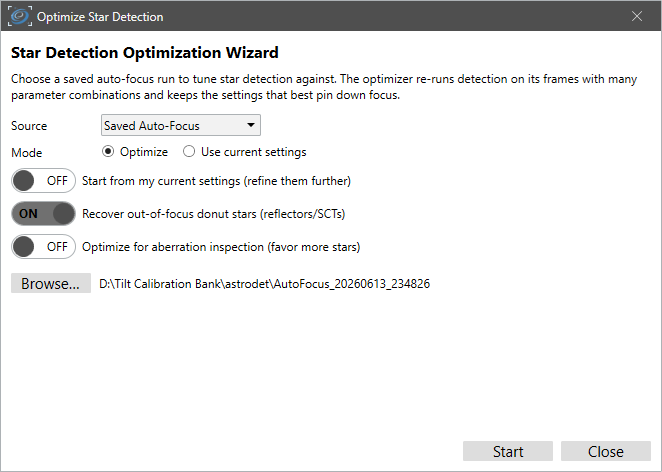
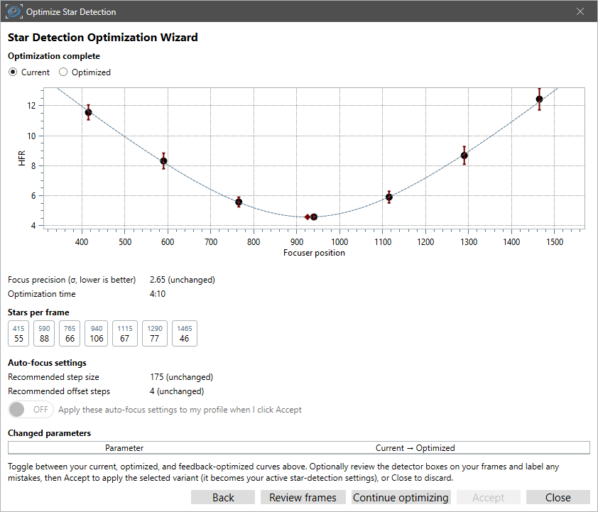

# Star Detection Optimization

Hocus Focus exposes around 30 star-detection knobs: brightness sensitivity, noise and star
clipping, structure layers, distortion and centering gates, hot-pixel handling, and more. Tuning
them well for a given optical train, camera, and sky is expert work, and the payoff that matters is
**autofocus reliability**: cleaner star measurements produce a tighter HFR-versus-focuser curve and
therefore a more repeatable best-focus position. Left to guesswork, the defaults are rarely the best
choice for your rig.

The **Star Detection Optimization Wizard** automates that tuning. It searches for the detection
settings that make your stars trace the cleanest, most repeatable focus V-curve, working from a set of
autofocus frames — either a run you saved earlier or one it captures live. Because the wizard scores
settings by the *quality of the focus curve they produce* (not by any single hand-picked metric), it
optimizes the whole detection pipeline end-to-end against the outcome you actually care about.

The wizard launches from the top of the Star Detection options page. Its optimized settings are
stored **separately** from your presets and are activated by a single Simple-Mode toggle ("Use
Optimized Settings") that only appears once a run has succeeded. Nothing is overwritten until you
confirm, and the toggle is fully reversible.

## What the wizard does

The wizard drives a derivative-free search engine, the `StarDetectionOptimizer`. The
**same** engine runs in the live wizard and in the offline `TestApp optimize` harness, so results are
reproducible and the optimizer can be exercised without launching NINA.

{ width=620 }

*The wizard's start page: choose a saved auto-focus run and the optimization objectives.*

The high-level loop has three steps:

1. **Seed from the defaults, measure against your current settings.** The optimizer starts its search
   from the **fully-default** detection parameters (built through the autofocus detection path, with
   PSF modeling off and the full-frame region set) rather than from your current settings, so a search
   that has drifted into a poor corner is not anchored there. Improvement is always reported **relative
   to your current settings**: the "before" number you see is what your rig does today. If you would
   rather refine your current setup in place, enable **"Start from my current settings"** on the start
   page to seed from those instead. Either way the wizard **never hands back a result worse than your
   current settings**: if the search cannot beat them, it returns them unchanged.
2. **Search.** A staged compass/pattern search explores a curated set of detection parameters,
   evaluating each candidate against your saved run.
3. **Apply the best.** On confirm, the winning parameters are written into the live properties and a
   recommended autofocus step size is offered alongside them. From the summary you can press
   **"Continue optimizing"** to run another pass seeded from the result so far (up to three passes
   total; the summary then shows the full Current → R1 → R2 → R3 trajectory).

{ width=620 }

*The summary shows the resulting focus curve, focus precision, and a recommended auto-focus step size.*

Optionally, you can label a handful of hard frames (missed stars, false positives) to add a
**recall/precision** term to the score (recall = the fraction of real stars recovered; precision = the
fraction of accepted detections that are real). This term is decisive for dim or bloated, out-of-focus
"donut" stars that the raw star count barely reflects.

!!! note "Two start-page objectives: autofocus vs aberration inspection"
    By default the wizard optimizes for **autofocus repeatability** (the objective below). Turning on
    **Optimize for aberration inspection** instead reweights the objective toward **recovering many
    more stars across the whole frame** (what the [tilt / curvature
    model](../overview/tilt-aberration-inspector.md) needs), while a fit guard keeps the focus curve
    usable. The **"Recover out-of-focus donut stars"** toggle (the
    [donut-detection master switch](../settings/acceptance-gates.md#recover-out-of-focus-donut-stars))
    is also on the start page; enabling it lets the optimizer tune the defocus-aware settings and uses
    a larger evaluation budget, since it has more knobs to explore.

{ width=620 }

*The search begins at the seed (the default settings, or your current settings if you choose) and walks
the parameter space one coordinate move at a time, accepting only moves that improve the score and
refining its step size as it homes in on a maximum.*

## Where the frames come from: saved or live

The **Source** dropdown on the start page picks how the wizard gets the frames it optimizes against.

**Saved Auto-Focus** replays a run you saved earlier (autofocus saves its frames when **Save** is
enabled in the Hocus Focus auto-focus options). Point the wizard at the run's folder and it re-detects
those frames with every candidate setting. Use this when you already have a run that focused well and
want to squeeze more out of your detection settings.

**Live Auto-Focus** captures a fresh set of frames now, then optimizes them. This is the mode to use
when your *current* settings cannot build a focus curve yet — faint narrowband stars, heavily
defocused donuts, a new filter — so you have no good saved run to replay. Rather than run a full
autofocus (which would fail for the same reason detection is failing), the wizard sweeps the focuser
across a fixed range and just saves every frame, whether or not any stars are found. It then searches
those frames for settings that *do* build a clean curve.

A live run works like this:

1. **Reach rough focus manually** (a Bahtinov mask or a careful manual pass is fine). The sweep is
   centered on the current focuser position, so it needs to start near focus.
2. On the start page, choose **Live Auto-Focus**, tick **I have manually focused to rough focus**, set
   the **Exposure**, and choose the folder to **Save captured frames to** (the camera and focuser must
   be connected, and a save folder is required before **Start** enables). The panel also shows the step
   size, number of points, binning, filter, and gain the sweep will use — these come from your profile's
   auto-focus settings.
3. Press **Start**. The wizard moves the focuser out and steps back across a fixed range (using your
   profile's auto-focus step size and offset steps), saving a frame at every point, then returns the
   focuser to where it started. Because the sweep does not try to converge, it captures a full set of
   frames even when the current settings detect nothing.
4. The saved frames are optimized exactly like a replayed run, and the summary appears as usual.

!!! tip "Make the exposure long enough for the wings of the sweep"
    The optimizer needs stars across the *whole* sweep, not just near focus, so pick an exposure that
    keeps stars visible at the heavily defocused ends. Narrowband filters in particular often need a
    longer exposure at first. Once a live run succeeds you can shorten the exposure and run it again to
    see how far you can push it (see the [Quick Start](../quick-start.md) narrowband tip).

On the summary, a live run adds one extra option next to the recommended step size: **Apply this
exposure time to my profile when I click Accept**. Tick it to adopt the sweep exposure as your
auto-focus exposure time, so the settings you optimized against are the ones you will actually focus
with.

## How a candidate is scored

For each candidate the evaluator runs star detection on every frame of the saved run, pools the
per-frame HFR by focuser position, fits the autofocus hyperbola, and reads off the best-focus
uncertainty \( \sigma_{\text{focus}} \), the fit's \( R^2 \) and reduced \( \chi^2 \), the per-frame
accepted-star counts, and where those stars sit on the sensor. These feed a composite objective
\( J \in [0, 1] \) that the search **maximizes**:

\[
J_{\text{run}} = \frac{W_f\,S_{\text{focus}} + W_s\,S_{\text{stars}} + W_c\,S_{\text{fit}} + W_{\text{cov}}\,S_{\text{cov}}}{W_f + W_s + W_c + W_{\text{cov}}}
\]

with default weights \( W_f = 0.55 \) (focus), \( W_s = 0.20 \) (star count), \( W_c = 0.25 \)
(curve fit), and \( W_{\text{cov}} = 0.05 \) (how well the accepted stars cover the sensor). When
ground-truth labels are present a further term \( W_\ell = 0.25 \) is added and all weights are
renormalized to sum to one. The weighted score is then scaled by two multiplicative penalties that
default to 1.0: one for defocus-relaxed junk, and one for leaning on a saturated bright star's
inflated HFR. A hard floor guards against starved frames: if any frame falls below 3 accepted stars,
that run scores \( J_{\text{run}} = 0 \).

The full breakdown of each sub-score lives on the dedicated pages below.

## Section map

This section documents every moving part of the optimizer:

- **[Objective function](objective-function.md):** the composite score \( J \): how \( S_{\text{focus}} \),
  \( S_{\text{stars}} \), and \( S_{\text{fit}} \) are computed, the hard floors, and the label-free
  precision penalty.
- **[Search variables](search-variables.md):** the curated set of tunable parameters, their bounds,
  initial step sizes, and the synthetic defocus-aware knobs.
- **[Search algorithm](search-algorithm.md):** the staged compass/pattern search: the coarse seed
  grid, the alternating late/early stages, step halving, the memoization that makes repeated
  evaluation cheap, and the evaluation budget.
- **[AF curve fitting](af-curve-fitting.md):** how the run is detected, pooled by focuser position,
  and fit to extract \( \sigma_{\text{focus}} \), \( R^2 \), and reduced \( \chi^2 \).
- **[Labels: recall & precision](labels-recall-precision.md):** the optional ground-truth labeling
  loop and how box-containment recall/precision enter the objective.
- **[Step size](step-size.md):** how a recommended autofocus step size is derived from the winning
  fit so a sweep lands roughly 3–4 measurement points per side of focus.

!!! tip "When the wizard helps most"

    Run it when you have switched cameras, scopes, or filters; when autofocus has felt unreliable; or
    when you have never tuned star detection beyond the Simple-Mode presets. The wizard optimizes
    against one saved run at a time, which keeps its recommendation interpretable, so the more
    representative that run is of how you actually autofocus (same camera, scope, filter, and
    exposure), the better the result. If you have several saved runs, pick the cleanest, most typical
    one; do not optimize against a run from a different rig and expect the settings to carry over.

For the design rationale behind these choices (why a derivative-free pattern search rather than a
smooth solver, why these weights, and why these exclusions), see
`docs/star-detection-optimization-wizard-design.md` in the project repository.
