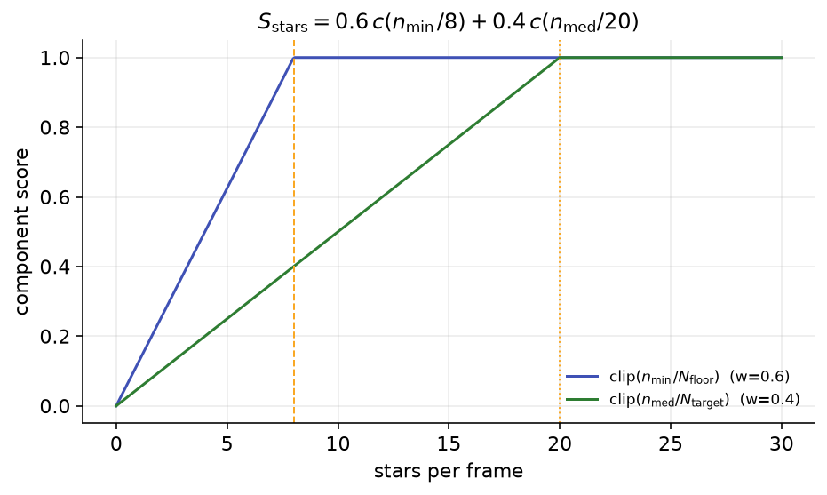
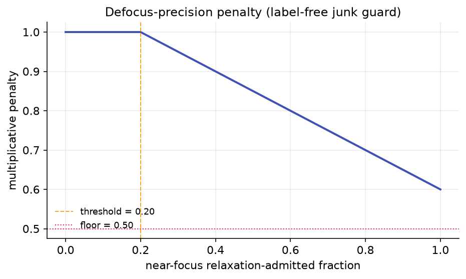

# The Objective Function

The Star Detection Optimization Wizard does not chase "more stars" or "lower HFR" directly. It maximizes a
single composite score \(J \in [0, 1]\) that captures what actually matters for autofocus: **how repeatable
the best-focus position is**, backed up by a healthy star count and a clean curve fit. Every candidate set of
detection settings is reduced to this one number, the search keeps whatever scores highest, and the result is
guaranteed never to be worse than your current settings. Only strictly-improving moves are accepted above the
seed, and the wizard additionally refuses to return anything that scores below your current settings (see
[Search algorithm](search-algorithm.md#three-guarantees)).

This page documents the exact objective: every sub-score, every constant, and how they combine. The values
here are taken directly from `OptimizationObjective.cs` (`ObjectiveConstants`); they are tunable in code but
fixed for a given build.

!!! note "Why focus repeatability, not sharpness"
    The wizard scores a whole autofocus sweep, not a single frame. A detection setting that makes one frame
    look pretty but scatters the per-position HFR points produces a wobbly curve and an uncertain minimum —
    you would land on a slightly different focuser position every run. Minimizing that uncertainty
    (\(\sigma_{\text{focus}}\), below) is the same thing as making focus sharp *and* repeatable.

## Composite score for one run

For a single autofocus run, all frames are detected, frames sharing a focuser position are pooled into one
HFR point, the HFR-vs-focuser curve is fitted, and the fit yields \(\sigma_{\text{focus}}\), \(R^2\), and the
reduced \(\chi^2\). Those, together with the accepted-star counts and positions, feed the additive sub-scores
below: focus repeatability, star count, curve fit, and region coverage, plus a label score when you have provided
ground-truth labels. The per-run score is their weighted, renormalized average, then multiplied by two safety
penalties (a defocus-precision penalty and an extreme-HFR-outlier penalty):

\[
J_{\text{run}} \;=\; \frac{W_f\,S_{\text{focus}} + W_s\,S_{\text{stars}} + W_c\,S_{\text{fit}} + W_{\text{cov}}\,S_{\text{cov}}
\;\bigl[\,+\;W_\ell\,S_{\text{label}}\,\bigr]}{W_f + W_s + W_c + W_{\text{cov}} \;[\,+\;W_\ell\,]}
\;\times\; S_{\text{defocus-precision}} \;\times\; S_{\text{hfr-outlier}}
\]

The label term and \(W_\ell\) are present only when labels exist for the run; otherwise both the numerator
term and the denominator term are dropped (the weights always renormalize to sum to 1).

| Weight | Symbol | Value | Rewards |
|---|---|---|---|
| Focus | \(W_f\) | 0.55 | A tight, repeatable best-focus position |
| Stars | \(W_s\) | 0.20 | Enough usable stars on every frame |
| Curve fit | \(W_c\) | 0.25 | A clean, well-explained HFR curve |
| Coverage | \(W_{\text{cov}}\) | 0.05 | Accepted stars spread across the whole sensor |
| Label | \(W_\ell\) | 0.25 | Matching your hand-labeled stars (only when labels exist) |

Focus carries the largest weight because focus repeatability is the whole point of the exercise. The two
multiplicative penalties default to exactly 1.0 (no effect) and only bite in specific situations, described in
their own sections below.

!!! note "The aberration-inspection objective reweights these"
    The weights above are the default, autofocus-tuned objective. When you select **"Optimize for
    Aberration Inspection"** on the wizard's start page, the optimizer swaps in a star-count-favoring
    objective (`ObjectiveConstants.ForAberrationInspection`) that recovers far more stars across the
    frame — what a [tilt / curvature model](../overview/tilt-aberration-inspector.md) needs — while a
    fit guard tied to your current settings' \(\sigma_{\text{focus}}\) keeps the focus curve usable.
    The structure of the score (the sub-scores below) is unchanged; only the weighting differs.

### Hard floor: every frame must keep stars

Before any of the weighted math, two hard constraints can force \(J_{\text{run}} = 0\):

- **Starved frames.** If more than \(\text{MaxFramesBelowHardFloor} = 0\) frames have fewer than
  \(N_{\text{hard}} = 3\) accepted stars, the run scores zero. In other words, **every** frame in the sweep
  (including the most defocused extremes) must hold at least 3 stars. A setting that loses the curve at the
  ends is rejected outright.
- **Unusable focus uncertainty.** If the fit produces no finite \(\sigma_{\text{focus}}\) and no finite
  leave-one-out fallback, the run scores zero.

This hard floor is why the wizard will not happily crank sensitivity down to a handful of bright stars: it
would starve the defocused frames and fail the floor.

## \(S_{\text{focus}}\) — focus repeatability (weight 0.55)

The fit reports \(\sigma_{\text{focus}}\), the standard error of the best-focus position. Smaller means the
curve pins the minimum more precisely. It is normalized by the autofocus step size so the score is
scale-free, then mapped to \([0, 1]\):

\[
\rho = \frac{\sigma_{\text{focus}}}{\text{stepSize}}, \qquad
S_{\text{focus}} = \frac{1}{1 + (\rho / \rho_{\text{ref}})^2}, \qquad \rho_{\text{ref}} = 0.25
\]

When \(\sigma_{\text{focus}}\) is not finite, a leave-one-out best-focus standard error is used instead; if
neither is finite the run hard-fails (\(J_{\text{run}} = 0\)). The function is monotone-decreasing in
\(\rho\): at \(\rho = \rho_{\text{ref}} = 0.25\) (focus uncertainty equal to a quarter of a step) the score is
exactly 0.5; uncertainty far below a quarter-step approaches 1.0, and large uncertainty drives it toward 0.

{ width=620 }
*\(S_{\text{focus}} = 1/(1 + (\rho/\rho_{\text{ref}})^2)\) with \(\rho_{\text{ref}} = 0.25\): the reward falls
off as the best-focus position becomes less certain relative to the step size.*

!!! tip "Why divide by the step size"
    A 5-step uncertainty is fine if your steps are tiny and disastrous if they are coarse. Normalizing by the
    step size lets the same objective work across focusers and rigs, and ties directly into the step-size
    recommendation (see [Step size recommendation](step-size.md)).

## \(S_{\text{stars}}\) — usable star count (weight 0.20)

A run needs enough stars on the weakest frame, not just on the easy in-focus frames. \(S_{\text{stars}}\)
blends the minimum and median accepted-star counts across the sweep, weighting the minimum more heavily:

\[
S_{\text{stars}} = 0.6 \cdot \operatorname{clip}\!\left(\frac{n_{\min}}{N_{\text{floor}}}\right)
+ 0.4 \cdot \operatorname{clip}\!\left(\frac{n_{\text{med}}}{N_{\text{target}}}\right),
\qquad N_{\text{floor}} = 8,\; N_{\text{target}} = 20
\]

where \(\operatorname{clip}(\cdot)\) clamps to \([0, 1]\), \(n_{\min}\) is the smallest per-frame accepted-star
count, and \(n_{\text{med}}\) is the median. The minimum term saturates at 8 stars on the worst frame; the
median term saturates at 20. The 0.6 weighting on the minimum means a single starved frame hurts more than a
merely thin median, because the curve is weakest at the defocused extremes, so those are protected first.

{ width=620 }
*\(S_{\text{stars}}\) rises with the minimum-frame count (knee at \(N_{\text{floor}} = 8\)) and the median
count (knee at \(N_{\text{target}} = 20\)); the minimum carries the larger share.*

This is a soft preference on top of the hard floor of 3 stars/frame: passing the floor keeps you in the game,
but you score better as the worst frame climbs toward 8 and the median toward 20.

## \(S_{\text{fit}}\) — curve consistency (weight 0.25)

A good detection setting produces HFR points that lie cleanly on the fitted curve. \(S_{\text{fit}}\) rewards
a high \(R^2\) and penalizes an over-scattered fit, but only on the high side of the reduced \(\chi^2\):

\[
S_{\text{fit}} = \operatorname{clip}(R^2) \cdot \text{penalty}, \qquad
\text{penalty} =
\begin{cases}
1 & \text{reduced }\chi^2 \le \chi_\tau \\[4pt]
\dfrac{\chi_\tau}{\text{reduced }\chi^2} & \text{reduced }\chi^2 > \chi_\tau
\end{cases}
\qquad \chi_\tau = 2.0
\]

The penalty equals exactly 1 at the knee \(\chi_\tau = 2.0\) and decays smoothly above it. Only the **high**
side is penalized: star-rich fields routinely produce a reduced \(\chi^2 \ll 1\) (which looks over-fit but is
benign here), so a low reduced \(\chi^2\) is left alone. A non-finite reduced \(\chi^2\) carries no
information and therefore no penalty.

{ width=620 }
*\(S_{\text{fit}} = \operatorname{clip}(R^2)\cdot\text{penalty}\): a high \(R^2\) is rewarded, and an
over-scattered fit (reduced \(\chi^2 > \chi_\tau = 2.0\)) is progressively penalized; below the knee there is
no penalty.*

## \(S_{\text{cov}}\) — region coverage (weight 0.05)

A detection setting can post a tight, well-fit curve while quietly collapsing onto a handful of bright stars in one
part of the frame. That is fragile: it ignores most of the sensor and is easily thrown off by a gradient or a
passing cloud. \(S_{\text{cov}}\) rewards spreading the accepted stars across the whole frame, not just finding
enough of them.

The sensor is divided into a 3×3 grid of equal regions. For each near-focus frame, coverage is the fraction of those
nine regions that hold at least one accepted star, and \(S_{\text{cov}}\) is the mean of that fraction over the
near-focus frames. The same number of stars clustered in one corner scores lower than the same count spread evenly,
so the optimizer is pulled toward settings that keep stars everywhere.

The weight is deliberately small (0.05). Coverage is allowed to cost a little focus tightness — recovering stars
across the frame is worth a minor rise in \(\sigma_{\text{focus}}\) — but at one-eleventh of the focus weight it
cannot override the dominant focus term. When a run has no accepted-star positions to score, the term drops out of
both the numerator and the denominator, so \(J_{\text{run}}\) is unchanged.

!!! note "Coverage and aberration inspection"
    This term reinforces what the **"Optimize for Aberration Inspection"** objective already favors: stars spread
    across the sensor are exactly what a [tilt / curvature model](../overview/tilt-aberration-inspector.md) needs.
    Under the default autofocus objective it stays a gentle nudge.

## \(S_{\text{label}}\) — recall and precision (weight 0.25, only with labels)

When you have hand-labeled stars on a frame (via the labeling workflow), the run also earns a label score that
turns the star-count proxy into measured recall and precision against your ground truth:

\[
S_{\text{label}} = 0.5 \cdot \text{recall} + 0.5 \cdot \text{precision}
\]

Recall and precision are scored by **box containment** of accepted-star centers:

- **Recall** = the fraction of your "missed" boxes (stars that should have been detected, plus any
  "wrongly-rejected" boxes you flagged) that now contain at least one accepted star. An empty set scores 1.0.
- **Precision** = the fraction of your "should-reject" boxes (an accepted star you judged spurious) that now
  contain **no** accepted star, i.e. the bad detection has been excluded. An empty set scores 1.0.

See [Labels: recall and precision](labels-recall-precision.md) for the labeling loop and how each box maps to
a sub-score.

## \(S_{\text{defocus-precision}}\) — the defocus junk penalty

The three sub-scores above are combined by a weighted **average**. The defocus-precision term is different: it
is a **multiplicative** penalty in \([0.5, 1.0]\) applied after the weighted sum. It guards the optional
defocus-aware gates (which relax distortion/centering to recover bloated donut stars) from being abused to
flood near-focus frames with junk.

\[
J_{\text{run}} \;\leftarrow\; J_{\text{run}} \times S_{\text{defocus-precision}}, \qquad
S_{\text{defocus-precision}} \in [\,0.5,\; 1.0\,]
\]

The penalty shape, for a relaxed fraction \(f\) (relaxation-admitted stars over accepted stars):

\[
S_{\text{defocus-precision}} = \operatorname{clip}_{[0.5,\,1]}\!\bigl(\,1 - \text{Strength}\cdot\max(0,\; f - \text{Threshold})\,\bigr),
\qquad \text{Threshold} = 0.20,\; \text{Strength} = 0.5
\]

| Constant | Value | Role |
|---|---|---|
| Threshold | 0.20 | Relaxed fraction tolerated before any penalty |
| Strength | 0.5 | How hard \(J\) is scaled per unit of excess relaxed fraction |
| Min factor | 0.5 | Floor — this term alone can at most halve \(J\), never zero it |
| Near-focus window | 1.5 steps | Half-width (in step sizes) of the "near focus" band around the fitted minimum |

Two properties make this safe:

- **Off is bit-identical.** When the defocus-aware gates are OFF (the default), every per-frame
  relaxation-admitted count is 0, so \(S_{\text{defocus-precision}} = 1.0\) exactly and \(J\) is unchanged.
- **Only near-focus relaxation is punished.** The preferred signal counts relaxation-admitted stars only on
  frames within 1.5 step sizes of the fitted best-focus position. By the gate's size-scaled design a
  near-focus real star is small and never needs relaxation, so a near-focus relaxed star is necessarily a
  large, low-fill junk blob. Legitimate donut recovery happens on the defocused extremes (far from the
  minimum) and is intentionally **not** penalized. When per-frame focuser positions or the fitted minimum are
  unavailable, the term falls back to the run-level relaxed fraction, guarded so a thin run cannot be
  penalized spuriously.

{ width=620 }
*The penalty stays at 1.0 until the near-focus relaxed fraction exceeds the 0.20 threshold, then decays at
strength 0.5 down to a floor of 0.5.*

!!! warning "The defocus-aware gates are opt-in"
    With the gates off (default) this penalty is inert and the objective is identical to the three-term
    version. It exists so the optimizer can safely explore turning the gates on — recovering bloated donuts on
    the extremes — without learning to manufacture spurious near-focus stars.

## \(S_{\text{hfr-outlier}}\) — the bright-blob penalty

A bright star whose core saturates measures a half-flux radius that reads too large, because its peak clips flat. If
the optimizer keeps such a star as one of only a few accepted stars near focus, that one inflated HFR pulls the
curve point, and the fit can look deceptively tight while resting on a bloated outlier. Like the defocus-precision
term, \(S_{\text{hfr-outlier}}\) is a **multiplicative** penalty in \([0.5, 1.0]\) applied after the weighted sum.

\[
J_{\text{run}} \;\leftarrow\; J_{\text{run}} \times S_{\text{hfr-outlier}}, \qquad
S_{\text{hfr-outlier}} \in [\,0.5,\; 1.0\,]
\]

The accepted-star HFRs from the near-focus frames are pooled, and a star counts as an extreme outlier only when its
HFR clears **both** bars: at least \(4\times\) the robust scatter (median absolute deviation) above the median,
**and** at least \(1.5\times\) the median. The first bar handles loose frames; the second guards the case where every
star is nearly identical, so the scatter collapses toward zero. The penalty is then a function of the outlier
**fraction** \(f\) — outliers over accepted stars in the near-focus pool:

\[
S_{\text{hfr-outlier}} = \operatorname{clip}_{[0.5,\,1]}\!\bigl(\,1 - \text{Strength}\cdot\max(0,\; f - \text{Threshold})\,\bigr),
\qquad \text{Threshold} = 0.05,\; \text{Strength} = 1.0
\]

| Constant | Value | Role |
|---|---|---|
| MAD multiple | 4.0 | How far above the median (in robust scatter) an HFR must sit to count as an outlier |
| Relative margin | 1.5 | An outlier must also be at least 1.5× the median HFR (guards the zero-scatter case) |
| Threshold | 0.05 | Outlier fraction tolerated before any penalty |
| Strength | 1.0 | How hard \(J\) is scaled per unit of excess outlier fraction |
| Min factor | 0.5 | Floor — this term alone can at most halve \(J\), never zero it |

Using a **fraction** rather than a flag is what makes this useful. A bright saturated star is admitted at almost any
sensitivity, so a plain "is there a big-HFR star" test would dock every candidate equally and change nothing. The
fraction shrinks as a lower sensitivity admits more normal stars, so the penalty eases exactly as the curve stops
leaning on the outlier. The term therefore pulls the search toward **more stars and higher recall**, not away from
it.

Two properties make this safe:

- **Off is bit-identical.** With no per-star HFR data, or no near-focus extreme outlier, \(S_{\text{hfr-outlier}} = 1.0\)
  exactly and \(J\) is unchanged.
- **It works with the detector, not against it.** The
  [Exclude Saturated Stars From HFR](../settings/hotpixel-saturation.md) option keeps a saturated star's inflated HFR
  out of the curve point; this penalty additionally discourages settings that would lean on such a star in the first
  place.

## All constants at a glance

| Constant | Symbol | Value | Where it acts |
|---|---|---|---|
| Focus weight | \(W_f\) | 0.55 | \(S_{\text{focus}}\) |
| Star-count weight | \(W_s\) | 0.20 | \(S_{\text{stars}}\) |
| Curve-fit weight | \(W_c\) | 0.25 | \(S_{\text{fit}}\) |
| Coverage weight | \(W_{\text{cov}}\) | 0.05 | \(S_{\text{cov}}\) |
| Label weight | \(W_\ell\) | 0.25 | \(S_{\text{label}}\) (labels only) |
| Focus reference | \(\rho_{\text{ref}}\) | 0.25 | \(S_{\text{focus}}\) |
| Min-count knee | \(N_{\text{floor}}\) | 8 | \(S_{\text{stars}}\) |
| Median-count knee | \(N_{\text{target}}\) | 20 | \(S_{\text{stars}}\) |
| Reduced-\(\chi^2\) knee | \(\chi_\tau\) | 2.0 | \(S_{\text{fit}}\) |
| Hard star floor | \(N_{\text{hard}}\) | 3 | Hard fail |
| Max starved frames | — | 0 | Hard fail |
| Precision threshold | — | 0.20 | \(S_{\text{defocus-precision}}\) |
| Precision strength | — | 0.5 | \(S_{\text{defocus-precision}}\) |
| Precision min factor | — | 0.5 | \(S_{\text{defocus-precision}}\) |
| HFR-outlier MAD multiple | — | 4.0 | \(S_{\text{hfr-outlier}}\) |
| HFR-outlier relative margin | — | 1.5 | \(S_{\text{hfr-outlier}}\) |
| HFR-outlier threshold | — | 0.05 | \(S_{\text{hfr-outlier}}\) |
| HFR-outlier strength | — | 1.0 | \(S_{\text{hfr-outlier}}\) |
| HFR-outlier min factor | — | 0.5 | \(S_{\text{hfr-outlier}}\) |
| Near-focus window | — | 1.5 steps | \(S_{\text{defocus-precision}}\), \(S_{\text{cov}}\), \(S_{\text{hfr-outlier}}\) |

For how this objective is searched (the coarse grid and staged compass search), see
[Search algorithm](search-algorithm.md); for the knobs it is allowed to move, see
[Search variables](search-variables.md).
