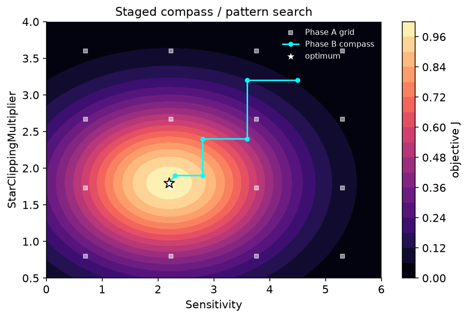

# Search Variables: The Curated Search Space

The optimizer does **not** tune every star-detection parameter. It tunes a deliberately small, **curated set** of knobs that have the largest, most predictable effect on the autofocus curve, and it leaves the rest out of the search entirely. Keeping the search space small is what lets a derivative-free search converge inside a fixed evaluation budget (`MaxEvaluations = 250` by default, raised to `400` when *Recover out-of-focus donut stars* is enabled).

This page is the reference for that curated set: every variable, its bounds, the setting it maps to, the two *synthetic* variables that drive more than one parameter at once, how values are quantized, and the EARLY/LATE split that makes the search fast.

!!! note "Where the search space comes from"
    The curated set is defined once, in code, by `OptimizerVariable.CreateCuratedSet()`. Each entry carries its own `[Lower, Upper]` bounds and `InitialStep`, and every proposal the search makes is clamped and quantized through that one descriptor, so the published bounds below are the bounds the optimizer actually obeys.

## The curated variables

Each row is one tunable axis. **Type** governs quantization (see [Quantization rules](#quantization-rules)). **InitialStep** is the starting pattern-search step on that axis; the search halves Continuous steps as it converges down to a floor of `InitialStep × 0.125`. **Maps to** is the underlying `StarDetectorParams` field, which corresponds to a `StarDetectionOptions` setting.

| Variable | Type | Lower | Upper | InitialStep | Maps to setting |
|---|---|---|---|---|---|
| `Sensitivity` | Continuous | 0 | 50 | 1.0 | Sensitivity (see [acceptance gates](../settings/acceptance-gates.md)) |
| `StarClippingMultiplier` | Continuous | 0.25 | 10 | 0.5 | Star clipping multiplier |
| `NoiseClippingMultiplier` | Continuous | 1 | 10 | 0.5 | Noise clipping multiplier (see [structure detection](../settings/structure-detection.md)) |
| `PeakResponse` | Continuous | 0.1 | 1 | 0.05 | Peak response / flatness gate (see [acceptance gates](../settings/acceptance-gates.md)) |
| `MaxDistortion` | Continuous | 0.1 | 1 | 0.1 | Max distortion gate |
| `MinHFR` | Continuous | 0.1 | 5 | 0.25 | Minimum HFR |
| `StarCenterTolerance` | Continuous | 0.05 | 1 | 0.05 | Star center tolerance |
| `StructureLayers` | Integer | 1 | 8 | 1 | Structure layers (see [structure detection](../settings/structure-detection.md)) |
| `NoiseReductionRadius` | Integer | 0 | 10 | 1 | Noise reduction radius (see [preprocessing](../settings/preprocessing.md)) |
| `MinimumStarBoundingBoxSize` | Integer | 2 | 20 | 1 | Minimum star bounding-box size |
| `HotpixelThresholdingEnabled` | Boolean | 0 | 1 | — | Hot-pixel thresholding on/off (see [hot pixel & saturation](../settings/hotpixel-saturation.md)) |
| `HotpixelThreshold` | Continuous | 0.0001 | 0.05 | 0.001 | Hot-pixel threshold |
| `DefocusAwareGates` | Boolean (synthetic) | 0 | 1 | — | Two gate-relaxation params at once (see below) |
| `DefocusAwareStructure` | Integer (synthetic) | 0 | 4 | 1 | Defocus-aware structure flag + layer boost (see below) |

Those are the **12** always-on axes. The two synthetic rows in the table above (`DefocusAwareGates`, `DefocusAwareStructure`) plus seven further defocus-tuning knobs (`DefocusDistortionSizeReference`, `DefocusDistortionMinFactor`, `DefocusCenteringToleranceFactor`, `DonutMorphCloseSize`, `DonutMinAnnularityHoleFraction`, `DonutMaxStreakEccentricity`, `DonutSaturationBloomRadius`) are added only when *Recover out-of-focus donut stars* is enabled, taking the curated set to **21** axes; with that master toggle off (the default) the optimizer never touches any defocus parameter. Several bounds are open-ended in the detector (there is no hard UI validation range), so the wizard applies pragmatic heuristic limits. For example, `Sensitivity` was widened from a 20 to a 50 ceiling and `StarClippingMultiplier` to a `[0.25, 10]` range because rich star fields kept pinning the older, tighter bounds. The two highest-impact axes, `Sensitivity` and `StarClippingMultiplier`, are also the pair the search grids over first in its coarse Phase A (see [search algorithm](search-algorithm.md)).

## The two synthetic variables

Most axes are a one-to-one alias for a single `StarDetectorParams` field. Two are **synthetic**: one variable drives more than one parameter so the optimizer can explore a behavior as a *single knob*.

### `DefocusAwareGates` (Boolean)

A single on/off switch that flips **both** defocus-aware gate relaxations together (`DefocusAwareDistortion` and `DefocusAwareCentering`) in lockstep. When enabled, these gates relax the distortion and centering checks for large candidates (large size is used as a defocus proxy), recovering bloated and donut-shaped defocused stars that the strict gates would reject (see [defocused stars](../settings/acceptance-gates.md)).

The variable reads the distortion flag as its value and writes the same value to both flags. Both flags are OFF in the default seed parameters, so the baseline is unchanged, and the search may flip the pair on if it helps the curve.

!!! warning "Why turning the gates on isn't free"
    Relaxing the gates can also admit large, low-fill junk blobs. The objective guards this with a multiplicative *near-focus precision penalty* (`SDefocusPrecision`): it is exactly `1.0` when no relaxation-admitted stars exist (so OFF is bit-identical), and it only bites when a near-focus frame shows a sustained relaxed fraction above `0.20`, the junk signature. Legitimate donut recovery on the defocused extremes is never penalized. See [the objective function](objective-function.md).

### `DefocusAwareStructure` (Integer, 0–4)

A single integer that drives **both** the `DefocusAwareStructure` flag **and** the `StructureLayerBoost` count. A value of `0` means OFF (the bit-identical baseline); any value `> 0` enables defocus-aware structure detection with that many extra wavelet layers, recovering large/donut defocused stars that otherwise never form a candidate at all.

The variable reads the *effective* boost (0 when the flag is off), so the seed's \(J\) is unchanged; the search may raise it. Note this knob is **structure-side** (it changes which candidates are formed), whereas `DefocusAwareGates` is **gate-side** (it changes which formed candidates survive).

## Quantization rules

Every proposal flows through the variable's descriptor as a `double`, which is **quantized** to a legal value of its type and then **clamped** to `[Lower, Upper]` before being stored:

- **Continuous** — identity (any real value in range).
- **Integer** — `Math.Round(v, AwayFromZero)`, then clamped. Integer step moves use `max(1, round(step))`, so an integer axis always moves by at least 1.
- **Boolean** — `v ≥ 0.5 ? 1 : 0`, bounds always `[0, 1]`. A Boolean move is a flip; only the `+` direction produces a candidate (the `−` flip is the same value and is deduplicated).

Because the bounds live in exactly one place per variable and every write re-quantizes through that same descriptor, a proposal can never escape the published range.

## EARLY vs LATE — why the split matters

Detection is internally split into a cacheable **EARLY context** (image preparation, candidate regions, both noise sigmas, early metrics) and a cheap **LATE** gate-and-measure pass. The optimizer mirrors this split by classifying each curated axis using the detector's single source of truth, `StarDetector.IsEarlyCacheKeyParameter`:

- **EARLY axes** feed `BuildDetectionContext`. Moving one **forces a full re-detect** of every frame *and* evicts the cached early context. The EARLY-keyed curated variables are: `NoiseClippingMultiplier`, `StructureLayers`, `NoiseReductionRadius`, `HotpixelThresholdingEnabled`, `HotpixelThreshold`, and, when donut recovery is enabled, the synthetic `DefocusAwareStructure` (it shares the early cache-key property name) and `DonutMorphCloseSize` (the early morphological close).
- **LATE axes** are everything else: `Sensitivity`, `StarClippingMultiplier`, `PeakResponse`, `MaxDistortion`, `MinHFR`, `StarCenterTolerance`, `MinimumStarBoundingBoxSize`, and, when donut recovery is enabled, the synthetic `DefocusAwareGates`. A move on a LATE axis is a **per-frame cache hit**: it reuses the already-built early context and only re-runs the cheap gate/measure stage.

!!! tip "Why this is ~10–13× faster"
    The staged compass search refines all the cheap LATE axes first (with the EARLY params pinned, so every probe is a cache hit), then runs one bounded EARLY stage, and only revisits EARLY if it keeps improving. This drastically cuts the number of full re-detects versus probing every axis on every sweep, without changing which points are reachable, only the order they're visited. See [the search algorithm](search-algorithm.md).

{ width=620 }

*The coarse grid seeds a starting point, then the staged compass search steps along axes (accepting only strictly-improving moves) and halves its step as it homes in.*

## Bounds are a floor and a ceiling, not a target

The optimizer starts from the seed (the **default** detection parameters, or your **current** settings when you choose *"Start from my current settings"*) and only accepts strictly-improving moves, so the result can never score worse than the seed; on top of that, the wizard never hands back a result worse than your current settings (see [search algorithm](search-algorithm.md#three-guarantees)). The bounds above define how far each axis is *allowed* to travel; rich star fields tend to push `Sensitivity` and the clipping multipliers toward their upper ends, while sparse fields stay low. If you find an optimized value pinned exactly at a bound, that is a hint the true optimum may lie outside the curated range and the limit (not the data) stopped the search.
