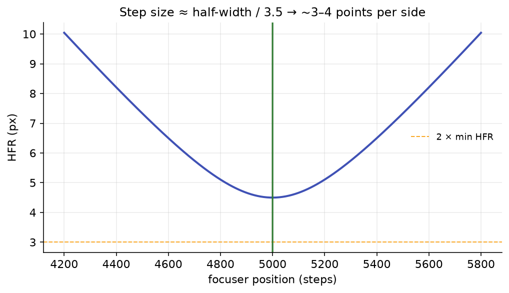

# Step-Size Recommendation

Once the optimizer has fitted a clean HFR-vs-focuser curve, it reads the curve's *shape* to recommend an
autofocus **step size**. A step size that is too coarse skips over the focus-sensitive
region and leaves you with two or three points to fit a curve through; one that is too fine wastes exposures
crawling across focus. The recommender sizes the step so a sensible number of measurements land where the
curve actually carries information.

The logic lives in `StepSizeRecommender.cs` and runs on the *winning* fit at the end of an optimization, so
the suggestion reflects detection settings that have already been tuned for your rig.

## The focus-sensitive band

Far from focus the HFR curve is steep and almost linear; near the minimum it flattens. The band that matters
for pinning the minimum is where HFR climbs from its minimum value up to roughly three times that minimum. The
recommender measures the half-width of that band:

\[
\text{HFR}(p_{\text{focus}} \pm \text{halfWidth}) \;=\; 3 \cdot \text{HFR}_{\min}
\]

Starting from the fitted best-focus position, it searches **outward in both directions** for the offset at
which the fitted HFR reaches \(3 \times \text{HFR}_{\min}\): a coarse outward walk brackets the target, then a
bisection refines it to high precision. The search is bounded (at most a few times the sampled focuser span)
so a flat or degenerate fit cannot send it off to infinity. The left and right offsets are **averaged** so an
asymmetric model still yields a single half-width; if only one side reaches the target, that side is used on
its own, and if neither does, the recommender leaves your current step alone.

{ width=620 }
*The shaded band spans the region where HFR is below three times its minimum. The recommended step (green lines)
divides each side of that band into roughly 3–4 measurement points.*

## From half-width to step size

The recommended step packs about **3.5 points per side** of focus into the band:

\[
\text{step} \;=\; \operatorname{round}\!\left(\frac{\text{halfWidth}}{\text{PointsPerSide}}\right),
\qquad \text{PointsPerSide} = 3.5
\]

The result is clamped to a minimum of 1 and, if a focuser maximum step is supplied, to that maximum. The
recommendation is reported alongside a default **offset of 4 steps** per side, so an autofocus run sampling
that many points on each side of the estimated minimum lands neatly inside the focus-sensitive region.

!!! warning "A sweep too narrow to contain the band is capped"
    The half-width is read off the **fitted** curve, so when the sweep is too shallow to reach three times the
    minimum HFR it comes from extrapolating the model past everything you measured. The shallower the sweep,
    the further out that lands: it can call for a sweep several times wider than anything measured, and even
    exceed the focuser's travel.

    The half-width is therefore capped at **1.5× the sampled half-span**, and the summary marks the
    recommendation *capped by this sweep's width; re-run auto-focus to refine*. The cap does not change where
    the recommendation converges, only how fast: each run widens the sweep, and a shallow rig reaches the same
    answer in about three runs. It only engages when the sweep's ends reach less than roughly 2.1× the minimum
    HFR; a well-shaped sweep is untouched.

!!! note "Degenerate fits are left alone"
    If the fit is missing, its minimum is not finite, the minimum HFR is not positive, or the curve never
    reaches three times its minimum on either side within the bounded search, the recommender returns your
    **current** step unchanged (with an undefined half-width) rather than guessing. You only get a new number
    when the curve genuinely supports one.

!!! tip "How to use the recommendation"
    Treat it as a starting point for your profile's **Auto Focus Step Size** on the same rig and filter. With
    [per-filter star detection](../settings/index.md#auto-focus-sweep-for-one-filter) enabled, Accept writes it
    to the target filter's own sweep override instead of the profile, so each filter keeps its own.
    Because the band width depends on focal ratio, pixel scale, and the focuser's steps-per-unit-travel,
    the right step differs between setups, which is exactly why deriving it from a measured curve beats a
    fixed guess. The step size also feeds back into the objective: \(S_{\text{focus}}\) normalizes focus
    uncertainty by the step size, so a well-chosen step makes the optimization's focus score meaningful
    (see [The objective function](objective-function.md) and [AF-curve fitting](af-curve-fitting.md)).
