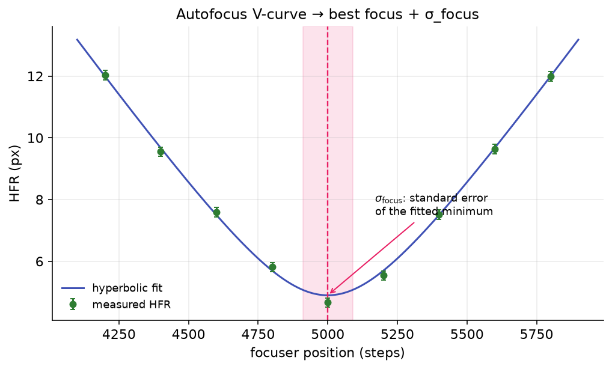

# Autofocus

Hocus Focus replaces NINA's built-in autofocus engine with a star-detection-driven routine that sweeps the focuser, measures Half-Flux Radius (HFR) on every frame, fits a curve to the resulting V-shape, and moves to the modeled best-focus position. It is the same star detector you tune elsewhere in the plugin, now feeding a more careful curve-fitting and validation pipeline.

## What it does, and why it is better

A focus sweep produces a set of (focuser position, HFR) points that form a V: sharp in the middle, bloated on either side. The job of autofocus is to find the bottom of that V. Hocus Focus improves on a plain minimum-finder in several ways:

- **Multiple curve-fitting models.** Hyperbolic (several asymmetric variants), parabolic, and trendline fits, each with a goodness-of-fit rejection gate (\(R^2\) or reduced \(\chi^2\)). See [Hyperbolic Curve Fitting](hyperbola-fitting.md) for the model formulas and when each applies.
- **Hybrid model selection.** At the end of a run every hyperbolic model is refit and the one with the least expected error for the best-focus position is kept, so each run self-selects its most trustworthy fit.
- **Weighted fitting.** Each point carries its own measurement uncertainty \(\sigma\) (the per-frame star-HFR scatter), and the fit can weight points by \(1/\sigma^2\) so a noisy point counts for less.
- **Outlier rejection.** An iterative two-tailed Grubbs test removes points that do not belong on the curve (e.g. a frame ruined by a cloud or satellite).
- **Stability reporting.** A leave-one-out (LOO) cross-validation estimates how much the best-focus position would move if any single point were dropped.
- **HFR-improvement validation.** An optional before/after check confirms the run actually made the stars sharper, retrying the run if it did not.

{ width=620 }
*An autofocus run: measured HFR points form a V, a hyperbolic model is fit through them, and the fitted minimum (with its \(\sigma_{\text{focus}}\) error band) marks best focus.*

{ width=620 }

*A real autofocus run: HFR versus focuser position with the hyperbolic best-fit curve.*

## The autofocus run, step by step

**Setup.** Temperature compensation and guiding are paused so focus and the image stay stable, the autofocus filter offset is applied if filter-wheel offsets are enabled, and the starting focuser position is recorded.

**Initial HFR (optional).** When *Validate HFR Improvement* is on, the engine first takes Frames Per Point exposures at the starting position and averages their HFR into the baseline `InitialHFR`.

**Bracketing the minimum.** The focuser moves outward by the configured offset-steps × step-size, then steps back inward. After each group of frames a trendline is refit to all points collected so far; the sweep continues until the trendline establishes a clear minimum with enough points on both sides, then queues whatever extra points are needed to reach the target count on each side of the V.

**Per-point measurement.** At each focuser position the engine collects Frames Per Point frames, runs star detection on each, measures HFR, and, when more than one frame is taken, combines them into a single point with an associated \(\sigma\). The fit is updated live as each new point arrives, so the chart fills in during the run.

**Curve fitting (per update).** Points are sorted by focuser position for reproducibility, their \(\sigma\) values are regularized (see below), and the selected model is fit. A trendline is always computed for the stopping logic; hyperbolic or parabolic models are fit once at least three points exist. The Grubbs outlier test then runs, and fitting repeats (up to *Max Outlier Rejections* rounds) until no further outlier is flagged.

**Finalization.** Once the sweep is complete:

1. In **Hybrid** mode all four concrete hyperbolic models are refit on the final points (with consensus outlier rejection: only points that every solved model flags are removed). Fits whose minimum is non-finite or lies outside the sampled range are dropped, and a five-parameter asymmetric model stays eligible only if it beats the symmetric baseline on a nested F-test. Among the survivors the model with the smallest expected best-focus uncertainty is chosen. See [The Hybrid selector](hyperbola-fitting.md#the-hybrid-selector-default).
2. A leave-one-out stability pass refits with each point omitted in turn, reporting the spread of predicted best-focus positions.
3. The final focus position is read from the chosen model: the hyperbolic/parabolic minimum, the trendline intersection, or (for the blended trend models) the average of the two.
4. The fit is checked against the active rejection gate (\(R^2\) or reduced \(\chi^2\)) and confirmed to lie inside the measured sweep, an optional *Focuser Offset* is applied, and the focuser moves there.

**Final validation and retries.** With *Validate HFR Improvement* on, Frames Per Point exposures are taken at the final position and averaged into `FinalHFR`. The run passes only if

\[
\text{FinalHFR} < \text{InitialHFR} \times (1 + \text{HFRImprovementThreshold}).
\]

If it fails, the whole run is retried up to NINA's configured number of attempts. On success the engine writes an autofocus report (and, if *Save* is enabled, the images, star-detection results, and annotated frames), broadcasts the result, and restores temperature compensation, guiding, and the filter.

!!! note
    Hocus Focus also supports **per-region** autofocus, detecting and fitting a separate curve for each image region. This underpins field-tilt analysis, where different parts of the sensor reach best focus at different focuser positions.

## Reported metrics

| Metric | Meaning |
|---|---|
| **HFR** | Half-Flux Radius: the radius of the circle enclosing half a star's total flux, in pixels. Per frame it is the median HFR across detected stars; per point it is the average (or median) across Frames Per Point frames. Lower is sharper. |
| **\(R^2\)** | Coefficient of determination, 0–1; how well the model explains the measured points. Closer to 1 is better, and it is the default rejection gate for all fit types. |
| **Reduced \(\chi^2\)** | \(\chi^2\) per degree of freedom for weighted hyperbolic fits: \(\chi^2=\sum_i (r_i/\sigma_i)^2\) divided by \((N-p)\). A scatter-units sanity bound; see the caveats in the tooltip below. |
| **\(\sigma_{\text{focus}}\)** | Standard error of the fitted minimum position, estimated from the hyperbolic fit's Jacobian; drawn as the horizontal error band on the best-focus marker. Degenerate (low-curvature) fits may report NaN. |
| **LOO Std Error** | Leave-one-out stability: the spread of predicted best-focus positions when each point is dropped in turn. It serves as a fallback for \(\sigma_{\text{focus}}\) when that is degenerate. |

!!! warning "Reduced \(\chi^2\) is not a calibrated test here"
    The per-point \(\sigma\) is the star-ensemble scatter, which overstates the uncertainty of the per-point median HFR. As the verbatim tooltip notes, reduced \(\chi^2\) "typically runs well below 1, shrinks as more stars are detected, and grows as Frames Per Point increases. Treat this threshold as a coarse sanity bound rather than a calibrated statistical test." It is only meaningful with weighted fits.

## Key autofocus options

All tooltips below are quoted verbatim from the plugin UI.

{ width=402 }

*The Auto Focus tab supplements NINA's own auto-focus options.*

| Setting | Default | Range | What it does |
|---|---|---|---|
| **Max Concurrency** | 0 | ≥ 0 | "The maximum number of auto focus images that can be processed at the same time. This is useful if processing time is much longer than exposure time and your system has limited memory or cores. 0 represents no limit." |
| **AutoFocus Timeout** | 600 | > 0 | "How long an Auto Focus operation can take before we cancel it and move on." |
| **Validate HFR Improvement** | On | — | "If enabled, takes an extra exposure before and after to ensure HFR improved. This check may be done in addition to the R² validation configured in NINA's Auto Focus options." |
| **HFR Improvement Tolerance** (backing property `HFRImprovementThreshold`) | 0.15 | — | "How much wiggle room when validating HFR improvements. The default value of 15% means that the Auto Focus fails if the initial HFR is 15% or more better than the final HFR" |
| **Hyperbolic Fit Model** | Hybrid (Best Fit) | Symmetric / Tilted Hyperbola / Smooth Blend / Uneven Blend / Hybrid (Best Fit) | "Which hyperbolic model is fit to the focus curve. Hybrid (Best Fit) is the recommended default: the curve is rendered live with the Tilted Hyperbola, then at run completion every model is refit and the one with the least expected error for the best-focus position is kept — so each run self-selects its most trustworthy fit. The fixed choices: Symmetric is the classic 4-parameter hyperbola; the others are asymmetric (different slope on either side of focus, common because out-of-focus HFR behaves differently than in-focus): Tilted Hyperbola is a single smooth curve with a linear skew, Smooth Blend smoothly blends two hyperbolas, and Uneven Blend is the original blended fit." |
| **Weighted Hyperbolic Fit** | On | — | "Weights each point in the hyperbolic fit based on measurement error. σ values are regularized before fitting: a degenerate near-zero σ (e.g. from a frame with very few detected stars) is floored at 20% of the sweep's median σ, and an unknown σ gets the median, so no single point can dominate the fit through a degenerate error estimate." |
| **Fit Rejection Criterion** | R² | R² / Reduced χ² | "Which goodness-of-fit metric decides whether an auto-focus run is rejected. R² (default) keeps the existing behavior, rejecting when the fit's R² falls below NINA's R² threshold (Focuser settings). Reduced χ² instead rejects when the hyperbolic fit's reduced χ² exceeds the threshold below — a scatter-units goodness-of-fit bound for a focus curve, but it is only valid when 'Weighted Hyperbolic Fit' is enabled (it relies on per-point measurement σ). Quadratic and trendline fits always use R² regardless of this setting." |
| **Reduced χ² Rejection Threshold** | 5.0 | 0–1000 (0 disables) | "Upper bound on the hyperbolic fit's reduced χ² (χ² per degree of freedom) above which the run is rejected, when the rejection criterion is set to Reduced χ². … Treat this threshold as a coarse sanity bound rather than a calibrated statistical test. Set to 0 to disable. Meaningful only with weighted fits." |
| **R² Rejection Threshold** | from NINA | 0–1 | "The minimum R² (coefficient of determination) below which an auto-focus run is rejected, when the rejection criterion is set to R². This is NINA's own R² threshold from the Focuser settings; editing it here changes that same profile setting. R² closer to 1 indicates a better fit to the measured focus curve." |
| **Max Outlier Rejections** | 1 | ≥ 0 | "Controls the maximum number of points that can be rejected as outliers during Auto Focus curve fitting." |
| **Outlier Rejection Confidence** | 0.90 | > 0.5, < 1.0 | "Confidence level for a two-tailed Grubbs statistical test of outliers to use during Auto Focus curve fitting. 0.90 is a reasonable default." |
| **Save** | Off | — | "Saves details about every Auto Focus run, including a copy of the image, the star detection results, and the stretched annotated image" |
| **Save Path** | (empty) | folder | "The folder to save Auto Focus runs" |
| **Focuser Offset** | 0 | any | "Advanced Only! Moves the focuser this fixed amount at the end of an AutoFocus" |

!!! tip "When these help"
    - Leave **Weighted Hyperbolic Fit** on and **Hyperbolic Fit Model** set to **Hybrid (Best Fit)**. Those are the defaults, and they let each run pick its most reliable model and discount noisy points; only the reduced-\(\chi^2\) gate depends on the weighting being enabled.
    - Set **Max Concurrency** to a non-zero cap only if frame processing is starving memory or CPU on a slow machine; leave it at 0 (no limit) otherwise.
    - Set a non-zero **Focuser Offset** only for a measured, repeatable focus bias in your train. It is an advanced-only fixed nudge applied after the calculated position.

## How it uses the star detector

Every HFR measurement comes from the same Hocus Focus star detector documented in [Star detection](star-detection.md), run with autofocus-specific overrides:

- **Profile-driven parameters.** Sensitivity, noise reduction, and the brightest-stars count are taken from NINA's profile (Image and Focuser settings), and the run is flagged as autofocus mode.
- **Region of interest.** When NINA's inner-crop ratio is below 1 and the camera is not subsampling, detection is restricted to that central crop; otherwise the full frame is analyzed. If the camera supports hardware subsampling with the inner crop enabled, the engine reads out only that central rectangle.
- **Per-region detection.** For multi-region runs the detector measures HFR only inside each region's boundary, and the per-region results are saved separately.
- **Replay with cache reuse.** When replaying a saved run, the engine can reuse the cached star-detection result if the detector version and region key still match, falling back to fresh detection otherwise, so you can re-fit a curve with new options without re-running hardware. Replay decodes the saved frames deterministically (concurrent image loads are serialized), so a re-fit reproduces the same per-position HFR every time rather than occasionally pairing two positions with an identical value.
- **The measurement.** From each detection it takes the median HFR (`AverageHFR`) as the point value and the per-star HFR standard deviation (`HFRStdDev`) as the measurement \(\sigma\) fed into the weighted curve fit.

Because detection quality directly drives the HFR points (and therefore the curve and the chosen focus position), the [Star Detection Optimizer](../optimization/index.md) tunes the detector specifically against autofocus runs, and its [recommended step size](../optimization/step-size.md) sets how far apart to space the sweep points so the V is well sampled on both sides.
