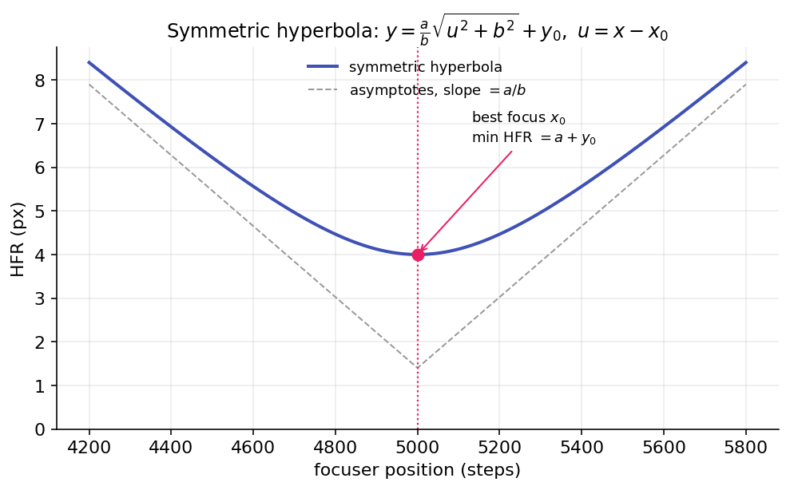
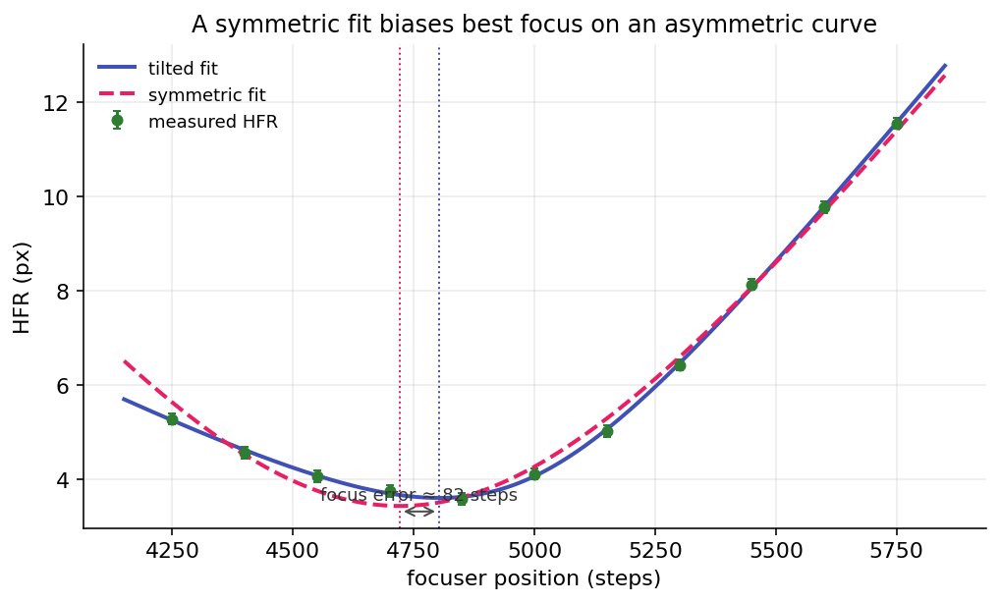
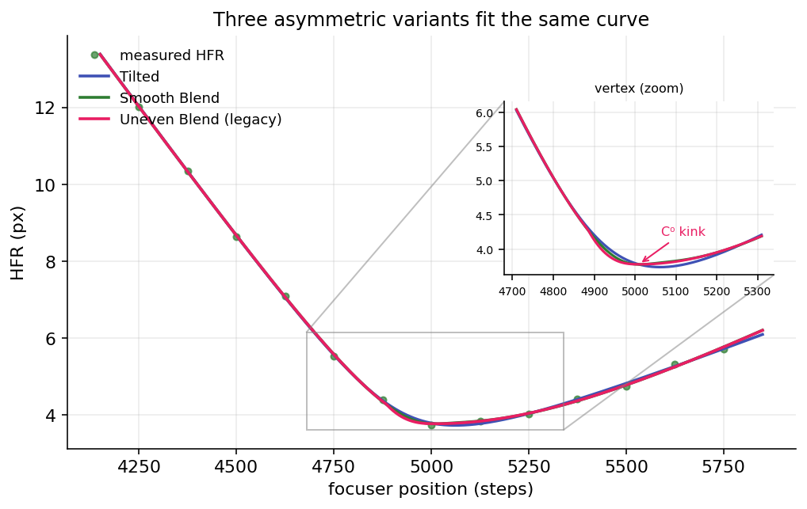
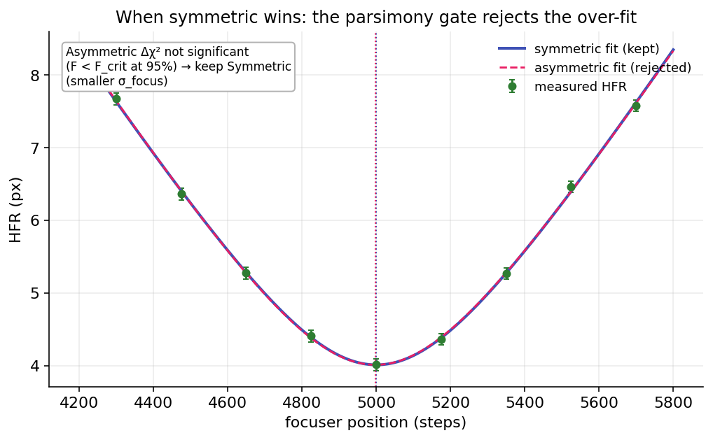

# Hyperbolic Focus-Curve Fitting

A focus sweep produces a set of `(focuser position, HFR)` points that trace a V: HFR is large when the
star is defocused and drops to a minimum at best focus. Hocus Focus fits a hyperbola to that V, reads
the best-focus position from the fit, and reports how precise that position is. This page covers the
family of hyperbolic models, how the points are weighted and cleaned, and how the default **Hybrid**
setting picks the most trustworthy fit for each run.

This is the modeling detail behind the [Autofocus](autofocus.md) run. The option that switches between
models lives there (see [Key autofocus options](autofocus.md#key-autofocus-options)), and the
optimizer scores detection settings off the same fit outputs (see
[AF-Curve Fitting & Sigma-Focus](../optimization/af-curve-fitting.md)).

Throughout, let \(u = x - x_0\), where \(x\) is the focuser position and \(x_0\) is the best-focus
position.

## Why the focus curve is a hyperbola

Away from focus, a star is a defocus disc whose diameter grows roughly linearly with distance from
best focus, so HFR is nearly linear in the wings. Near focus the curve rounds off to a minimum. A
hyperbola captures both regimes: two straight asymptotes joined by a smooth, rounded vertex. (NINA
also offers a parabola, which curves everywhere; the hyperbola's linear wings match real defocus
better.)

{ width=620 }

*The minimum sits at \(x_0\) (best focus) with HFR value \(a + y_0\); far from focus the curve
approaches two straight lines of slope \(\pm a/b\).*

Two things are read from the fitted curve: the **minimum position** is sent to the focuser, and its
**uncertainty** \(\sigma_{\text{focus}}\) (the standard error of that position) measures how sharply
best focus is pinned down. A tight, well-curved V gives a small \(\sigma_{\text{focus}}\); a shallow,
noisy one gives a large one.

## The symmetric model

The classic fit has four parameters \(\{x_0, y_0, a, b\}\):

\[
y = \frac{a}{b}\sqrt{u^2 + b^2} + y_0 .
\]

The minimum is at \(x = x_0\) with value \(a + y_0\); \(b\) sets how wide the vertex is; and each wing
approaches the asymptotic slope

\[
y \;\to\; y_0 + \frac{a}{b}\,\lvert u\rvert \qquad \text{as } \lvert u\rvert \to \infty .
\]

With the fewest parameters, the symmetric model is the most stable fit (it has the lowest
leave-one-out scatter), but it cannot represent a curve that rises at different rates on either side
of focus.

## Why real curves are often asymmetric

Inside and outside focus a star defocuses differently, from spherical aberration, the optical train,
and the atmosphere, and at the defocused extremes stars get dimmer and scarcer so HFR is noisier on
one side. The result is one wing steeper than the other. Forcing a symmetric curve onto an asymmetric
V pulls the fitted minimum toward the shallower side, biasing the best-focus estimate.

{ width=620 }

*On an asymmetric curve the symmetric fit (dashed) cannot match both wings, so its minimum lands away
from where the asymmetric tilted fit (solid) places best focus.*

## Asymmetric models

Three five-parameter variants break the left/right symmetry in different ways.

### Tilted hyperbola

This adds a linear skew \(\sigma\) (bounded \(\lvert\sigma\rvert \le 0.9\)) to the symmetric form:

\[
y = y_0 + \frac{a}{b}\left(\sqrt{u^2 + b^2} + \sigma\,u\right) .
\]

The two asymptotes now have slopes \(\tfrac{a}{b}(1 + \sigma)\) and \(\tfrac{a}{b}(1 - \sigma)\), one
steeper than the other, and \(\sigma = 0\) recovers the symmetric model. The minimum shifts off
\(x_0\) by a closed-form offset:

\[
u^{*} = x_{\min} - x_0 = -\,\frac{\sigma\,b}{\sqrt{1 - \sigma^2}} .
\]

It is a single smooth curve with an analytic gradient (so \(\sigma_{\text{focus}}\) is well defined)
and a closed-form minimum. It is the best all-round asymmetric model and the one drawn live as a run
progresses.

### Smooth blend

This blends a left and a right hyperbola through a logistic weight centered on the vertex, giving each
side its own curvature scale (\(b\) and \(c\)):

\[
t(x) = \frac{1}{1 + e^{\,u/w}}, \qquad
y = y_0 + t\,\frac{a}{b}\sqrt{u^2 + b^2} + (1 - t)\,\frac{a}{c}\sqrt{u^2 + c^2} .
\]

It is smooth everywhere (so it also has an analytic gradient) and reduces to the symmetric model when
\(b = c\). The blend half-width \(w\) is derived from the data, not fitted: \(w = 0.25 \times\) the
median spacing between focuser positions. A fitted \(w\) is only weakly identifiable and tends to
destabilize the minimum. Use this when the two sides have genuinely different curvature, not just a
different slope.

### Uneven blend (legacy)

The original blended fit uses a hard linear ramp instead of a logistic:

\[
t = \operatorname{clamp}\!\left(\frac{x_0 - x}{\text{step}},\, 0,\, 1\right), \qquad
y = t\,\frac{a}{b}\sqrt{u^2 + b^2} + (1 - t)\,\frac{a}{c}\sqrt{u^2 + c^2} + y_0 .
\]

The hard ramp makes the curve only \(C^0\): it has a kink, the transition width is tied to the
focuser step size rather than fitted, and the minimum is forced to sit exactly at \((x_0,\, a + y_0)\).
Prefer Smooth Blend, which keeps two curvatures while removing the kink. The Uneven Blend is kept for
backward compatibility.

{ width=620 }

*All three variants fit the points well; the vertex zoom shows the Uneven Blend's \(C^0\) kink where
the Tilted and Smooth Blend curves stay round.*

## Weighted fitting and robustness

Each focuser position carries a per-point HFR scatter \(\sigma_i\) (the spread of star HFR in that
frame), and the fit weights points by their inverse:

\[
w_i = \frac{1}{\sigma_i}, \qquad
\sigma_i \leftarrow \max\!\big(\sigma_i,\; 0.2 \cdot \operatorname{median}(\sigma)\big) .
\]

The floor at 20% of the median \(\sigma\) caps how much any single point can dominate, which protects
against a star-starved frame reporting a near-zero scatter. (See the **Weighted Hyperbolic Fit**
option in [Key autofocus options](autofocus.md#key-autofocus-options).) On top of the weights, an
in-fit Huber loop down-weights any point whose residual exceeds \(1.5\) times the residual MAD, so a
single bad measurement is softened before any point is dropped outright.

## Fit-quality metrics

Four numbers describe a fit, and they answer different questions.

| Metric | What it measures |
|---|---|
| \(R^2\) (weighted) | Fraction of the point variation the model explains (0–1, higher is better). The default accept/reject gate. |
| Reduced \(\chi^2_\nu\) | Weighted residuals relative to the error bars. |
| \(\sigma_{\text{focus}}\) | Standard error of the fitted best-focus position. |
| Leave-one-out (LOO) std | How much the best-focus estimate moves when any single point is dropped. |

Reduced chi-squared is

\[
\chi^2_\nu = \frac{1}{n - p}\sum_i w_i^2\big(\text{model}(x_i) - y_i\big)^2 ,
\]

with \(n\) points and \(p\) parameters. Because \(\sigma_i\) is the ensemble scatter rather than the
true uncertainty of the pooled mean, \(\chi^2_\nu\) usually runs well below 1; treat it as a coarse
sanity bound, not a calibrated test.

\(\sigma_{\text{focus}}\) is propagated from the fit covariance \(\mathrm{Cov} \approx s^2 (J^{\top} W
J)^{-1}\) by the delta method, and is reported as `NaN` for a degenerate (nearly flat) fit. The LOO
std is a non-parametric companion that needs at least five points.

These two families measure different things: \(R^2\) and \(\chi^2_\nu\) say how well the curve matches
the points, while \(\sigma_{\text{focus}}\) and LOO say how precisely the answer (best focus) is
located. A fit can match the points well yet locate focus poorly (a flat-bottomed V), which is why
both matter.

!!! note
    The user-facing **Fit Rejection Criterion** option (\(R^2\) or reduced \(\chi^2\)) is a separate
    accept/reject gate applied to the finished run. It is not the metric the Hybrid selector below
    uses to choose a model.

## The Hybrid selector (default)

Hybrid is a meta-model and the default. The curve is drawn live with the Tilted hyperbola; at run
completion every concrete model is refit and the most trustworthy one is kept:

1. **Consensus outlier rejection.** Each candidate proposes its own Grubbs outliers, and only points
   flagged by *every* solved model are removed, up to the Max Outlier Rejections cap. No model can
   improve its standing by pruning data the others trust.
2. **Refit** all four models (Symmetric, Tilted, Smooth Blend, Uneven Blend) on the single common
   cleaned set.
3. **Viability filter.** Drop any fit whose minimum is non-finite or falls outside the sampled
   position range.
4. **Parsimony gate.** A five-parameter asymmetric model is eligible to win only if it significantly
   beats the four-parameter Symmetric baseline, by a nested F-test at 95% confidence (the statistic is
   given below). If no asymmetric model clears the gate, only Symmetric is eligible, so the run never
   reports a tilt the data do not justify.
5. **Rank the survivors** by ascending \(\sigma_{\text{focus}}\). Only if no survivor has a finite
   \(\sigma_{\text{focus}}\) does the leave-one-out std break the tie; the final tiebreak is ascending
   reduced \(\chi^2\), then descending \(R^2\). The winner is the fit the run uses.

The parsimony gate compares the symmetric (\(p_{\text{sym}} = 4\)) and asymmetric
(\(p_{\text{asym}} = 5\)) fits with the nested F-statistic:

\[
F = \frac{\big(\chi^2_{\text{sym}} - \chi^2_{\text{asym}}\big) / (p_{\text{asym}} - p_{\text{sym}})}
         {\chi^2_{\text{asym}} / (n - p_{\text{asym}})} .
\]

{ width=620 }

*On clean, near-symmetric data the asymmetric fit adds no significant improvement, so the F-test keeps
the simpler symmetric model with its smaller \(\sigma_{\text{focus}}\).*

## Which model should I pick?

Leave it on **Hybrid (Best Fit)**. Across a large bank of real runs no single fixed model wins on every curve, so
per-run self-selection is the safe default. Asymmetric models fit tighter (lower RMS and
\(\chi^2\)) but a five-parameter fit is easier to over-fit on a thin sweep, which is exactly what the
parsimony gate guards against.

If you prefer a fixed model: **Symmetric** is the most stable and a good choice for clean,
near-symmetric curves; **Tilted Hyperbola** is the best fixed asymmetric model; **Smooth Blend** suits curves
whose two sides have clearly different curvature; and **Uneven Blend** is only for reproducing old
behavior. The setting lives in [Key autofocus options](autofocus.md#key-autofocus-options), and the
optimizer uses these same fit metrics when it scores detection settings
([AF-Curve Fitting & Sigma-Focus](../optimization/af-curve-fitting.md)).
