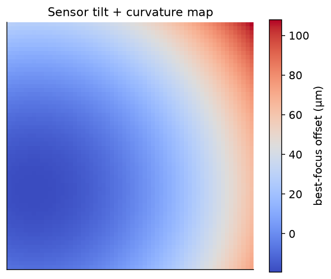

# Overview & Features

Hocus Focus is a plugin for [NINA](https://nighttime-imaging.eu/) that, in the words of its own description, provides **"Improved Star Detection, Star Annotation, Auto Focus, and Tilt Correction for NINA."** It replaces or augments NINA's built-in star handling and auto-focus routines with a more accurate star detector, a fully customizable annotator, a concurrent auto-focus engine, and an aberration inspector that measures backfocus (the spacing between the corrector/flattener and the sensor) and sensor-tilt errors.

The plugin is deliberately modular. Per its documentation, you "can use the new Star Detector or Annotator without requiring both" — keep whichever pieces you like and leave the rest on NINA's defaults. The features are wired in under **Options → Imaging → Image Options**, where installing the plugin adds **Star Annotator** and **Auto Focus** dropdowns; select **"Hocus Focus"** in those to turn the features on.

!!! note "Requirements"

    Hocus Focus targets NINA 3.2.0.2001 or newer (the plugin's declared `MinimumApplicationVersion`). The Aberration Inspector in particular requires that **Hocus Focus is selected for both Auto Focus and Star Detection**.

## The four feature areas

### Star Detection

The improved star detector fits a point-spread function (PSF) to each star — both a **Gaussian** and a **Moffat 4** model are supported. When PSF modeling is enabled, fit failures cause a star to be rejected and the surviving fits drive a better HFR calculation, plus per-star **eccentricity and FWHM** measurements. The result, when parameters are set well, is **higher accuracy — a lower HFR standard deviation** — across a frame. See [Star Detection](star-detection.md) for the full detection pipeline.

### Star Annotation

The annotator controls how detected stars are drawn on top of an image. It offers **customizable colors and fonts** for the star overlays, and supports **dynamic reloading of annotations without re-running star detection** — so you can restyle the overlay or change what is shown without paying for another detection pass. See [Star Annotation](star-annotation.md).

### AutoFocus

The Hocus Focus auto-focus engine **analyzes each exposure while the next focus point is being exposed**, which can make it faster than NINA's built-in auto focuser. It can **save AF runs** — the images and the annotated star detection — so a run can be **replayed later with different settings**. The concurrent design is especially valuable with the Hocus Focus star detector, which is more resource-intensive than the built-in one. See [AutoFocus](autofocus.md).

### Tilt & Aberration Inspector

The inspector estimates **backfocus and tilt errors** by running an auto-focus and computing AF curves for the **center and corner regions of the sensor split into a 3×3 grid**, producing a full **sensor tilt and curvature model** — which lets it measure backfocus error even when tilt is present. For single exposures it also generates **FWHM contour maps** and **eccentricity vector fields** for a quick visual read, offers a **3D visualization of sensor tilt**, and can **replay saved AF runs**. See [Tilt & Aberration Inspector](tilt-aberration-inspector.md).

{ width=620 }
*The Aberration Inspector models how best-focus position varies across the sensor, separating uniform backfocus error from tilt and field curvature.*

## Simple vs Advanced configuration

Hocus Focus exposes "simpler configuration, with an advanced mode for fine tuning." In practice there are three levels of control, in increasing order of effort:

| Level | Who it's for | What you do |
|---|---|---|
| **Simple** | Most users | Accept the heuristic defaults / Simple-mode presets and let the detector adapt to your image scale. |
| **Advanced** | Tuners | Open Advanced settings to hand-tune individual detection, gating, and PSF parameters. |
| **Optimization Wizard** | Anyone chasing the lowest HFR scatter | Let the optimizer search the parameter space against an objective function using your own saved AF runs. |

Start at the Simple level — "higher accuracy (lower HFR Standard Deviation)" is available "if parameters are set properly," and the defaults are a reasonable starting point. Move to Advanced only when you need to correct a specific behavior, and reach for the wizard when you want the settings tuned automatically rather than by hand.

!!! tip "When to go beyond Simple"

    If detection already finds plenty of clean stars and your auto-focus curves are tight, the defaults are doing their job — leave them alone. Advanced tuning and the Optimization Wizard pay off when a particular setup (unusual pixel scale, heavy nebulosity, persistent false detections, or bloated defocused stars) is tripping up the defaults.

For the full per-setting reference, see [Settings](../settings/index.md). To have those settings tuned automatically against your saved runs, see the [Optimization Wizard](../optimization/index.md).
