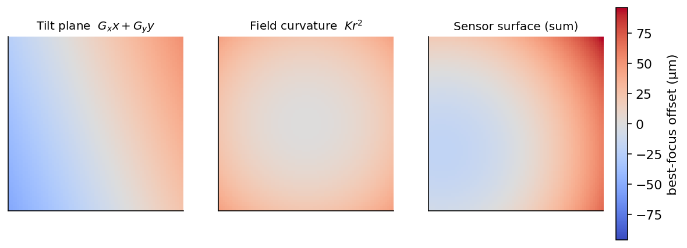
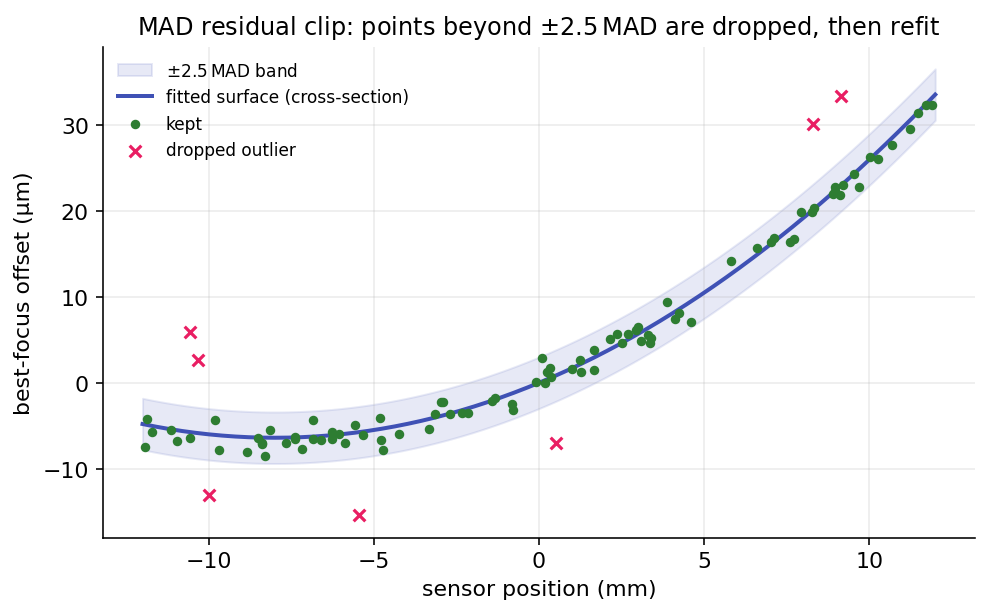

# Sensor Model Fitting

The [Tilt & Aberration Inspector](tilt-aberration-inspector.md) turns a focus sweep into numbers for
tilt, field curvature, and backfocus. Those numbers come from fitting a surface to where best focus
falls across the sensor. This page covers that surface: the two models the inspector fits, how the
measurements that feed them are gathered, the weighted fit itself, how outliers are detected
and dropped, and the features that keep the result trustworthy.

This is the math companion to that inspector page, which covers the panel, its readouts, and the
[options](tilt-aberration-inspector.md#inspector-options) that choose which model runs and tune it.
Both models are built from focus curves measured by the same engine as a normal
[Autofocus](autofocus.md) run. The 4-corners model uses one best-focus position per region (the center
and four corners); the sensor surface model uses one per star, each fit with the hyperbola family from
[Hyperbolic Curve Fitting](hyperbola-fitting.md).

Throughout, \(x\) and \(y\) are sensor positions in microns measured from the image center, and \(z\)
is the focuser position (in microns) at which that point of the sensor reaches best focus.

## Two models, one surface

The inspector fits the focus surface at two levels of detail.

- The **4-corners model** is the simpler of the two, always computed. It measures best focus at the
  center and the four corners, then reads tilt from how the corners differ and backfocus from how the
  corners sit relative to the center. It is cheap and needs only those five focus curves, but it cannot
  tell field curvature apart from backfocus, and it says nothing about sensor centering.
- The **sensor surface model** (the **Sensor Curve Model** option) is the rigorous model. It fits a
  focus curve for *every* matched star across the frame, then fits a tilted paraboloid through all of
  those best-focus positions. That extra data lets it separate tilt, field curvature, and centering,
  and put an uncertainty on each result. It is also more demanding: it needs many well-fit stars, so it
  is more sensitive to measurement error and does not always succeed.

The two are not rivals. The 4-corners model captures only the linear part of the focus surface: drop
the curvature terms from the paraboloid and you are left with the same kind of tilt plane. It is
enough for a quick corner-versus-center check. The surface model is what you want when you intend to correct the sensor
physically: a successful fit measures tilt and backfocus independently, with field curvature separated
from both, so you can address each one systematically (tilt with the adapter screws, backfocus and
curvature with spacing).

{ width=560 }

*Best focus is reached at a different focuser position across the sensor. A smooth left-to-right
gradient is tilt; a center-to-corner bowl is curvature. The models below separate the two.*

## 4-Corners Model

The center and four corner regions each yield an estimated best-focus position. The center is held
back for the backfocus comparison below; the four corners are fed to an ordinary-least-squares fit of
a plane, over normalized image coordinates that run from \(-0.5\) to \(+0.5\) on each axis:

\[
\text{Focus}(x, y) = A\,x + B\,y + C .
\]

\(A\) and \(B\) are the tilt slopes along the horizontal and vertical axes (in focuser steps per
normalized image unit) and \(C\) is the mean focus plane. Each corner's **Adjustment Required** is its
best-focus position minus that mean, reported in focuser steps (and in microns when *Microns per
Focuser Step* is set). There is no outlier rejection here, because there are only four points to fit.

**Backfocus** is read off the same regions rather than the plane: it is the mean of the four corner
best-focus positions minus the center position, converted to microns with *Microns per Focuser Step*,
and compared against the critical focus zone. A positive value means the corners focus past the
center, a sign the sensor sits too far from the corrector. The screw-by-screw guidance built from this
plane is covered under
[Guiding tilt-adapter screw adjustments](tilt-adapter-wizard.md).

## The sensor surface model

The surface model fits a tilted paraboloid:

\[
z(x, y) = G_x\,(x - X_0) + G_y\,(y - Y_0) + K_x\,(x - X_0)^2 + K_y\,(y - Y_0)^2 + Z_0 .
\]

Each parameter has a physical reading:

- \(G_x, G_y\) are the **tilt gradients**, the change in best-focus position per micron of sensor
  displacement. They are the linear (planar) part of the surface.
- \(K_x, K_y\) are the **curvature coefficients**. They bow the surface into a bowl or dome.
- \(X_0, Y_0\) locate the **optical center** (the vertex of the paraboloid) relative to the image
  center, so a decentered field can be modeled rather than mistaken for tilt.
- \(Z_0\) is the focuser position of the surface at its center.

By default the field is modeled as **rotationally symmetric**: \(K_x = K_y = K\), one curvature
coefficient and six free parameters. Turning on **Astigmatic field curvature** lets \(K_x\) and
\(K_y\) differ, a seventh parameter that represents the saddle-shaped field of an astigmatic optical
train. Leave it off unless you have reason to expect astigmatism, since the extra parameter is easier
to over-fit.

The inspector also reports the familiar tilt and curvature quantities, derived from the fitted
parameters:

\[
\theta = \arctan\!\sqrt{G_x^2 + G_y^2}, \qquad
\varphi = \operatorname{atan2}(G_y, G_x), \qquad
K = \tfrac{1}{2}(K_x + K_y) .
\]

\(\theta\) is the tilt angle and \(\varphi\) its direction. The linear-gradient form above replaces an
older parameterization written directly in \((\theta, \varphi, K)\); writing the surface as a linear
function of \(G_x, G_y, K_x, K_y\) removes a numerical trap at zero tilt (where the tilt direction is
undefined) and lets the curvature cross zero, so a single fit covers a bowl, a dome, and a flat field
without special cases.

{ width=720 }

*The surface is a tilt plane plus a curvature term. The fit estimates both at once and reports them
separately, so you can tell a tilt problem (fixable with screws) from field curvature (an optical
property of the corrector and focal ratio).*

## From stars to data points

Each data point in the surface fit is one star's best focus. Getting there takes three steps.

**Per-star focus curves.** Every star is tracked across the sweep (the cross-frame matching is
described under registration below), and its HFR-versus-focuser-position points are fit with a
[hyperbola](hyperbola-fitting.md). The fit gives the
star's best-focus position and its standard error \(\sigma\) (how sharply that position is pinned
down). A star whose curve fit explains less than \(R^2 = 0.90\) of its own variation, or fails to fit
at all, is discarded rather than contributing a noisy point.

**Cross-frame registration.** Stars drift in pixel position from frame to frame as the image breathes
through focus, so they have to be matched into tracks before any star's curve can be fit. Matching
itself is done with a k-d tree of nearest neighbors: the stars of a reference frame seed a registry,
and each other frame's stars are matched to it by nearest neighbor within a search radius. The
reference is the frame with the most detected stars, so the registry and the frame alignment have as
many anchor stars as possible to match against.

Two registration approaches are available, set by **Use RANSAC** (on by default) under
[Inspector options](tilt-aberration-inspector.md#inspector-options):

- **Nearest-neighbor only** (RANSAC off). Stars are matched directly in their original pixel
  positions, using a wide search radius so the frame-to-frame drift still falls inside it.
- **RANSAC alignment first** (RANSAC on). Every frame is first transformed onto the reference frame by
  a RANSAC-estimated transform (a similarity transform by default, or an affine one when **Use Affine
  Alignment** is on), so matching stars land almost on top of each other. The nearest-neighbor match
  then runs with a much tighter search radius. This is what keeps matching reliable at the defocused
  ends of the sweep, where stars are bloated and sparse; it falls back to the wider radius if any frame
  fails to align.

A star must be matched in **at least five frames** to be fit, so its focus curve has enough points to
be meaningful.

**Building the points.** Each surviving star contributes one data point: its sensor position in
microns, \(\bigl((\text{pixel} - \tfrac{W}{2})\cdot p,\ (\text{pixel} - \tfrac{H}{2})\cdot p\bigr)\)
for pixel size \(p\), and its best-focus position in microns. The point carries the per-star
uncertainty \(\sigma\), which becomes the fit weight

\[
w_i = \frac{1}{\sigma_i} .
\]

A tightly-pinned star pulls on the fit harder than a loosely-pinned one. When a star's \(\sigma\) is
unavailable it is filled in with the **median** \(\sigma\) of the other stars, so an unknown
uncertainty is treated like a typical star rather than dominating or being ignored.

## Fitting the surface

The surface is fit by weighted nonlinear least squares (Levenberg–Marquardt), minimizing the weighted
sum of squared residuals

\[
\sum_i w_i^2 \,\bigl(z(x_i, y_i) - z_i\bigr)^2 ,
\]

which is the \(\chi^2\) of the fit when \(w_i = 1/\sigma_i\). The model is linear in every parameter
except the center \((X_0, Y_0)\), and the model's gradient is supplied analytically rather than
estimated by finite differences, which makes the fit faster and more stable. The same per-point weight is applied
to the residuals and to the gradient, so the optimizer's step stays consistent with what it is
minimizing.

Two details keep the fit well-behaved:

- **Parameter scaling.** The parameters span very different magnitudes (a center offset in microns, a
  dimensionless gradient near \(10^{-3}\), a curvature coefficient near \(10^{-6}\)). The optimizer is
  told each parameter's scale so it can take sensible steps in every direction at once.
- **The center.** With **Fixed Sensor Center** on (the default), \(X_0\) and \(Y_0\) are pinned to
  zero and the sensor is assumed centered. Turning it off lets the fit estimate the center along with
  everything else, bounded to the sensor's own dimensions. Pinning the center is more than an optics
  assumption: a free center and the tilt gradients are partly confounded (a small shift of the vertex
  looks like a little tilt), so fixing it also tightens the remaining parameters and their error bars.

## Detecting and rejecting outliers

A bad star (a blend, a hot pixel mistaken for a star, a cosmic ray) can land far from the true
surface. The model rejects outliers at three levels, from the individual measurement up to the whole
surface.

**Within a star's focus curve.** Before a star's best focus is trusted, its own HFR points are
screened with a Grubbs test on the median- and MAD-scaled residuals, dropping a single gross outlier
and refitting. The screen never prunes a star below five points, so it cannot manufacture a tight fit
by deleting data.

**Across the surface.** After the surface is fit, the residual of every point is measured and the
spread of those residuals is summarized robustly with the scaled median absolute deviation

\[
\operatorname{MAD} = 1.483 \cdot \operatorname{median}_i \bigl| r_i - \operatorname{median}(r) \bigr| ,
\]

where the constant makes the MAD a consistent estimate of the standard deviation for clean Gaussian
scatter. Any point whose residual exceeds \(2.5\,\operatorname{MAD}\) in magnitude is dropped and the
surface is refit on what remains. This repeats until no point is dropped (capped at ten passes), and
it backs out to the previous fit if a pass fails to improve the overall fit quality, so the rejection
can never make the model worse.

{ width=640 }

*Most stars scatter tightly around the fitted surface. The few that fall outside the
\(\pm 2.5\,\operatorname{MAD}\) band are dropped, then the surface is refit, so a handful of bad star
measurements cannot pull the tilt and curvature off true.*

The MAD is used instead of the standard deviation on purpose. The MAD has a 50% breakdown point, so a
cluster of gross outliers cannot inflate the spread enough to hide themselves, which is exactly the
failure mode of clipping on the standard deviation.

## What makes the fit robust

A few additional safeguards keep the result stable from run to run.

- **Inverse-variance weighting** lets confident stars carry the fit and noisy ones step aside, with
  median imputation so a missing uncertainty neither dominates nor disappears.
- **Minimum data requirements.** At least nine stars are needed to fit a surface at all, each star
  needs five matched frames, and the inspector warns when fewer than ten stars made it into the model.
- **An overfit guard.** A fit that explains the data almost perfectly (\(1 - R^2 < 0.005\)) is treated
  as suspicious rather than excellent, since on this kind of data it usually means too few points
  survived to constrain the surface.
- **A deliberate acceptance gate.** A low \(R^2\) on its own never rejects the model, because a nearly
  flat sensor genuinely explains little variance while still being fit well. The model is rejected only
  when \(R^2\) is below **Acceptable R² Min** (default \(0.05\)) *and* the reduced \(\chi^2\) is also
  poor (above \(5\)).
- **Determinism.** The per-star curve fits run in parallel but are written back in a fixed order, so
  the surface fit, and every number derived from it, is identical no matter how the work was scheduled.

## Fit-quality metrics

Four numbers describe how well the surface fits the points and how precisely it pins the parameters.

| Metric | What it measures |
|---|---|
| \(R^2\) (weighted) | Fraction of the best-focus variation the surface explains. Reported as the model fit quality; low values only reject the model alongside a poor reduced \(\chi^2\). |
| Reduced \(\chi^2_\nu\) | Weighted residuals relative to the per-star error bars. Independent of how tilted the sensor is, which is what makes it a repeatable acceptance criterion. |
| RMS error | Plain (unweighted) root-mean-square residual, in microns. An intuitive "how far off, typically." |
| Std errors | One-sigma uncertainties on the tilt angle and the curvature radius. |

Reduced chi-squared is the \(\chi^2\) per degree of freedom,

\[
\chi^2_\nu = \frac{1}{n - p} \sum_i w_i^2 \,\bigl(z(x_i, y_i) - z_i\bigr)^2 ,
\]

with \(n\) enabled points and \(p\) free parameters. Because the per-star \(\sigma\) is an approximate
uncertainty rather than a calibrated one, \(\chi^2_\nu\) routinely runs above 1 even for good fits and
its absolute scale depends on the rig, which is why it only rejects a model in combination with a low
\(R^2\).

The error bars come from the fit covariance. At the solution the parameter covariance is

\[
\mathrm{Cov} \approx s^2 \,(J^{\top} W J)^{-1} , \qquad s^2 = \frac{\text{weighted RSS}}{n - f} ,
\]

with \(J\) the model's Jacobian, \(W = \operatorname{diag}(w_i^2)\), and \(f\) the number of *free*
parameters (a pinned center is excluded, so it cannot make the matrix singular). The tilt angle and
curvature radius are functions of the parameters, so their uncertainties follow by the delta method.
For the radius the relation is simple: \(R \propto 1/|K|\), so its relative error equals the curvature
coefficient's, \(\sigma_R / R = \sigma_K / |K|\). When the fit is rank-deficient or ill-conditioned,
or the field is so flat that the radius diverges, the standard error is reported as not determined
rather than as a misleading finite number.

## From fit to physical numbers

The fitted parameters are converted into the quantities the panel displays.

| Result | How it is computed |
|---|---|
| **Tilt** | The angle \(\theta = \arctan\sqrt{G_x^2 + G_y^2}\), in degrees, with its one-sigma error. |
| **Tilt effect** | Half the spread of the planar term across the four sensor corners: the worst-case best-focus offset, in microns, caused purely by tilt. |
| **Curvature radius** | \(R = 1 / (2000\,|K|)\) millimeters. Larger is flatter (and better), with its one-sigma error. |
| **Curvature effect** | The curvature term evaluated at a corner: the corner-to-center offset, in microns, caused purely by field curvature. |
| **Critical focus** | \(\text{CFZ} = 2.44\,F^2 \cdot 0.55\) microns, from the telescope focal ratio \(F\). The tolerance the other effects are graded against. |
| **Centering** | The optical-center offsets \(X_0, Y_0\); flagged when either exceeds ten pixels. |
| **Mean focuser position** | The focuser position that minimizes total defocus over the whole surface, from the surface's mean elevation (a closed-form integral of the paraboloid over the sensor). |
| **AutoFocus offset** | The mean focuser position minus the autofocus result, in steps: how far a single center-of-frame autofocus lands from the surface's best compromise. |

The grading uses the critical focus zone as the yardstick. Tilt is called acceptable when its effect
is within \(0.25 \times \text{CFZ}\); curvature when its effect is within \(1.5 \times \text{CFZ}\). A
tilt adapter can remove the planar part (see the
[Tilt Adapter Wizard](tilt-adapter-wizard.md)); the
curvature residual is a property of the corrector and focal ratio and is addressed with spacing, not
screws.
