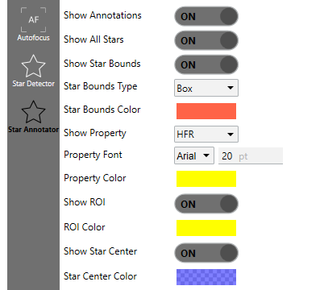
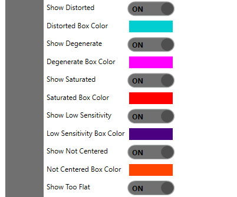

# Star Annotation

Star annotation overlays diagnostic information on top of the image NINA already shows you. After Hocus Focus detects stars, the annotator redraws the frame with a marker around each star, an optional text label (HFR, FWHM, eccentricity, and more), reticules on star centers, the region-of-interest box, and optional boxes that reveal *why* particular candidates were rejected. It is your window into what the detector actually saw, which helps when tuning detection or diagnosing focus problems.

Hocus Focus registers its annotator as a pluggable behavior (it implements NINA's `IStarAnnotator`), so it can be selected from the same dropdown NINA uses for any star annotator. The AutoFocus engine and the Tilt & Aberration Inspector both pick the active annotator through `IPluggableBehaviorSelector<IStarAnnotator>`. The settings below live in the plugin options under the Star Annotator section and persist with your NINA profile.

{ width=620 }
*Annotated frame: accepted stars carry a bounds marker plus a label (here HFR); rejected candidates can be revealed in their own colors.*

## How it works

The annotator converts the displayed image to an 8-bit grayscale canvas, draws every overlay element onto it, and hands the result back to NINA as the image you see. Changing any annotation option triggers a live re-render on a background thread, so you can flip a setting and watch the overlay update without re-running detection.

If **Show Annotations** is off, the annotator returns the image untouched, and nothing else in this page applies until you turn it back on.

Auto Focus is the exception: it measures each frame with its own detection pass and shows the frame unannotated. Turn on **Annotate During Auto Focus** and it overlays that same detection — the very stars that produced the HFR point — onto each frame as the sweep runs.

By default the annotator draws *every* detected star. If you turn **Show All Stars** off, it keeps only the **Maximum Stars** brightest stars (sorted by average brightness) and labels those. The rejection boxes described later are drawn from the detector's metrics independently of this limit, so they always appear in full when their toggle is on.

!!! tip "When this helps"
    On dense fields the labels can become an unreadable wall of text. Turn **Show All Stars** off and cap **Maximum Stars** at, say, a few dozen to keep only the brightest, most reliable measurements visible.

## Display options

These controls govern the always-on overlay drawn for accepted stars. ("Property" is NINA's term for the per-star label / annotation type.)

{ width=402 }

*Display options control which markers and labels the annotator draws over each frame.*

| Setting | Default | Range / values | What it does |
|---|---|---|---|
| Show Annotations | On | on / off | Master switch. *"Toggles the annotations on/off"*. When off, the unmodified image is returned. |
| Annotate During Auto Focus | Off | on / off | Draws the overlay on the displayed image during an Auto Focus run, so you can watch star detection as the sweep progresses. Requires **Show Annotations**. Applies to a normal auto focus only — not to the Aberration Inspector's multi-region run, nor to a replayed run. |
| Show All Stars | On | on / off | *"Whether to annotate all stars"*. When off, only the brightest **Maximum Stars** are labeled. |
| Maximum Stars | 200 | ≥ 1 | *"The maximum number of stars to annotate (the brightest ones)"*. Only applies when **Show All Stars** is off. |
| Show Star Bounds | On | on / off | *"Whether to draw the bounding box or ellipse around the star"*. |
| Star Bounds Type | Box | Box, Ellipse, PSF | *"The type of boundary surrounding the star. Star detection internally uses a box, but an ellipse can be more aesthetically pleasing"*. |
| Star Bounds Color | Red, 50% | ARGB color | *"The color of the bounding box or ellipse around the star"*. |
| Show Property | HFR | None, HFR, FWHM, FWHM X, FWHM Y, FWHM Pixels, Eccentricity, PSF Rotation, Background, PSF Background, PSF Peak, Moffat Beta | *"What type of annotation to show for each star"*. Picks the text label drawn beside each star. |
| Property Color | Yellow | ARGB color | *"The color of the annotation text next to the star"*. |
| Property Font | Arial | system font | Font family used for the text labels. The point size is set with an inline pt box under **Property Font** (no separate label). |
| (font size, inline) | 18 pt | > 0 | Point size of the text labels, set via the inline pt box under **Property Font**. |
| Show ROI | On | on / off | *"Whether to show the region of interest"*. |
| ROI Color | Yellow | ARGB color | *"The color of the region of interest boxes"*. |
| Show Star Center | On | on / off | *"Whether to show a reticule on each star center"*. |
| Star Center Color | Blue, 50% | ARGB color | *"The color of the reticule on each star center"*. |

### Bounds type

The detector always works internally with a rectangular bounding box; the bounds type only changes how that region is drawn:

- **Box** — a plain rectangle around the bounding box.
- **Ellipse** — an ellipse inscribed in the bounding box. Purely cosmetic, often easier on the eye.
- **PSF** — a rotated ellipse sized to the fitted PSF's FWHM and oriented at its rotation angle. This requires PSF modeling to be enabled, and it also nudges the star-center reticule by the PSF's fitted offset so the crosshair sits on the model center rather than the raw centroid.

### Label type

The label drawn beside each star reflects the selected annotation type. **HFR** (the default) shows the Half-Flux Radius in pixels and works for every detected star. The remaining types and their meanings:

| Type | Shows | Needs PSF fit |
|---|---|---|
| None | no label | — |
| HFR | Half-Flux Radius (pixels) | No |
| FWHM | FWHM in arcseconds | Yes |
| FWHM X / FWHM Y | per-axis FWHM (pixels) | Yes |
| FWHM Pixels | FWHM in pixels | Yes |
| Eccentricity | axis-ratio eccentricity | Yes |
| PSF Rotation | fit rotation angle in degrees | Yes |
| Background | sky background at the star | No |
| PSF Background | model background term | Yes |
| PSF Peak | model peak intensity | Yes |
| Moffat Beta | Moffat \(\beta\) parameter (skipped when not finite) | Yes |

!!! note
    Every "Needs PSF fit" label only appears if PSF modeling produced a fit for that star. With PSF modeling off, those types render nothing while **HFR**, **Background**, and **None** still work. See the PSF modeling settings page for how fits are produced.

## Rejection diagnostics

This is where annotation earns its keep. The detector records, per frame, the bounding boxes of candidates it threw out and groups them by the gate that rejected them. Each class has its own toggle (all default **off**) and its own color, so you can light up exactly the failure mode you are chasing. By default these reject boxes share a half-transparent green, so give the ones you are studying distinct colors before comparing them.

{ width=402 }

*Each rejection reason has its own show toggle and box color, so you can see why a candidate was excluded.*

| Toggle | Default color | What it reveals |
|---|---|---|
| Show Distorted | Green, 50% | *"Whether to show the failed stars that were too distorted"*. Candidates whose box-fill / aspect ratio failed the distortion gate. (The gate/reason is "Too Distorted", but the toggle is **Show Distorted**.) |
| Show Degenerate | Green, 50% | *"Whether to show the failed degenerate stars"*. Too few pixels or too little contrast to fit. |
| Show Saturated | Green, 50% | *"Whether to show the partially-saturated stars that were processed with masked pixels"*. Grouped here with rejection diagnostics, but saturated stars are **kept** (measured with their saturated pixels masked during PSF fitting), not rejected. |
| Show Low Sensitivity | Green, 50% | *"Whether to show the failed low sensitivity stars"*. Signal too weak relative to background and noise. |
| Show Not Centered | Green, 50% | *"Whether to show the failed not centered stars"*. Centroid fell outside the centering tolerance. |
| Show Too Flat | Green, 50% | *"Whether to show the failed too flat stars"*. Peak too close to the local background. |
| Show Contaminated | Magenta, 50% | Marks stars flagged by the contamination test (neighbor, gradient, or hot column). |

Each toggle has a companion color setting (Distorted Box Color, Degenerate Box Color, Saturated Box Color, Low Sensitivity Box Color, Not Centered Box Color, Too Flat Box Color, Contaminated Box Color); the six rejection-gate colors all share the tooltip *"The color of the failed star bounding box"*.

**Contaminated** is special. Its tooltip explains: *"Whether to mark stars flagged as possibly contaminated by a neighbor, background gradient, or hot column. The marker is shown whether or not 'Reject Contaminated Stars' is enabled, so you can see which stars were flagged even when they are excluded from measurements"*. In other words the magenta box appears even for stars the detector already removed from the measured set, so you can tell which measurements a nearby star or gradient may have affected. The marker is drawn as the star's bounding box, in **Contaminated Box Color** (magenta, half-transparent by default).

!!! tip "When this helps"
    Turn on **Show Degenerate**, **Show Distorted**, and **Show Low Sensitivity** together to see which stars are being dropped and why. If real stars are vanishing into one rejection color, that gate is too aggressive for your optics; adjust the matching acceptance gate. If a marker sits on noise, the gate is doing its job.

## Structure map overlay (debug)

**Show Structure Map** overlays the detector's binary structure mask so you can see exactly which pixels were treated as potential star structure. Its tooltip: *"Overlays the structure map to aid debugging. Original shows the initial structure map after noise clipping and binarization, and Dilated shows it after dilation has been performed"*.

| Value | Shows |
|---|---|
| None | no overlay (default) |
| Original | the structure map after noise clipping and binarization |
| Dilated | the same map after morphological dilation |

The mask pixels are blended onto the image in **Structure Map Color** (*"The color of the overlayed structure map"*; magenta/purple, half-transparent by default). This control is only exposed when the detector's debug mode is enabled, since it exists for algorithm-level tuning rather than routine use. Leave it off during normal focusing; the overlay obscures the underlying image.

## Practical recipes

!!! example "Tuning detection quality"
    Cap labels (**Show All Stars** off, **Maximum Stars** ≈ 50), then enable the rejection toggles one or two at a time with distinct colors. Walk the gates until the accepted set looks right for your focal ratio and seeing.

!!! example "Checking focus quality across the field"
    Set **Show Property** to FWHM or Eccentricity (PSF modeling required) and watch for consistent, low values near best focus. The star-center reticule makes off-center or trailed stars at the defocus extremes easy to spot.

!!! example "Mapping the PSF across the sensor"
    Combine **Star Bounds Type = PSF** with the Eccentricity or PSF Rotation label to overlay the actual fitted ellipse shape and orientation everywhere in the frame. Systematic stretch toward the corners points to tilt, coma, or curvature, the kind of thing the Tilt & Aberration Inspector quantifies.

!!! example "Understanding contamination in nebulosity"
    Turn on **Show Contaminated** while imaging over bright nebulosity. Because flagged stars draw whether or not they were rejected, you can immediately see which measurements a gradient or close neighbor may be biasing.
