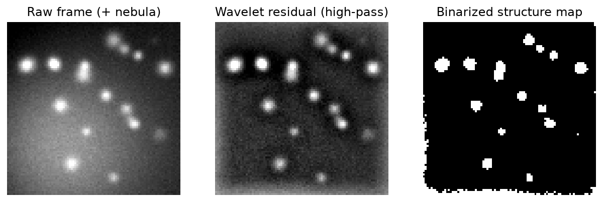
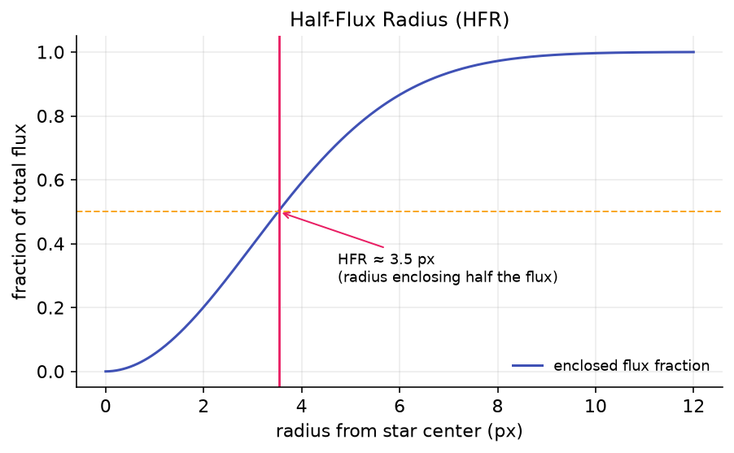
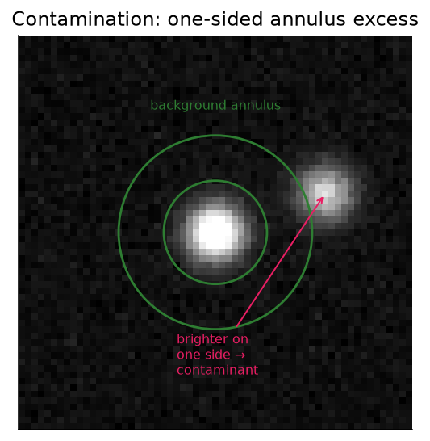
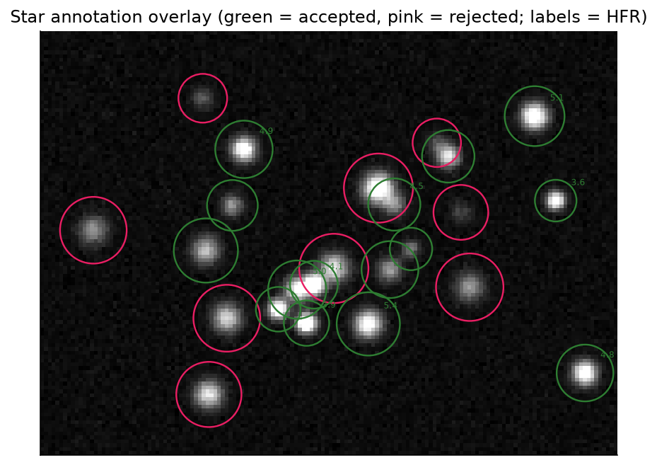

# Star Detection

Everything Hocus Focus does (autofocus, the tilt/aberration inspector, sequence triggers) rests on one
job: finding the real stars in a frame and measuring each one cleanly. The star detector takes a raw
monochrome (or debayered) image and returns a list of accepted stars, each with a sub-pixel centroid, a
local background, a Half-Flux Radius (HFR), and optionally a fitted PSF. It is deliberately conservative:
the goal is not to count *every* point of light, but to keep a clean, well-measured set whose aggregate HFR
is a trustworthy focus signal.

## Why this detector is good

A naive "threshold and count blobs" detector is fooled by the things real astrophotos are full of: nebula
and galaxy gradients, hot pixels, sensor noise, saturated cores, diffraction spikes, close double stars, and
heavily defocused donuts. Hocus Focus addresses these head-on:

- **Large-scale structure is removed before detection** with an à-trous B3-spline wavelet (a multi-scale
  smoothing that separates star-sized structure from large-scale background) residual, so nebulosity and
  sky gradients do not drown faint stars or create spurious blobs.
- **The background is modeled as a tilted plane per star**, not a single number, so a one-sided gradient
  under a star no longer biases its centroid, flux, or HFR.
- **Contamination is detected even under a background gradient**, so a neighboring star bleeding into one side of the
  measurement annulus is flagged and (by default) removed, instead of quietly corrupting the HFR.
- **Multiple independent acceptance gates** reject clipped, distorted, off-center, flat, dim, and
  contaminated candidates, each tracked as a named rejection count you can inspect.
- **Aggregation is robust** (median and median absolute deviation (MAD), plus an explicit outlier pass), so a handful of bad
  measurements cannot drag the reported focus metric around.

Nearly every stage is tunable. This page walks the pipeline in execution order; the
[Settings](../settings/index.md) section documents each knob in detail, and the
[Optimization](../optimization/index.md) section can tune them for you against your own data.

## The pipeline, in order

### 1. Region of interest (crop)

If a detection region smaller than the full frame is configured, the detector crops to that ROI first and
applies all later stages inside it (an optional inner crop can additionally blank out a central region of
the structure map). Working on a crop is faster and lets the inspector analyze sensor regions
independently. The ROI offset is added back to every star's coordinates at the end, so positions are always
reported in full-frame pixels.

### 2. Hot-pixel filtering

Single bright pixels (cosmic rays, sensor defects) look like tiny, intensely peaked stars and would survive
most gates. A 3×3 median replaces a hot pixel with the median of its neighbors while leaving genuine stars
(which span many pixels) essentially untouched. With **Use Hotpixel Thresholding** enabled, only pixels that
exceed their surroundings by the configured threshold are corrected, so real star cores are preserved. For
bayered images the filter runs on the raw CFA before debayering. See
[Hot Pixels & Saturation](../settings/hotpixel-saturation.md).

!!! note
    Hot-pixel filtering also runs automatically whenever measurement noise reduction is enabled, because the
    blurring step would otherwise smear a hot pixel into a small false structure.

### 3. Noise reduction

An optional Gaussian blur (radius configurable) suppresses pixel-to-pixel noise so faint stars rise above
the floor and the structure step is cleaner. It can be applied to the image actually measured, to the
structure-detection copy only, or to neither. Blurring trades a little positional precision for sensitivity,
so it helps most on noisy, short, or high-gain subs and can hurt on already-clean, well-sampled frames. See
[Preprocessing](../settings/preprocessing.md).

### 4. Wavelet structure detection (remove large-scale structures)

This step is what makes the detector insensitive to nebulae and gradients. The detector computes an
à-trous B3-spline wavelet residual over a configurable number of layers and **subtracts it**, which removes
structures larger than the stars while keeping the stars themselves. A short Gaussian smoothing then heals
the holes that subtracting large scales can punch in the middle of big or out-of-focus stars.

{ width=620 }

*Left to right: the raw frame (with nebula), the wavelet residual capturing only star-scale structure, and
the binarized structure map that defines candidate regions.*

The number of **structure layers** is the key knob: too few and large or defocused stars get cut away with
the nebula; too many and the background creeps back in. At very small pixel scales, or when you need a wide
defocus range, more layers help. An opt-in *defocus-aware* mode adds extra layers via a boost so bloated
donut stars survive the subtraction. See [Structure Detection](../settings/structure-detection.md).

### 5. Binarization (noise floor)

The smoothed structure map is thresholded into foreground (star) vs. background. The threshold is the
structure map's median plus the **Noise Clipping Multiplier** times an estimated noise sigma, where the sigma
comes from a Kappa-Sigma noise estimate (an iterative clip-at-k·σ robust estimate) on the noise-reduced image:

\[
T = \text{median} + k_\sigma \cdot \sigma_{\text{noise}}
\]

Raising \( k_\sigma \) demands a stronger signal to count as a star (fewer, more reliable detections);
lowering it admits fainter structure (more stars, more risk of noise). By default this threshold is computed
*per region* rather than once for the whole frame (locally adaptive binarization), so the same multiplier stays
fair across a vignetted or gradient-heavy frame. See [Preprocessing](../settings/preprocessing.md), and
[Adaptive Binarization](../settings/adaptive-binarization.md) for why the default multiplier is 2.

### 6. Optional dilation

A morphological dilation (ellipse element, configurable size and iteration count) can grow the binarized
foreground slightly. This boosts small structures and bridges narrow gaps so a single star is not split into
fragments. By default it can be left off; it is most useful when stars are barely resolved. See
[Structure Detection](../settings/structure-detection.md).

### 7. Connected-component candidate boxes

The detector scans the binarized map and floods each connected foreground region into a candidate, recording
its bounding box and pixel list. Every candidate is collected here with **no size or shape filtering** —
the gates come next. The running total is reported as the *structure candidates* count, the denominator for
all the rejection statistics.

### 8. Per-candidate measurement

For each candidate the detector measures, in order:

- **Local background plane.** Pixels in an annulus around the star (the bounding box expanded by a
  configurable margin) are fit to a tilted plane \( b_0 + b_1\,dx + b_2\,dy \) by robust iteratively
  reweighted least squares with Huber weights. This models a smooth one-sided gradient (galaxy, nebula,
  bright neighbor halo) instead of assuming a flat background. The plane is then subtracted **per pixel**
  everywhere it matters (centroid, flux, and HFR), so a gradient no longer biases the measurement. On a
  flat field the plane equals the annulus median, so nothing changes.
- **Centroid.** An iterative flux-weighted centroid; after the first pass it restricts contributing pixels
  to a circular aperture around the running estimate, so bright off-axis pixels do not pull the center of an
  asymmetric or tilted star.
- **HFR.** The flux-weighted mean radius over the star's circular aperture, sampled on a grid through the
  centroid with the background plane subtracted at each sample. This is the primary focus quantity.

{ width=620 }

*HFR is the radius of the aperture containing half the star's flux, a focus-sensitive size measure that
does not require fitting a model.*

The pixel sampling step controls the HFR grid: a finer step samples undersampled stars more faithfully at
some cost in speed. See [Preprocessing](../settings/preprocessing.md) and
[PSF Modeling](../settings/psf-modeling.md) for the optional model fit (step 10).

### 9. Acceptance gates

Each measured candidate must clear every gate to be accepted. Each gate is also a named rejection counter,
so the metrics panel tells you exactly *why* candidates are being dropped:

| Gate | Rejects when | Tune with |
|---|---|---|
| Too small | bounding box width or height below the minimum box size | Min Bounding Box Size |
| On border | bounding box touches a frame edge (likely clipped) | — |
| Too distorted | fill ratio (pixels / \(d^2\)) below the max-distortion threshold | Max Distortion |
| Degenerate | parameters could not be computed | — |
| Low sensitivity | normalized brightness / noise sigma at or below the sensitivity threshold | Brightness Sensitivity |
| Not centered | centroid falls outside the centered acceptance sub-box | Star Center Tolerance |
| Too flat | star median at or above peak-response × peak (a flat blob, not a peaked star) | Star Peak Response |
| HFR failed / too low | HFR could not be measured, or is at/below the minimum HFR | Min HFR |
| Contaminated | a one-sided neighbor was detected in the annulus (when rejection is on) | Contamination Sensitivity |

The fill-ratio idea behind *too distorted*: a round disk fills about \( \pi/4 \approx 0.79 \) of its
bounding box, while a streak (a satellite trail or merged pair) fills far less. The **Defocus-Aware Gates**
option (opt-in) relaxes the distortion and centering gates for large candidates so bloated donut stars near
the sweep extremes are not thrown away; with it off, detection is unchanged. For telescopes with a central
obstruction, the separate opt-in
[Recover Out-of-Focus Donut Stars](../settings/acceptance-gates.md#recover-out-of-focus-donut-stars) group
goes further, reconnecting fragmented hollow rings and treating them like filled disks so they survive at
all. Full per-gate detail lives in [Acceptance Gates](../settings/acceptance-gates.md).

!!! note "Saturated stars are kept, not rejected"
    A partially-saturated star (background + peak at or above the saturation threshold) is **not** rejected.
    It is tracked in the saturation metric, and if PSF modeling runs, its clipped core pixels are masked
    during the fit rather than discarding the star. See
    [Hot Pixels & Saturation](../settings/hotpixel-saturation.md).

#### Gradient-robust contamination test

The contamination test reuses the robust background plane from step 8: it subtracts the fitted plane from
the annulus pixels, splits the residuals into eight angular sectors, and flags the star only when a single
sector shows a one-sided **positive** residual excess above the contamination-sensitivity threshold (scaled
by a local, MAD-based noise estimate). Because a contaminant *adds* light, the test ignores both smooth
gradients (already removed by the plane fit) and edge-clip deficits, which are negative.

{ width=620 }

*A neighboring star brightens one side of the annulus. The plane fit absorbs smooth gradients; a one-sided
positive bump in a single sector is what trips the contamination flag.*

By default, contaminated stars are **rejected** so the HFR and PSF statistics stay clean; you can instead
keep and merely flag them (used by the diagnostics tooling). See
[Contamination](../settings/contamination.md).

### 10. Optional PSF modeling

When enabled (off during autofocus, where speed matters), each accepted star is fit with a Gaussian or
Moffat point-spread function in parallel. A fit is accepted only if its \( R^2 \) meets the goodness-of-fit
threshold; otherwise it is counted as a PSF failure and the star keeps its empirical HFR. The PSF yields
sigma, FWHM in arcseconds, and eccentricity, the shape metrics the tilt/aberration inspector relies on. See
[PSF Modeling](../settings/psf-modeling.md) and the
[Tilt / Aberration Inspector](tilt-aberration-inspector.md) overview.

### 11. Outlier rejection and aggregation

The surviving stars are aggregated into the frame-level numbers. By default the detector reports the
**median** HFR (robust to a few bad measurements). In the mean-with-outlier-rejection mode it first computes
the median and MAD, then discards stars outside

\[
\text{median} - k_{\text{low}}\,\text{MAD} \;\le\; \text{HFR} \;\le\; \text{median} + k_{\text{high}}\,\text{MAD}
\]

before averaging the rest. PSF-derived sigma, FWHM, and eccentricity are likewise aggregated by median and
MAD across the stars that fitted successfully. The result is one clean HFR (and shape) value per frame: the
signal autofocus and the inspector consume.

{ width=620 }

*The final accepted set (green) versus rejected candidates (pink), each labeled with its HFR. This overlay
is what the annotator draws on the image.*

## Where to go next

- Tune any stage: the [Settings](../settings/index.md) section has one page per pipeline area.
- Let the plugin tune detection against your own focus runs:
  [Optimization](../optimization/index.md).
- See the data behind the detector's key defaults:
  [Precision & Recall](../settings/precision-recall.md).
- See how the accepted stars are drawn on the image:
  [Star Annotation](star-annotation.md).
