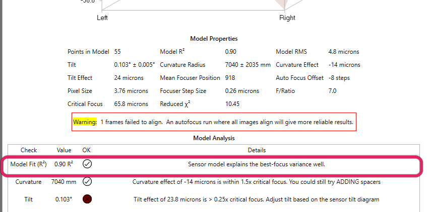
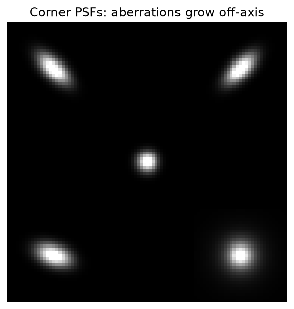
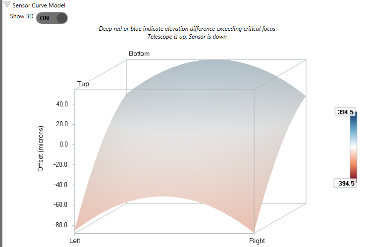
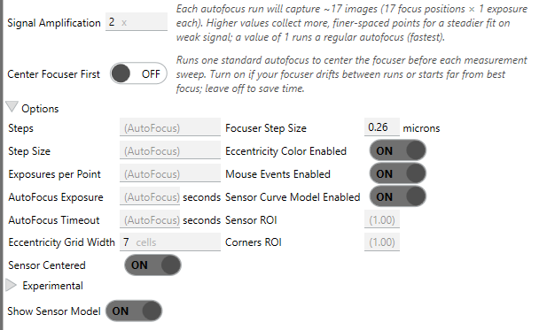

# Tilt &amp; Aberration Inspector

The **Aberration Inspector** is a dockable panel that drives an autofocus run (or a single snapshot)
and turns the result into a quantitative picture of how your sensor sits in the optical train. It
answers the questions a single center-of-frame focus number cannot: *Is one corner sharper than the
other? Is the field bowed? Is my backfocus right?* (Backfocus is the spacing between the
corrector/flattener and the sensor.) When paired with a tilt-adapter calibration, the inspector
translates those numbers into concrete screw-turn guidance.

## Sensor tilt, in one paragraph

A camera sensor should sit perfectly perpendicular to the optical axis. When it does not, best focus
is reached at a *different* focuser position on each side of the frame: stars on one edge are tight
while the opposite edge is bloated, no matter where you park the focuser. That asymmetry is **tilt**.
A separate but related defect, **field curvature**, is when the best-focus surface is not flat but
bowl- or dome-shaped, so the corners and the center focus at different positions even with zero tilt.
The inspector measures both, plus the axial **backfocus** offset between the center and the corners.

{ width=620 }

*A best-focus offset map: tilt shows up as a smooth gradient across the sensor, curvature as a
center-to-corner bowl. The inspector separates the two.*

## What the inspector measures

Running a **Detailed Analysis** performs an autofocus across several regions of the frame at once.
Per the tooltip, this is used to "detect various aberrations, such as tilt, incorrect backfocus, and
field curvature." The panel reports, among others:

{ width=620 }

*The inspector reports tilt, curvature, and backfocus, then grades each against critical focus.*

| Measurement | What it means (from the panel tooltips) |
|---|---|
| **Tilt** | "The angle the sensor is tilted. 0 indicates no tilt, and values here are typically very small." |
| **Tilt Effect** | "The maximum nominal distance from the corners of the sensor to the center, due purely to the modeled tilt." |
| **Curvature Effect** | "The nominal distance from the corner of the sensor to the center, due purely to the modeled curvature. Curvature effect is more exaggerated on larger sensors." |
| **Curvature Radius** | "Near focus, the base of the sensor parabola is close to a sphere. This value represents the radius of that sphere. Larger values indicate flatter curves, which are better." |
| **Critical Focus** | "The focuser distance a pixel can be from optimal focus before the effects can be noticed. This value increases with larger (slower) F/ratios, which can tolerate more curvature before affecting image quality." |
| **Mean Focuser Position** | "The weighted mean focuser position under the sensor curve … a focus point where pixels throughout the sensor have minimum absolute distance from optimal focus." |
| **Auto Focus Offset** | "The number of focuser steps between the AutoFocus position and the Sensor Mean Focuser Position." |

A lighter-weight **Simple Analysis** "[takes] a single exposure to produce a FWHM contour map and
Eccentricity vector field," useful for a quick look at off-axis aberrations without a full sweep.

{ width=620 }

*Off-axis aberration grows toward the corners. The eccentricity vector field and FWHM contour from a
Simple Analysis make this pattern visible at a glance.*

## How it measures it

The Detailed Analysis fits a focus curve **per region** rather than just at the center. Internally it
evaluates the full field plus five named regions (center, top-left, top-right, bottom-left, and
bottom-right) and records each region's estimated best-focus position and its goodness-of-fit
(\(R^2\)).

### The tilt plane

The four corner positions are fed to an ordinary-least-squares fit of a plane over the sensor in
normalized image coordinates that run from \(-0.5\) to \(+0.5\) on each axis:

\[
\text{Focus}(x, y) = A\,x + B\,y + C
\]

\(A\) and \(B\) are the tilt slopes in the horizontal and vertical directions (in focuser steps per
normalized image unit), and \(C\) is the mean focus plane. Each corner's required adjustment (the
**Adj Steps** / **Adj Microns** columns) is its best-focus position minus the mean, reported in
focuser steps (and in microns, if you have set *Focuser Step Size*).

### The full sensor surface (optional)

Turning on **Sensor Curve Model Enabled** goes further. Per its tooltip, it will "in addition to analyzing
AutoFocus curves for the corners and center, create a paraboloid model of the sensor by creating
focus curves for every star. This enables calculation of centering error and curvature, and is
similar to the type of analysis done by CCD Inspector." Stars are matched across frames (the panel
notes "[each] star needs to be matched across at least 5 of the frames, and some star fits are
rejected as outliers during modeling"), optionally after RANSAC alignment, and a paraboloid is fit
through the per-star best-focus positions. For the surface model itself, the weighted fit, and how
outliers are detected and rejected, see [Sensor Model Fitting](sensor-model.md).

{ width=620 }

*The sensor curve model: a 3D surface of best-focus offset across the sensor (telescope up, sensor down).*

!!! tip "When the surface model helps"
    Turn on **Sensor Curve Model Enabled** when you intend to physically correct tilt or want curvature and
    centering numbers, not just a corner-vs-center plane. It is heavier (it fits a curve for every
    matched star) and needs enough matched stars to be meaningful, so leave it off for a quick tilt
    check.

!!! note "When frames fail to align or come back empty"
    Matching stars across frames is hardest at the defocused extremes of the sweep, where stars are
    bloated and sparse. The matcher chains alignment through neighboring frames, retries against a
    denser reference, and escalates its search box for the hardest frames rather than giving up, so the
    "*N frames failed to align*" condition is rare. See [cross-frame
    registration](sensor-model.md#from-stars-to-data-points) for how these fallbacks work. If you still
    hit it, collect more stars on the weak frames (a wider exposure, or the
    [donut-recovery settings](../settings/acceptance-gates.md#recover-out-of-focus-donut-stars)) and
    re-run.

    A frame where the detector finds no stars at all (one from an extreme end of the sweep, or one
    lost to cloud) does not stop the analysis. It is skipped, and the run reports
    "*N frame(s) had no detected stars and were skipped*". Such a frame cannot align either, so
    with **Align images before matching** on, it also counts toward the failed-to-align total. To see
    which frame it was, run with **Keep frames for Review** on and open **Review Frames**, where it
    reads *Detected stars: 0*. If every frame comes back empty there is no reference frame to build
    on and the analysis stops outright, reporting
    "*Sensor modeling failed. None of the N frames in this run had any detected stars*"; longer
    exposures or looser detection settings are the fix.

## Correcting tilt with a tilt adapter

Once tilt is measured, a **tilt adapter** lets you correct the linear (tilt-plane) part of it. The
**Tilt Adapter Wizard** learns where each screw sits relative to your sensor and the adapter's
hardware model, then converts the measured tilt into concrete screw-turn (or stepper-step)
instructions. See [Tilt Adapter Wizard](tilt-adapter-wizard.md).

The arrows describe what the adapter must do: ⬆ means that corner of the adapter plate moves toward
the objective, ⬇ toward the camera, the same on every rig with the same **Increasing focuser
position** setting ([below](#which-way-does-your-focuser-travel)). ⬆ and ⬇ are the larger moves,
↑ and ↓ the smaller ones. In the **Tilt** row the sizing is relative: a screw needing at least half
the largest correction in the row gets a large arrow, one needing under a tenth of it gets a dash.
In the **Backfocus** row it is absolute, taken from the measured **Curvature Effect**: a dash below
10 µm, a small arrow up to 50 µm, a large arrow at 50 µm or more. That row reads the same on every
screw, because backfocus moves the whole plate, and it appears only once a sensor curve model has
been fit, since the curvature it corrects comes from that fit.

Below the arrows, a second table gives the amount for each screw. Its three rows split the job into
**Tilt**, **Backfocus**, and the **Total** you apply, and each amount carries the rotation that
produces it: `1.25 ⟳` means 1.25 turns clockwise (tighten), `0.50 ⟲` counter-clockwise (loosen). A
screw with nothing worth turning shows a dash instead. Stepper adapters show signed steps
(`+35 steps`) matching the wizard's prompts; screw adapters get a **Display** selector for Turns,
Degrees, or Minutes (60 minutes to a turn, a clock face rather than arcminutes). This table also
needs a fitted sensor curve model, plus the adapter's thread pitch (or stepper step size) and screw
radius from the wizard. A legend at the top of the section defines both conventions and is marked
"(assumed)" until the adapter direction has been measured in the wizard.

If the thread pitch (or stepper step size) saved for your adapter differs by more than 15% from the
value the wizard last measured, a warning box naming both appears under the numbers. The amounts
above are computed from the saved value, so settle that difference in the Tilt Adapter Wizard, by
re-running the calibration or adopting the measured value, before you act on them.

With a connected motorized adapter, the guidance section also shows the adapter's live motor
positions and an **Automatic Adjustment** button: after you approve the planned motor moves in a
review dialog, the inspector sends them to the adapter itself. See [Motorized Tilt
Adapter](motorized-tilt-adapter.md#automatic-adjustment).

The whole correction loop can be rehearsed in the daytime against the
[Camera Simulator](camera-simulator.md#rehearse-a-tilt-calibration-in-the-daytime), which injects a
known tilt and provides on-screen buttons standing in for the adapter's screws.

## Inspector options

These settings live in the inspector panel (not the main Options page). Defaults and ranges are taken
from the option definitions; descriptions quote the in-app tooltips where one exists. The alignment,
star-matching, outlier-rejection, and save-images settings (plus **Astigmatic field curvature** and
**Min R² (rejection)**) sit inside an **Experimental** sub-expander within the Options section.

{ width=519 }

*The inspector's Options section sets the analysis grid, exposures, and sensor-model behavior.*

| Setting | Default | Range | What it does |
|---|---|---|---|
| **Eccentricity Grid Width** | 7 | odd, positive | "How many cells wide to divide the sensor pixels when generating a grid of eccentricity vectors … the height will be calculated proportionally." |
| **Focuser Step Size** | blank | blank or &gt;0 | µm of focuser travel per step. Blank uses the value your focuser driver reports (shown greyed out in the box); a value here overrides it. See [below](#where-the-focuser-step-size-comes-from). |
| **Increasing focuser position** | Moves camera away from objective (standard) | standard / reversed | Which way your focuser travels. Affects direction labels and diagrams only — see [below](#which-way-does-your-focuser-travel). Also editable under Options → Hocus Focus → Auto Focus. |
| **Sensor ROI** | 1.0 | 0.1–1.0 | "Uses only a centered portion of the full sensor when evaluating aberration. This is useful if you have a flattener that cannot produce a flat field for your sensor." |
| **Corners ROI** | 1.0 | 0.1–1.0 | "Reduces the size of the corner regions when performing corners analysis … evaluate only stars closer to the corners than the full 1/9th region. This can be combined with Sensor ROI." |
| **Sensor Curve Model Enabled** | off | on/off | "Create a paraboloid model of the sensor by creating focus curves for every star. This enables calculation of centering error and curvature … similar to … CCD Inspector." |
| **Show Sensor Model** | on | on/off | Displays the 3D surface model in the panel. |
| **Sensor Centered** | on | on/off | "Assume the sensor is perfectly centered in the optical train. If this option is off, the sensor location will be modeled along with the other model parameters." |
| **Astigmatic field curvature** | off | on/off | "When off (default), field curvature is modeled as rotationally symmetric … Enable to fit independent X and Y curvature, representing the saddle-shaped field of an astigmatic optical train. Adds one free parameter." |
| **Align images before matching** | on | on/off | Align frames with RANSAC before matching stars, so matching stays reliable at the defocused ends of the sweep. |
| **Use affine alignment (diagnostic)** | off | on/off | Use a 6-DOF affine transform (adds shear) instead of similarity; only enabled when **Align images before matching** is on. |
| **Outlier rejection** | on | on/off | Drop matched stars whose per-star hyperbolic fit is too poor. |
| **Match using brightness** | off | on/off | Enable an adaptive search that rejects matched stars whose brightness differs too much. |
| **Starting Brightness Tolerance** | -1 (auto) | -1 or &ge;0.01 | Starting brightness tolerance for the adaptive match search; -1 starts from the previous run's value. |
| **Min R² (rejection)** | 0.05 | 0–1 | Minimum model \(R^2\) for acceptance; only triggers rejection when reduced \(\chi^2\) also fails. |
| **Eccentricity Color Enabled** | on | on/off | "Enable color on the eccentricity map." |
| **Mouse Events Enabled** | on | on/off | "Enable mouse events on charts to scroll, pan, and zoom. Disable this if you don't want the charts to intercept mouse actions." |
| **Steps** | -1 (auto) | -1 or &gt;0 | "The minimum number of data points needed on each side of the AutoFocus curve minimum. Uses the value set for AutoFocus if blank." |
| **Step Size** | -1 (auto) | -1 or &gt;0 | "How many focuser steps in between each data point … Uses the value set for AutoFocus if blank." |
| **Signal Amplification** | 1 | &ge;1 | "Increases the resolution and signal of sensor-model / tilt calibration runs by capturing more, finer-spaced focuser points. The focuser step size is divided by this factor and the number of steps multiplied by it, so the sweep covers the same range with more points (and smaller defocus jumps between adjacent frames, which makes star alignment more reliable) … Applies to live captures only." Off by default: each step multiplies the exposures a sweep captures, and a tilt calibration is seven sweeps. Raise it for faint fields or poor seeing. Sits above the Options expander, with a live estimate of the images each run will capture. |
| **Center Focuser First** | off | on/off | "When on, a quick standard AutoFocus is run before each live sensor-model / tilt calibration sweep to center the focuser at best focus. The detailed sweep then brackets focus symmetrically, which reduces extreme one-sided defocus frames that fail to align … Has no effect when replaying saved frames." Sits above the Options expander, next to Signal Amplification. |
| **Exposures per Point** | -1 (auto) | -1 or &ge;1 | "How many exposures to average together for each focuser point. Uses the value set for AutoFocus if blank." |
| **AutoFocus Timeout** | -1 (auto) | -1 or &gt;0 | "How long, in seconds, after which AutoFocus should time out and fail. Uses the value set for AutoFocus if blank." |
| **Simple Analysis exposure** (the unlabeled seconds box beside **Take Exposure**) | -1 (auto) | -1 or &gt;0 | "How long of an exposure to take for analysis. Defaults to the Auto Focus exposure duration if not set." Sets the exposure for the single-frame Simple Analysis. |
| **AutoFocus Exposure** | -1 (auto) | -1 or &gt;0 | Per-frame exposure for a Detailed Analysis sweep; defaults to the AutoFocus exposure duration when blank. The **Simple Analysis exposure** box sets the single-frame exposure instead. |
| **Looping** | off | on/off | "If enabled, repeatedly take and analyze exposures." |

!!! tip "Sensor ROI protects the tilt fit"
    Restricting analysis to the well-corrected center (**Sensor ROI**) keeps a corner your
    flattener cannot correct from polluting the tilt fit.

### Where the focuser step size comes from

The focuser step size is the scale that turns everything the inspector measures — which is measured in
focuser positions — into microns. It sets the curvature and tilt effects in µm, the per-screw corrections,
and the backfocus error.

It resolves in this order:

1. **What you typed** in **Focuser Step Size**, if anything.
2. **What your focuser driver reports**, if it reports a usable value. Most drivers do, so most people never
   need to touch this. The greyed-out hint in the box shows the value that will be used.
3. **Nothing** — micron readouts are hidden rather than guessed.

!!! warning "⚠ differs from the focuser driver"
    If you type a value and it disagrees with the driver's by more than 1%, the box shows this flag. It is
    informational: **your** value is the one being used, and if you measured it yourself it is very likely the
    better of the two.

    It is worth a look, though, because the driver field is optional in ASCOM and some drivers fill it in
    wrongly. The common failure is a driver reporting `1` — meaning "one step per step" rather than one micron
    per step — which would scale every micron the inspector reports by whatever your real step size is.

    To go back to the driver's value, clear the box.

### Which way does your focuser travel?

Everything the inspector measures is in focuser positions. Turning one of those measurements into a
sentence about the real world — "move the sensor **towards** the flattener", "⬆ = toward the
objective", "Telescope is up" — needs one more fact that no driver reports: whether a **higher**
focuser position moves your camera *away* from the objective, or *toward* it.

Almost every focuser is the first kind, so **Increasing focuser position** defaults to **Moves camera
away from objective (standard)**. If your focuser is wired or geared the other way, set it to
**reversed** and the labels follow.

!!! info "This setting can only be wrong on a label"
    It affects direction **labels and diagrams only**: the tilt-table captions, the Telescope/Sensor
    labels on the sensor model, the spacer advice, the ⬆/⬇ motion arrows, and the wizard's direction
    wording. It can never change a measurement, a stored screw angle, or a correction — the tilt
    adapter's direction is measured in focuser units, and the focuser convention cancels out of that
    measurement entirely.

    So if the labels read backwards on your rig, just flip this. Nothing you have already calibrated
    is affected, no numbers change, and nothing starts turning the other way.

    One narrow exception, worth knowing about: if you skip the wizard's **Measure direction** step and
    set the adapter direction by hand, that hand-entered direction *is* interpreted through this
    setting. Running the six-step calibration overwrites it with a measurement that does not depend on
    this setting at all.

## Running it from a sequence

The **Run Aberration Inspector** sequence instruction performs a Detailed Analysis unattended. It
validates that the camera and focuser are connected before running and fails the instruction if the
analysis does not complete. Its estimated duration is built from the configured step count, exposure
time, and a focuser settle allowance (the focuser-settle setting plus two seconds), scaled by the
number of autofocus attempts and capped to guard against unreasonable estimates, so a long sequence
plan can budget time for the run.
