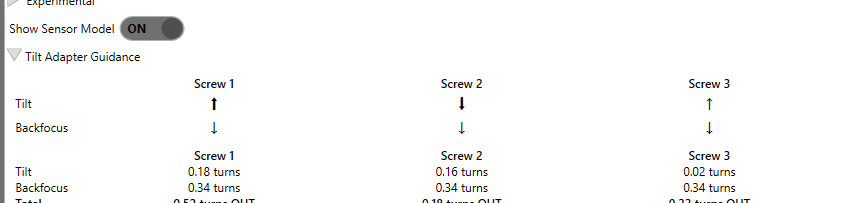

# Tilt Adapter Wizard

A measured tilt plane tells you which corners need to move and by how much, but turning a screw moves
the sensor along that screw's own axis. To convert the [Tilt & Aberration
Inspector](tilt-aberration-inspector.md) measurement into a concrete instruction (*"turn this screw
inward ¼ turn"*), the wizard must know where each screw sits relative to the sensor and how far a turn
moves it. That mapping is established once by the **Tilt Adapter Wizard**.

{ width=620 }

*Tilt Adapter Guidance turns the model into concrete per-screw adjustments: direction and number of turns.*

## The screw-angle convention

Screw orientations are stored as angles measured **clockwise from straight up (12 o'clock)**: `0°` is
the top of the sensor, `90°` is to the right, `180°` is the bottom, `270°` is to the left. The wizard
stores one angle per screw (`Screw1AngleDegrees` … `Screw4AngleDegrees`).

!!! warning "Orientation is tracked in image space, not physically"
    A star diagonal, a mirror, or a rotator can flip the sensor's orientation inside the camera body,
    so screws numbered clockwise on the physical adapter can appear counter-clockwise in the image.
    The wizard therefore derives the winding direction from the actual measurements rather than
    assuming clockwise. Do not reason about screw numbers from the physical adapter; trust the
    calibrated image-space angles.

## 3-screw vs 4-screw adapters

The adapter type is set by the **Screws** field (default `3`).

- **3-screw adapter**: screws are independent and spaced about `120°` apart. The wizard labels
  Screw 1 at the top (12 o'clock) and numbers the rest clockwise, then solves for the three angles
  with an equal-spacing constraint, splitting measurement error evenly between them.
- **4-screw adapter**: screws are spaced about `90°` apart and **opposite screws are mechanically
  coupled**, so adjustments are made in pairs (turn one in while the opposite turns out). The wizard
  exploits this: "opposite screws are always 180° apart regardless of mirroring," so it measures two
  screws and places the other two 180° across.

## The calibration loop

The wizard establishes the screw-to-tilt mapping empirically. You take a **baseline** measurement,
then follow on-screen instructions to turn screws by a known amount (the wizard prompts, e.g., "turn
ALL screws INWARD exactly 1 full turn each," then per-screw steps), re-measuring after each. From the
change in the tilt vector \((\Delta A, \Delta B)\) it computes each screw's angle and the sign of its
effect (`ScrewInwardCurvatureSign`: whether turning a screw inward pushes that side away from or
toward the telescope). To average out seeing, set **Measurements** above 1; the wizard flags
inconsistent repeats so you can re-run.

!!! tip "Each calibration step runs a full inspector sweep"
    A calibration measurement is a full sensor-model sweep, so it runs the same alignment and
    focus-centering steps as a standalone Detailed Analysis. With **Center Focuser First** on (the
    default), each step re-centers
    the focuser at best focus before its sweep, so the measurement is not skewed toward one side of
    focus. **Signal Amplification** gives each step more, finer-spaced focus points for a steadier
    per-star fit. For a heavily-defocused frame that would otherwise fail to register, the frame aligner
    escalates its search rather than dropping the frame from that step's model. These help most on faint
    fields or in poor seeing, and are set under [Inspector
    options](tilt-aberration-inspector.md#inspector-options). Raising **Measurements** above 1 averages
    independent repeats on top of them.

!!! note "Set Microns per Focuser Step for the best guidance"
    Per its tooltip, *Microns per Focuser Step* is "how much the focuser moves per step, in microns.
    If this is set, the adjustment chart will include adjustments in microns." Without it, adjustments
    are still reported in focuser steps, and the tilt-angle calculation falls back to the connected
    focuser's reported step size when available.

!!! tip "Tilt, backfocus, and curvature: what the screws can fix"
    The Sensor Model splits the focus surface into two effects. The **Tilt Effect** is the linear
    plane (one side focuses ahead of the opposite side); you null it by moving the screws
    *differentially*, reported as the per-screw **Tilt** amount.

    The **Curvature Effect** is the symmetric corners-versus-center bowl. The wizard reads it as a
    spacing error and derives a **backfocus** correction from it, reported as the per-screw
    **Backfocus** amount: turn all screws the same way to move the whole sensor along the optical axis
    (or add spacers for changes beyond the adapter's travel), then re-measure and repeat until the
    Curvature Effect stops dropping. What remains is the residual curvature of a correctly spaced
    system, set by your corrector design and focal ratio; the adapter cannot remove it (a
    better-matched corrector or stopping down does).

## Hardware model and device presets

The calibration above tells the inspector *which* screws to move and the focus deviation to remove.
To turn that into a number of turns (or stepper steps) rather than focuser steps, the wizard needs the
adapter's **physical hardware model**:

| Hardware field | Meaning |
|---|---|
| **Adjustment Type** | Whether the adapter is adjusted by **Screws** (reported in turns) or **Stepper Motors** (reported in steps). |
| **Thread Pitch** | Axial microns the sensor moves per full screw turn; used when Adjustment Type is Screws. |
| **Stepper Step Size** | Axial microns per stepper step; used when Adjustment Type is Stepper Motors. |
| **Screw Radius** | Distance of each adjuster from the sensor center, in millimeters; converts a tilt *angle* into an axial movement at the screw. |

**Device presets.** Rather than entering those numbers by hand, pick your adapter from the **Device**
list. Choosing a preset pre-fills and locks the hardware fields to the manufacturer's values. The
built-in presets are:

| Device | Adjustment | Adjusters | Thread Pitch (µm/turn) | Stepper Step (µm) | Screw Radius (mm) |
|---|---|---|---|---|---|
| Neumann CTU XT48 | Screws | 3 | 400 | — | 44 |
| ASG Photon Cage - 78mm | Screws | 4 | 212 | — | 44 |
| ASG Photon Cage - 90mm | Screws | 4 | 212 | — | 50 |
| ASG Electronic EAT - 90mm | Stepper Motors | 4 | — | 1.8 | 55 |
| ASG Photon Cage - ZWO 461 | Screws | 4 | 212 | — | 54 |
| ASG Electronic EAT - ZWO 461 | Stepper Motors | 4 | — | 1.8 | 62.75 |

The ASG Photon Cage adjusters are 120 TPI, which is 211.7 µm per full turn (the manufacturer rounds
this to ~212). For the motorized EAT units the Screw Radius column is the radius of the motors from
the sensor center.

**Not in the list?** Pick the **"Manual"** entry. It leaves every hardware field editable, so you can
enter your adapter's adjustment type, screw count, thread pitch (or stepper step size), and screw
radius yourself.

!!! note "The wizard cross-checks the hardware values it measures"
    A calibration run also *measures* an effective thread pitch / stepper step size from how far the
    sensor actually moved. The wizard remembers the last measured value and **warns you if it diverges
    from the configured value**, which usually means the wrong preset is selected or a number was
    mistyped. Without a valid hardware model, adjustments are still reported in focuser steps (and, if
    *Microns per Focuser Step* is set, in microns); you just do not get the turn/step figure.

## Saving and replaying a calibration run

Calibration involves several focus sweeps, which are expensive to repeat. Turn on **Save Calibration
for Replay** and the wizard writes each step's autofocus run (plus a `metadata.json`) into the folder
you choose, so a calibration can be re-analyzed later without going back to the telescope.

The **Replay** button next to **Calibrate** re-runs the analysis on a saved folder. Because the run
was saved with the star-detection settings used at capture time, it first asks how to apply settings:

- **Use current settings**: replay with your current profile's star-detection and tilt-calibration
  settings.
- **Use the captured settings (don't change my profile)**: replay with the star-detection settings
  from when the calibration was captured, held in memory only; your profile is left untouched.
- **Update my profile to the captured settings**: overwrite your profile's star-detection settings
  with the captured ones, then replay.

!!! tip "Tuning detection against a saved calibration"
    Replay is the daytime tuning loop for the inspector: save a calibration once at the scope, then
    iterate on detection settings indoors (for example, after running the [Optimization
    Wizard](../optimization/index.md)) and replay with *Use current settings* to compare. It is the
    same idea as [replaying an autofocus run](autofocus.md).
