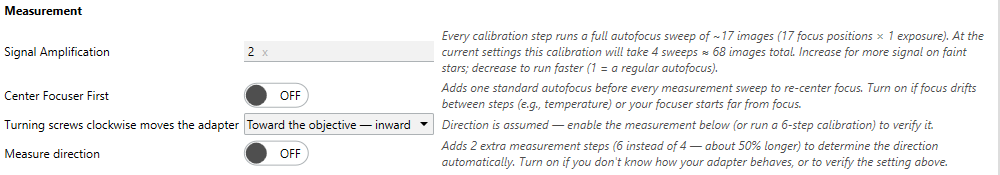

# Tilt Adapter Wizard

A measured tilt plane tells you which corners need to move and by how much, but turning a screw moves
the sensor along that screw's own axis. To convert the [Tilt & Aberration
Inspector](tilt-aberration-inspector.md) measurement into a concrete instruction (*"turn this screw
clockwise ¼ turn"*), the wizard must know where each screw sits relative to the sensor and how far a
turn moves it. That mapping is established once by the **Tilt Adapter Wizard**. (To practice the
measure-and-correct loop before working on real hardware, see the
[Camera Simulator](camera-simulator.md#rehearse-a-tilt-calibration-in-the-daytime).)

{ width=620 }

*Tilt Adapter Guidance turns the model into concrete per-screw adjustments: direction and number of turns.*

## The screw-angle convention

Screw orientations are stored as angles measured **clockwise from straight up (12 o'clock)**: `0°` is
the top of the sensor, `90°` is to the right, `180°` is the bottom, `270°` is to the left. The wizard
stores one angle per screw (`Screw1AngleDegrees` … `Screw4AngleDegrees`). The stored angle is the
direction the best-focus tilt *responds* in, not where the screw sits: on adapters where a clockwise
turn moves the plate toward the **camera**, that turn lowers best focus at the screw, so the stored
angle sits 180° from the screw's physical position in the image. The wizard's diagram and the
saved-calibration readout always show the **physical** position, and [Manual Calibration
Entry](#manual-calibration-entry) always takes the physical angle, so you never have to do that
conversion yourself.

!!! warning "Orientation is tracked in image space, not physically"
    A star diagonal, a mirror, or a rotator can flip the sensor's orientation inside the camera body,
    so screws numbered clockwise on the physical adapter can appear counter-clockwise in the image.
    The wizard therefore derives the winding direction from the actual measurements rather than
    assuming clockwise. Do not reason about screw numbers from the physical adapter; trust the
    calibrated image-space angles.

## 3-screw vs 4-screw adapters

The adapter type is set by the **Screws** field (default `3`).

- **3-screw adapter**: screws are independent and spaced about `120°` apart. The wizard labels
  Screw 1 at the top (12 o'clock) and numbers the rest clockwise, then solves for the three angles
  with an equal-spacing constraint, splitting measurement error evenly between them.
- **4-screw adapter**: screws are spaced about `90°` apart and **opposite screws are mechanically
  coupled**, so adjustments are made in pairs (tighten one while the opposite loosens). The wizard
  exploits this: opposite screws are always 180° apart regardless of mirroring, so it measures two
  screws and places the other two 180° across.

## The calibration loop

The wizard establishes the screw-to-tilt mapping empirically. The core run is **four steps**: a
**baseline** measurement, a screw 1 move, a re-baseline, and a screw 2 move. By default the wizard adds
a fifth: **Measure final re-baseline** (on by default, in the **Measurement** section) restores the
screw 2 move and measures it once more. That gives screw 2's move the same bracketed reference screw
1's already has, referenced to the midpoint of the re-baselines on either side of it, which cancels
steady drift between steps instead of leaving it in the reading. Turn the setting off to skip the extra
autofocus run if your setup is thermally stable and drift is not a concern.

The move steps prompt a known amount of motion, worded as clockwise/counter-clockwise (tighten/loosen)
turns for screws (e.g., "Turn screw 1 CLOCKWISE exactly 1 full turn") and as signed +/− steps for
stepper adapters; every step ends with a measurement. From the change in the tilt vector \((\Delta A,
\Delta B)\) it computes each screw's angle. With a connected [motorized
adapter](motorized-tilt-adapter.md#hands-off-calibration), the wizard sends these moves itself
instead of prompting for them.

None of those steps measure which way a clockwise turn moves the adapter. That direction
comes from the adapter direction setting in the wizard's **Measurement** section, labeled **Screw ⟳
moves adapter** (or **+ steps move adapter** for steppers):
either **Toward the camera** (outward, the default) or **Toward the objective** (inward). Until it
is measured, guidance marks the direction "(assumed)". To measure it, turn on **Measure direction**:
this adds two steps (an all-screws-clockwise move plus a return to baseline) and reads the direction
off the **change in mean best-focus position** between them. Turning every screw clockwise is a pure
piston, so if the mean best-focus position *drops*, the plate moved toward the camera — on a standard
focuser, that means clockwise moves the adapter toward the camera. The saved calibration then reports
the direction as measured. That same all-screws step also feeds the **Piston-implied** pitch estimate
described below. To average out seeing, set **Measurements to average** above 1; the wizard flags
inconsistent repeats so you can re-run.

The measurement itself needs no knowledge of which way your focuser travels — the focuser convention
cancels out of it. Only the *wording* of the direction selector depends on it, so the selector reflects
your **Increasing focuser position** setting (see [Aberration Inspector](tilt-aberration-inspector.md#which-way-does-your-focuser-travel));
on a reversed focuser the same stored measurement reads as the opposite mechanical direction.

{ width=620 }

*The Measurement section configures each calibration sweep and sets which way a clockwise turn moves the adapter.*

A calibration measurement is a full sensor-model sweep, so it runs the same alignment and
focus-centering steps as a standalone Detailed Analysis. **Center Focuser First** (off by default)
re-centers the focuser at best focus before each step's sweep, so the measurement is not skewed
toward one side of focus. **Signal Amplification** gives each step more, finer-spaced focus points
for a steadier per-star fit. Both settings help most on faint fields or in poor seeing, and both are
editable in the wizard's **Measurement** section (they are the same settings as the [Inspector
options](tilt-aberration-inspector.md#inspector-options)), which also shows a live estimate of the
images each sweep captures and the total for the whole calibration. Heavily-defocused frames that
would otherwise fail to register are not dropped from a step's model: the frame aligner escalates
its search instead (see [cross-frame
registration](sensor-model.md#from-stars-to-data-points)).

!!! note "Focuser Step Size drives the micron figures"
    *Focuser Step Size* is how far the focuser moves per step, in microns. It normally comes from your
    focuser driver with no setup at all; you only need to type a value if your driver does not report one,
    or reports it wrongly. See [where it comes
    from](tilt-aberration-inspector.md#where-the-focuser-step-size-comes-from). Without any value at all,
    adjustments are still reported in focuser steps.

## What the screws can fix

The Sensor Model splits the focus surface into two effects. The **Tilt Effect** is the linear
plane (one side focuses ahead of the opposite side); you null it by moving the screws
*differentially*, reported as the per-screw **Tilt** amount.

The **Curvature Effect** is the symmetric corners-versus-center bowl. The wizard reads it as a
spacing error and derives a **backfocus** correction from it, reported as the per-screw
**Backfocus** amount: turn all screws the same way to move the whole sensor along the optical axis
(or add spacers for changes beyond the adapter's travel), then re-measure and repeat until the
Curvature Effect stops dropping. What remains is the residual curvature of a correctly spaced
system, set by your corrector design and focal ratio; the adapter cannot remove it (a
better-matched corrector or stopping down does).

## Manual calibration entry

If you already know where screw 1 sits in the image, you can skip the calibration loop. Open the
**Manual Calibration Entry** expander in the wizard and enter:

- **Screw 1 angle (°)**: the position angle of screw 1 in the image, using the convention above (0°
  is straight up, at 12 o'clock, increasing clockwise). The remaining screws are placed at equal
  spacing: 120° apart for 3 screws, 90° for 4.
- **Numbering direction**: whether screws 2 and up proceed clockwise or counter-clockwise from
  screw 1, *as seen in the image*. Mirrors or diagonals in the optical train can flip this relative
  to the physical adapter, so count the direction on an image if you can.

**Apply** writes the same calibration state a wizard run produces; the saved-calibration panel tags
it "Manually entered calibration (not measured by the wizard)." The curvature sign comes from the
adapter direction setting, so guidance stays marked "(assumed)" until a **Measure direction** run
verifies it. The entered angle is interpreted with the adapter direction setting in effect when you
click **Apply**; if you change that setting later, click **Apply** again. If guidance moves the
tilt the wrong way after a manual entry, the numbering direction is flipped: switch it and Apply
again. A wrong adapter direction setting inverts guidance the same way; correct that setting and
click **Apply** again.

## Hardware model and device presets

The calibration above tells the inspector *which* screws to move and the focus deviation to remove.
To turn that into a number of turns (or stepper steps) rather than focuser steps, the wizard needs the
adapter's **physical hardware model**:

| Hardware field | Meaning |
|---|---|
| **Adjustment type** | Whether the adapter is adjusted by **Screws** (reported in turns) or **Stepper Motors** (reported in steps). |
| **Thread pitch (µm/turn)** | Axial microns the sensor moves per full screw turn, per the adapter's mechanical spec; used when Adjustment type is Screws. |
| **Step size (µm/step)** | Axial microns per stepper step, per the adapter's mechanical spec; used when Adjustment type is Stepper Motors. |
| **Screw radius (mm)** | Distance of each adjuster from the sensor center, in millimeters; converts a tilt *angle* into an axial movement at the screw. |

**Device presets.** Rather than entering those numbers by hand, pick your adapter from the **Device**
list. Choosing a preset pre-fills and locks the hardware fields to the manufacturer's values. The
built-in presets are:

| Device | Adjustment | Adjusters | Thread Pitch (µm/turn) | Step size (µm) | Screw Radius (mm) |
|---|---|---|---|---|---|
| Neumann CTU XT48 | Screws | 3 | 400 | — | 44 |
| ASG Photon Cage - 78mm | Screws | 4 | 212 | — | 44 |
| ASG Photon Cage - 90mm | Screws | 4 | 212 | — | 50 |
| ASG Electronic EAT - 90mm | Stepper Motors | 4 | — | 1.8 | 55 |
| ASG Photon Cage - ZWO 461 | Screws | 4 | 212 | — | 54 |
| ASG Electronic EAT - ZWO 461 | Stepper Motors | 4 | — | 1.8 | 62.75 |
| OGMA Z'Tilter - 3-point configuration | Screws | 3 | 450 | — | 48.9 |
| OGMA Z'Tilter - 4-point configuration | Screws | 4 | 450 | — | 48.9 |
| OGMA O'Tilter | Screws | 3 | 450 | — | 43.25 |
| OGMA +Tilter / OAG Pro - 3-point configuration | Screws | 3 | 450 | — | 40 |
| OGMA +Tilter / OAG Pro - 4-point configuration | Screws | 4 | 450 | — | 40 |

The ASG Photon Cage adjusters are 120 TPI, which is 211.7 µm per full turn (the manufacturer rounds
this to ~212). For the motorized EAT units the Screw Radius column is the radius of the motors from
the sensor center. The two **ASG Electronic EAT** presets are motorized: the wizard can connect to
the adapter over a serial port, run the calibration hands-off, and let the inspector apply
corrections automatically. See [Motorized Tilt Adapter](motorized-tilt-adapter.md).

**Not in the list?** Pick the **"Manual"** entry. It leaves every hardware field editable, so you can
enter your adapter's adjustment type, screw count, thread pitch (or stepper step size), and screw
radius yourself.

!!! note "Measured pitch is an effective value, and it can legitimately differ from the mechanical spec"
    A calibration run also *measures* a thread pitch or stepper step size, from how far best focus
    actually moved for a known screw or motor move. That measurement runs through the optics and the
    focuser, not a ruler on the adapter: it is an **effective** µm/step in focus-shift terms, not
    necessarily the mechanical spec entered in the Hardware table above. On a rig where focuser travel
    and sensor travel are not exactly 1:1 (moving optics that re-image as the focuser travels, or a
    reducer or flattener riding the drawtube), the measured value can sit well above or below the
    mechanical spec. That is expected, not an error: moving-optics re-imaging, an overstated configured
    *Focuser Step Size*, and an understated adapter spec all produce the same symptom, and a single
    calibration run cannot tell them apart.

    Corrections are computed in the same effective frame the wizard measured, so clicking **Use
    measured value** keeps them self-consistent. Leaving the mechanical spec in place on a rig where
    the two disagree over-corrects or under-corrects every tilt and backfocus adjustment by that same
    ratio. The wizard remembers the last measured value and shows it next to the saved one, in the
    **Measured Adapter Hardware** panel, so you can compare before deciding.

    Two more readouts can appear in that panel, each hidden when the run did not produce it:

    - **Piston-implied** is a second, independent estimate of the same effective pitch, from how far
      best focus moved when all screws were driven the same amount (a pure piston, no tilt). It only
      appears when **Measure direction** (above) was on for that run, since that setting is what adds
      the all-screws step. Measure direction is **off by default**, so a default run shows neither
      this line nor its warning. When it does appear, the wizard warns if it disagrees with the
      tilt-derived measurement by more than 20%.
    - **Corner-AF cross-check** is the same measurement re-derived from the four corner regions' own
      autofocus results instead of the per-star sensor model: a second estimator of the screw moves.
      The wizard warns when it disagrees with the main reading by more than 15%.

    Without a valid hardware model, adjustments are still reported in focuser steps (and, if *Focuser
    Step Size* is set, in microns); you just do not get the turn/step figure.

## Saving and replaying a calibration run

Calibration involves several focus sweeps, which are expensive to repeat. Turn on **Save Calibration
for Replay** and the wizard writes each step's autofocus run (plus a `metadata.json`) into the folder
you choose, so a calibration can be re-analyzed later without going back to the telescope.

The **Replay** button next to **Calibrate** re-runs the analysis on a saved folder. Because the run
was saved with the star-detection settings used at capture time, it first asks how to apply settings:

- **Use current settings**: replay with your current profile's star-detection and tilt-calibration
  settings.
- **Use the captured settings (don't change my profile)**: replay with the star-detection settings
  from when the calibration was captured, held in memory only; your profile is left untouched.
- **Update my profile to the captured settings**: overwrite your profile's star-detection settings
  with the captured ones, then replay.

!!! tip "Tuning detection against a saved calibration"
    Replay is the daytime tuning loop for the inspector: save a calibration once at the scope, then
    iterate on detection settings indoors (for example, after running the [Optimization
    Wizard](../optimization/index.md)) and replay with *Use current settings* to compare. It is the
    same idea as [replaying an autofocus run](autofocus.md).
