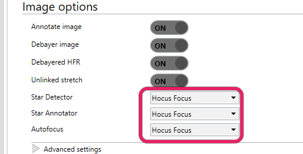
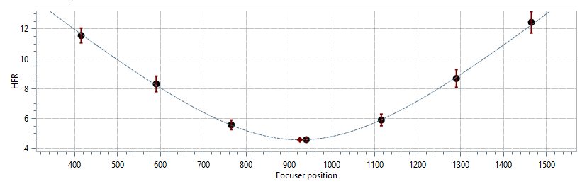
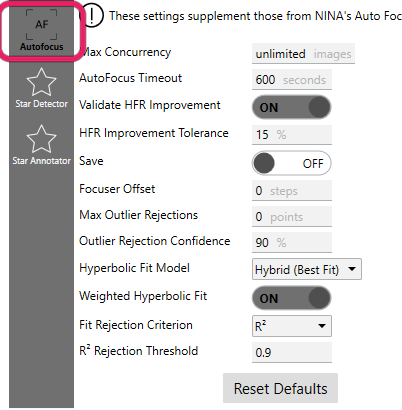

# Quick Start

This guide takes you from a fresh install of Hocus Focus to a working, tuned autofocus setup. The order
matters: get a basic autofocus running first, turn on saving, capture a run to disk, then let the
Optimization Wizard tune star detection against that saved run. Each step links to a deeper reference
page if you want the full detail.

!!! note "Before you start"
    Install the plugin first. In NINA, open **Plugins → Available**, find **Hocus Focus**, and install
    it (you need NINA **3.2.0.2001** or newer). Then restart NINA.

## 1. Tell NINA about your rig

Two rig numbers matter to several Hocus Focus features, so get them right first: your pixel scale and
how far your focuser moves per step.

- **Pixel size** (microns) — NINA's **Options → Equipment → Camera** tab. Usually filled in by the
  camera driver; confirm it matches your sensor.
- **Focal length** (mm) — NINA's **Options → Equipment → Telescope** tab. Together with pixel size this
  gives your pixel scale (arcsec/px). The detector uses it directly, and knowing it tells you which
  Simple-mode [Pixel Scale preset](settings/advanced-debug.md#pixel-scale) to pick.
- **Focuser Step Size** — set this in the
  [Aberration Inspector options](overview/tilt-aberration-inspector.md#inspector-options) (the inspector
  panel, not the main Options page). This tells the inspector how far the focuser moves per step, in
  microns, so it can report tilt and backfocus adjustments in microns rather than bare focuser steps.

## 2. Switch NINA over to Hocus Focus

Turn on the parts you want. Go to **Options → Imaging → Image Options** and, in the dropdowns, select
**Hocus Focus** for:

- **Star Detector** — the improved detector (see [Star Detection](overview/star-detection.md)).
- **Star Annotator** — the customizable overlay (see [Star Annotation](overview/star-annotation.md)).
- **Auto Focus** — the concurrent autofocus engine (see [Autofocus](overview/autofocus.md)).

{ width=510 }

*Set Star Detector, Star Annotator, and Autofocus to Hocus Focus in Options, Imaging, Image Options.*

!!! note "Some features need both"
    The autofocus engine and the Aberration Inspector require Hocus Focus to be selected for both
    **Auto Focus** and **Star Detector**. You can otherwise mix and match, for example keeping only the detector.

## 3. Get a first autofocus working

Aim for a run that completes and finds a believable best-focus position. It does not have to be a great
fit yet, and there is no need to hand-tune detection settings chasing one: tuning is the Optimization
Wizard's job (step 6), and it works from data you capture in the next two steps.

Two groups of settings matter:

- **The Simple-mode presets**, on the plugin's **Star Detector** tab (NINA's options → **Plugins** →
  **Hocus Focus**). Leave **Advanced Mode** off. Set
  [**Pixel Scale**](settings/advanced-debug.md#pixel-scale) (**Wide Field**, **Typical**, or
  **Long Focal Length**) to match your rig, raise
  [**Noise Level**](settings/advanced-debug.md#noise-level) if your sensor is noisy, and leave
  [**Focus Range**](settings/advanced-debug.md#focus-range) at **Typical**.
- **NINA's own focuser settings** (**Options → Equipment → Focuser**): the autofocus exposure time,
  step size, and initial offset steps. Size the sweep so it brackets focus decisively: at the outermost
  points stars should be visibly bloated, with HFR roughly three times its in-focus value, and about
  four points on each side of the minimum.

Get roughly focused first (a Bahtinov mask or a careful manual pass is fine), then run an autofocus from
the **Auto Focus** panel in NINA's **Imaging** tab. A working run sweeps the focuser, traces a V-shaped
HFR curve, fits a model through it, and moves to the fitted minimum:

{ width=620 }

*What success looks like: a V with a fitted minimum. Some scatter and a merely decent fit are fine at
this stage.*

If the curve looks flat, the step size is too small. If stars vanish at the ends of the sweep, the step
size is too large; reduce it, or set **Focus Range** to **Wide Range** so heavily defocused donut stars
are still detected. If few stars are found even near focus, increase the exposure time. Narrowband
filters in particular can need much longer autofocus exposures at first; step 7 shows how to bootstrap
them and work the exposure back down.

→ Full detail: [Autofocus](overview/autofocus.md).

## 4. Turn on Save and choose a folder

On the plugin's **Auto Focus** tab, turn on **Save** and set **Save Path** to a folder you have created
for this purpose. The folder must already exist: if it does not, autofocus still runs, but NINA shows a
warning and nothing is saved.

{ width=402 }

*The Auto Focus tab; the Save Path field appears once Save is turned on.*

Every autofocus run now writes a complete record of itself to a new `AutoFocus_<date>_<time>` folder
under that path: the focus images themselves, the star-detection results, and the stretched annotated
frames. A saved run is replayable: Hocus Focus can re-run detection and curve fitting on it later, with
different settings, without touching the telescope.

## 5. Run autofocus again

Run another autofocus, exactly as in step 3. The run itself is no different; the point is to capture a
real run from your rig to disk. One good run is enough to continue; a couple more from the same optical
setup (same camera, scope, and filter) give you a spare to pick from, and more data to share if you
ever need help.

## 6. Tune star detection with the Optimization Wizard

Now hand the saved run to the [Optimization Wizard](optimization/index.md). It replays your run while
searching for the detection settings that produce the cleanest, most repeatable focus curve, and it
never returns a result worse than your current settings.

1. Launch the wizard from the top of the **Star Detector** tab.
2. Choose your saved run as the source and keep the default objective, autofocus repeatability (leave
   **Optimize for aberration inspection** off).
3. When the search finishes, review the improvement (reported relative to your current settings), press
   **Continue optimizing** for another pass if you like, and accept the result. Adopt the recommended
   [autofocus step size](optimization/step-size.md) it offers alongside the settings.

The search re-runs star detection on every frame of your run for each candidate it evaluates, so it is
computationally expensive and can take a while on a slow imaging computer.

!!! tip "Run the wizard on another machine"
    The wizard works entirely from the saved folder, so it does not have to run on your imaging
    computer. Copy the `AutoFocus_*` folder to a faster machine with NINA and Hocus Focus installed, run
    the wizard there, and press **Export** at the bottom of the **Star Detector** tab. Back on the imaging
    computer, **Import** the exported `.json` file, review exactly what will change, and apply. See
    [exporting and importing settings](settings/index.md#exporting-and-importing-star-detection-settings).

→ Full detail: [Star Detection Optimization](optimization/index.md).

## 7. Narrowband filters: tune with a live sweep

Skip this step unless you autofocus through narrowband filters. Through Hα, OIII, or SII, so few
stars appear that autofocus often will not converge at all, which leaves you with no saved run for
the wizard to replay. The wizard's **Live Auto-Focus** source breaks that deadlock: instead of
replaying a run, it captures one, without needing a working autofocus first.

Reach focus manually before starting (a Bahtinov mask or a careful manual pass is fine); the sweep
is centered on the current focuser position, so it has to begin near focus. Then, in the wizard:

1. Choose **Live Auto-Focus** as the **Source**, and set the **Exposure**. Start with an exposure
   time you know shows stars through this filter, even if it is far longer than you would ever
   autofocus with. The sweep needs stars visible out at its defocused ends, and a too-short
   exposure just produces empty frames that nothing can be tuned against.
2. Choose the folder to **Save captured frames to** and press **Start**. The wizard sweeps the
   focuser across a fixed range (built from your profile's auto-focus step size and offset steps),
   saves an image at every point whether or not any stars are detected, returns the focuser to
   where it started, and then searches for the detection settings that build the cleanest focus
   curve from those frames.
3. Once a run succeeds, run it again with a shorter exposure, and keep shortening until the result
   degrades. This finds how far you can push this filter: a well-tuned detector handles much
   fainter stars than the defaults, and narrowband autofocus exposures often end up several times
   shorter than the safe starting value.
4. Finish with the exposure you will actually autofocus with. On the summary, turn on **Apply
   these auto-focus settings to my profile when I click Accept**: along with the recommended step
   size, it writes the sweep's exposure into your profile as the auto-focus exposure time, so you
   focus with the exposure you optimized against.

→ Full detail: the live-run walkthrough in
[Star Detection Optimization](optimization/index.md#saved-and-live-sources).

## 8. If you run into trouble

Saved runs replay deterministically, so sharing one lets the plugin author reproduce exactly what your
rig did, frame by frame. If autofocus misbehaves or a result looks wrong:

1. Upload the saved run folders (the `AutoFocus_<date>_<time>` folders under your **Save Path**) to a
   cloud storage provider such as Dropbox or Google Drive.
2. Post a download link in the **#hocus-focus** channel on the NINA
   [Discord server](https://discord.com/invite/rWRbVbw), with a short note about what you expected and
   what happened instead.

A replayable run is far more useful than a screenshot of the curve: it carries the actual frames and
detection results, not just a picture of them.

## Where to go next

With autofocus working and tuned, the same detector and saved-run machinery feed the rest of the plugin:

- **Check your sensor for tilt and backfocus.** Open the **Aberration Inspector** dockable panel and run
  a **Detailed Analysis**: an autofocus across the center and corners of the sensor at once, reporting
  tilt, backfocus error, and field curvature. Consider first re-running the
  [Optimization Wizard](optimization/index.md) with **Optimize for aberration inspection** turned on: it
  tunes detection to recover many more stars across the whole frame, which is what the tilt model needs.
  → [Tilt & Aberration Inspector](overview/tilt-aberration-inspector.md)
- **If you have a tilt adapter, calibrate it.** The **Tilt Adapter Wizard** learns where each screw sits
  relative to your sensor and how far a turn moves it, turning tilt measurements into concrete
  screw-turn guidance. → [Tilt Adapter Wizard](overview/tilt-adapter-wizard.md)
- **Practice in the daytime.** The **Camera Simulator** renders realistic star fields from an ASTAP
  star database, complete with defocus, donuts, and injectable sensor tilt, so you can test autofocus
  settings or rehearse a full tilt calibration with no sky at all.
  → [Camera Simulator](overview/camera-simulator.md)
- **Customize the annotation overlay**: colors, fonts, and what gets drawn over accepted and rejected
  stars. → [Star Annotation](overview/star-annotation.md)
- **Go deeper on the settings.** Every detection knob, and everything the optimizer searches over, is
  documented in [Star Detection Settings](settings/index.md) and
  [Star Detection Optimization](optimization/index.md).
