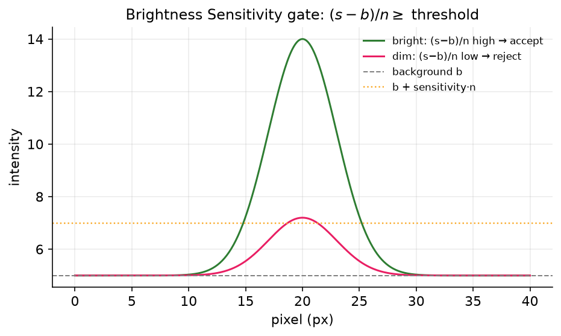
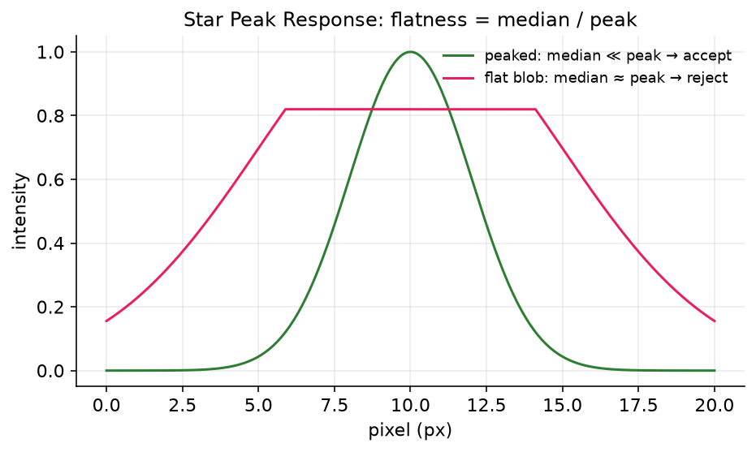
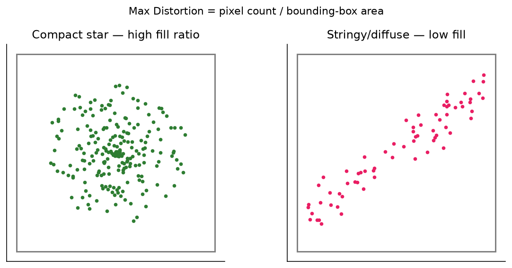
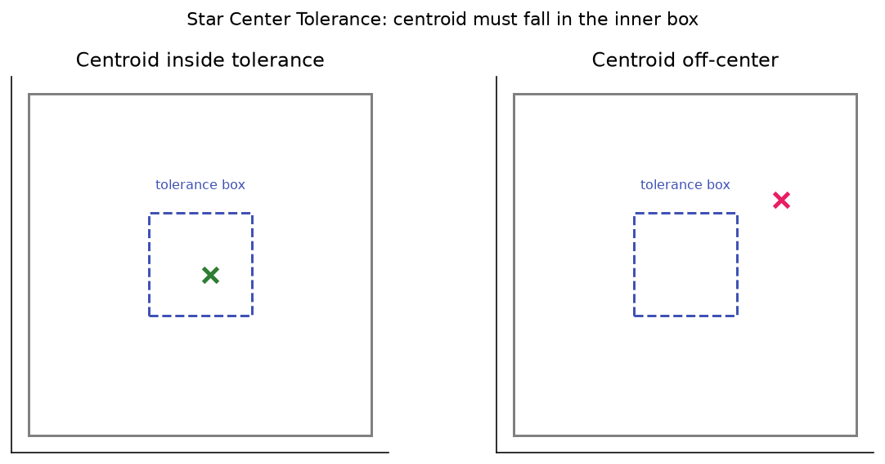
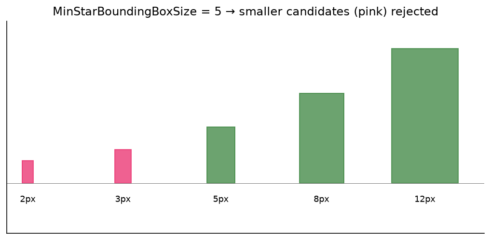

# Acceptance Gates

Once the structure-detection stage has produced a list of **candidate** bounding boxes, every candidate must pass a sequence of per-star quality gates before it is accepted into the measured-star set. Each gate guards against a specific kind of false positive — a hot pixel, a noisy clump, a diffraction spike, a clipped star at the image edge, a faint blob indistinguishable from background, or a contaminated neighbor — and each gate that rejects a candidate tags it with a **rejection reason** you can see in the star-detection metrics panel and the annotated overlay.

This page documents the gates exposed as **Advanced** star-detection options. They run in a fixed order, and a candidate is discarded by the **first** gate it fails:

1. **Too Small** — `MinStarBoundingBoxSize`
2. **On Border** (candidate touches the image edge; not user-tunable)
3. **Too Distorted** — `MaxDistortion`
4. **Degenerate** (parameters could not be computed; not user-tunable)
5. **Low Sensitivity** — `BrightnessSensitivity`
6. **Not Centered** — `StarCenterTolerance`
7. **Too Flat** — `StarPeakResponse`
8. **HFR analysis failed / Too Low HFR** — `MinHFR`
9. **Contaminated** — see [Contamination](contamination.md)

`StarBackgroundBoxExpansion` is not itself a gate, but it controls the local-background estimate that several gates depend on, so it is documented here too. The **Defocus-Aware Gates** group relaxes the distortion and centering gates for heavily out-of-focus frames; it is covered in its own section at the end.

!!! note
    These settings live under **Advanced** star detection. In **Simple** mode they are derived for you from the noise level, pixel scale, and focus-range presets, and the values below are what those presets resolve to. If you have run the [Optimization Wizard](../optimization/index.md), a curated subset of these gates is what it tunes.

## Summary

| Setting | Default | Range | Effect |
|---|---|---|---|
| Brightness Sensitivity | 2.0 | ≥ 0 | Minimum signal-to-noise \((s-b)/n\); rejects faint candidates as **Low Sensitivity** |
| Star Peak Response | 0.75 (75%) | 0–100% | Max median/peak ratio; rejects flat blobs as **Too Flat** |
| Max Distortion | 0.5 | 0–1 | Min fill ratio of the bounding box; rejects stringy shapes as **Too Distorted** |
| Star Center Tolerance | 0.3 (30%) | 0–100% | Centered sub-box the centroid must fall in; rejects off-center candidates as **Not Centered** |
| Min Bounding Box Size | 5 px | ≥ 1 | Smallest allowed candidate side; rejects tiny structures as **Too Small** |
| Min HFR | 1.2 px | > 0 | Smallest viable Half-Flux Radius; rejects hot-pixel-like spikes as **Too Low HFR** |
| Background Box Expansion | 3 px | ≥ 1 | Annulus width for the local-background estimate |
| Defocus-Aware Gates | Off | on/off | Relaxes distortion + centering for large (defocused) candidates |
| Defocus Size Reference | 30 px | 1–1000 | Size at/below which strict thresholds still apply |
| Defocus Distortion Min Factor | 0.25 | 0.01–1 | Most permissive distortion multiplier for huge donuts |
| Defocus Centering Tolerance Factor | 2.0 | 1–10 | Most permissive centering multiplier for huge donuts |

---

## Brightness Sensitivity

Rejects candidates whose signal does not rise far enough above the local background noise — the **Low Sensitivity** rejection reason.

> Given a star with a normalized brightness measure of **s**, a local background of **b**, and a background noise level of **n**, star sensitivity is measured as the ratio of the star brightness above the background relative to the background noise **(s-b)/n**. The noise level **n** is measured on the image actually used for star measurement, so this value is an honest multiple of the real noise and means the same thing regardless of noise-reduction settings. The default of 2 works well; if you find a large number of rejections due to low sensitivity, smaller values increase sensitivity

A candidate is accepted only when its normalized brightness divided by the measurement-image noise σ exceeds this threshold, so the gate is a signal-to-noise floor:

\[
\frac{s - b}{n} > \text{BrightnessSensitivity}
\]

**Smaller values are more sensitive** (they admit fainter stars); larger values are stricter. Because σ is measured on the same image that is actually sampled for star measurement, the number is an honest multiple of the real noise and behaves consistently across noise-reduction settings.

**Default:** 2.0 — **Range:** ≥ 0 (must be non-negative)

{ width=620 }
*Sensitivity is the star's brightness above background relative to the noise; a dim star with low \((s-b)/n\) is rejected.*

!!! tip "When to adjust"
    Lower it (toward 1) if too many real but faint stars are reported as **Low Sensitivity** (watch the **Low Sensitivity** count in the [Star Detection Results panel](index.md#reading-the-results-the-star-detection-results-panel)) and your autofocus runs are starved for stars. Raise it on noisy data where spurious faint blobs are slipping through. It can hurt by flooding detection with noise clumps if set too low, or by discarding usable faint stars near focus if set too high. Leave it at the default for typical data.

## Star Peak Response

Rejects candidates that are too flat to be a real star — the **Too Flat** rejection reason.

> The ratio of the star median relative to the star peak. It provides a measure of flatness, since median values close to the peak indicate low dispersion. Consider increasing if too many stars are rejected with "Too Flat"

A real star is sharply peaked, so its median pixel value sits well below its peak. A flat structure (a wide diffuse blob, a saturated plateau, part of a nebula) has a median close to its peak. The gate rejects a candidate when

\[
\text{median} \ge \text{StarPeakResponse} \times \text{peak}.
\]

The option is shown as a percentage (default 75%), so a candidate fails when its median exceeds 75% of its peak.

**Default:** 0.75 (75%) — **Range:** 0–100% (must be positive)

{ width=620 }
*A genuine star has a median far below its peak; a flat blob's median sits close to the peak and is rejected.*

!!! tip "When to adjust"
    Increase it if legitimate stars — often slightly defocused or undersampled ones — are wrongly rejected as **Too Flat** (check the **Too Flat** count in the [Star Detection Results panel](index.md#reading-the-results-the-star-detection-results-panel)). Leave it at the default for in-focus data. Setting it too high weakens the gate and lets diffuse, non-stellar structure through.

## Max Distortion

Rejects candidates whose pixels do not fill their bounding box compactly enough — the **Too Distorted** rejection reason.

> The ratio of star pixels to the size of a perfect square bounding box. A perfect circule has a distortion of PI/4, which is approximately 0.7. The default value of 0.5 allows for some distortion and measurement error and should work for most cases.

This is a **fill ratio**: the number of structure pixels divided by \(d^2\), where \(d\) is the larger of the bounding-box width and height. A perfectly round star fills about \(\pi/4 \approx 0.79\) of its square box. Elongated or stringy shapes (diffraction spikes, satellite trails, merged double stars, hot columns) fill much less and are rejected when

\[
\frac{\text{pixel count}}{d^2} < \text{MaxDistortion}.
\]

**Smaller values are more tolerant of distortion.** The default of 0.5 leaves headroom below the ideal disk value for genuine optical aberration and measurement error.

**Default:** 0.5 — **Range:** 0–1 (must be within [0, 1])

{ width=620 }
*Fill ratio is pixel count over the square box area; a compact star passes while a stringy shape fails.*

!!! tip "When to adjust"
    Lower it if real stars with elongation — from tilt, coma, field curvature, or tracking error — are being rejected as **Too Distorted** (watch the **Too Distorted** count in the [Star Detection Results panel](index.md#reading-the-results-the-star-detection-results-panel)). Raise it toward the \(\pi/4\) ideal only on excellent optics where you want to suppress trails and spikes aggressively; that risks discarding stars in the corners of a tilted or curved field. For heavily **defocused** frames, prefer the [Defocus-Aware Gates](#defocus-aware-gates) below over simply lowering this value, since that keeps near-focus frames strict.

## Star Center Tolerance

Rejects candidates whose measured centroid is too far from the center of the bounding box — the **Not Centered** rejection reason.

> Size (as a percentage) of a centered rectangle within the star bounding box that the star center must be in. 1.0 covers the whole region, and 0.0 will fail every star

The gate defines a centered sub-rectangle within the bounding box and requires the intensity-weighted centroid to fall inside it. A value of 100% covers the whole box (effectively disabling the check), while 0% would fail every star. This catches candidates where the apparent peak is offset — blends, partially-clipped stars, or a structure pixel-set that is really two sources.

**Default:** 0.3 (30%) — **Range:** 0–100% (must be positive and ≤ 1.0)

{ width=620 }
*The centroid must fall inside the centered acceptance sub-box; an off-center centroid is rejected.*

!!! tip "When to adjust"
    Raise it (toward 50%) if well-formed stars are rejected as **Not Centered** (track the **Not Centered** count in the [Star Detection Results panel](index.md#reading-the-results-the-star-detection-results-panel)), which is common with asymmetric aberration or undersampled centroids. Leave the default for typical fields. Setting it too high lets genuinely off-center blends and double stars through. As with distortion, for far-from-focus donut stars the [Defocus-Aware Gates](#defocus-aware-gates) relax this automatically for large candidates only.

## Min Bounding Box Size

Rejects candidates whose bounding box is smaller than this on either side — the **Too Small** rejection reason.

> The minimum allowed size (length of either side) of a star candidate's bounding box. Increasing this can be helpful at very high focal lengths if too many small structures are detected

This is the first gate applied. It removes tiny detections — single hot pixels that survived filtering, cosmic-ray hits, and noise specks — that are too small to be a resolved star.

**Default:** 5 px — **Range:** ≥ 1 (must be at least 1)

{ width=620 }
*Candidates smaller than the minimum box size on either side are rejected as Too Small.*

!!! tip "Starting point"
    From your rig: `MinStarBoundingBoxSize ≈ max(3, round(2–3 × FWHM_px))`, where `FWHM_px = FWHM_arcsec / pixelScale`. This is just a starting point the Simple presets and the optimizer refine.

!!! tip "When to adjust"
    Increase it at very long focal lengths, where the plate scale spreads real stars over many pixels and small structures are almost always artifacts. Lower it for wide-field, undersampled rigs where genuine stars occupy only a few pixels — too high a value there will silently drop real stars (and inflate the **Too Small** count in the [Star Detection Results panel](index.md#reading-the-results-the-star-detection-results-panel)). The Simple-mode presets already nudge this down for wide-field and up for long focal length.

## Min HFR

Rejects candidates whose measured Half-Flux Radius is at or below this floor — the **Too Low HFR** rejection reason.

> Minimum HFR for a star to be considered viable

A star's HFR is the radius enclosing half its total flux (see [Star detection](../overview/star-detection.md)). An impossibly small HFR indicates a point-like artifact — a residual hot pixel or single-pixel spike — rather than a focused star, which always has a finite, optics-limited width. The gate runs late, after HFR has actually been measured, and rejects when \(\text{HFR} \le \text{MinHFR}\).

**Default:** 1.2 px — **Range:** > 0 (the model accepts 0, but the UI requires a value greater than zero)

!!! tip "When to adjust"
    Leave it at the default for almost all setups. Lower it only if you are extremely undersampled and confident your real stars measure below 1.2 px. Raising it discards the sharpest stars and is rarely useful. The default of 1.2 is an honest-HFR floor calibrated to the current measurement pipeline; the older 1.5 floor was tuned against noise-inflated faint-star HFRs and is no longer appropriate.

## Background Box Expansion

Sets how far outside each candidate's bounding box the local background is sampled. This is not a gate, but the background estimate it produces feeds the sensitivity, flatness, and HFR measurements above, so it indirectly affects every gate.

> The background is estimated by looking in an area around the star bounding box, increased on each side by this number of pixels. The default value of 3 should work for most cases, but you can consider increasing it if stars are very spare, or even decreasing it if the star field is very crowded with stars less than 3 pixels from one another.

The detector fits a robust local background plane to the annulus of pixels just outside the bounding box; this expansion sets the annulus width. A wider annulus gives a more stable background but risks including neighboring stars in crowded fields.

**Default:** 3 px — **Range:** ≥ 1 (must be at least 1)

!!! tip "When to adjust"
    Increase it for sparse fields where you want a steadier background estimate. Decrease it in very crowded fields where neighbors sit within a few pixels of each other and would otherwise pollute the annulus. Leave the default for typical star fields.

---

## Defocus-Aware Gates

A single opt-in toggle that relaxes **both** the Max Distortion and Star Center Tolerance gates for large candidates, which act as a proxy for heavy defocus. It is **off by default**, and when off, detection is bit-identical to the strict gates.

> When enabled, both the Max Distortion and Star Center Tolerance gates are relaxed for large candidates (a proxy for large defocus). At large defocus a star becomes a hollow donut (the central-obstruction shadow): it has a big bounding box with a low pixel fill-ratio (which the strict Max Distortion would wrongly reject as too distorted) and a wobbly intensity-weighted center (which the strict centering test would wrongly reject as not centered). Small candidates (near focus) keep the strict thresholds, so junk is still rejected. Off by default; enable it if you collect autofocus frames far from focus and find defocused donut stars being dropped. The three Defocus-Aware tuning values below take effect only while this is enabled.

**Why it exists.** Far from focus, a star with a central obstruction becomes a hollow **donut**: a large bounding box with low fill ratio (so the strict Max Distortion rejects it as **Too Distorted**) and a hollow ring whose intensity-weighted centroid wobbles off-center (so the strict Star Center Tolerance rejects it as **Not Centered**). Those are exactly the frames at the ends of a wide autofocus sweep, where losing stars hurts the V-curve fit the most.

{ width=620 }
*Heavy defocus turns a star into a hollow donut — large box, low fill ratio, unstable centroid — which the strict gates reject.*

**How the relaxation works.** The candidate size used as the defocus proxy is \(d = \max(\text{box width}, \text{box height})\). Candidates at or below the **Defocus Size Reference** keep the strict thresholds; larger candidates are relaxed progressively:

- Distortion: the effective fill-ratio threshold is

    \[
    \text{MaxDistortion} \times \operatorname{clamp}\!\left(\frac{\text{SizeReference}}{d},\ \text{MinFactor},\ 1.0\right),
    \]

    so a bigger donut needs to fill proportionally less of its box, floored at `MinFactor × MaxDistortion`.

- Centering: the effective tolerance is

    \[
    \text{StarCenterTolerance} \times \operatorname{clamp}\!\left(\frac{d}{\text{SizeReference}},\ 1.0,\ \text{ToleranceFactor}\right),
    \]

    additionally capped at 1.0 (the sub-box covering the whole bounding box), so a bigger donut gets a larger centered acceptance region.

Because near-focus candidates stay at or below the size reference, they keep the strict thresholds and junk is still rejected. Stars admitted only by the relaxation are flagged internally so the optimizer can discourage over-relaxing into false positives.

!!! tip "When this helps"
    Enable it when you deliberately collect autofocus frames far from focus (wide sweeps) and see donut stars dropped as **Too Distorted** or **Not Centered** at the sweep extremes. It does nothing for near-focus imaging frames, and it should stay off there so the strict gates keep filtering noise. If even heavily defocused stars never appear as candidates at all (not merely rejected), that is a structure-detection problem — see Defocus-Aware Structure on the [Structure detection](structure-detection.md) page — not a gate problem.

!!! warning
    The three tuning values below are consulted **only while Defocus-Aware Gates is enabled**. With the toggle off they have no effect.

### Defocus Size Reference

> Tuning knob for the Defocus-Aware Gates (only used while they are enabled). The candidate bounding-box size (in pixels, the larger of width/height) at or below which the strict gate thresholds still apply; larger candidates get the relaxed thresholds. Shared by both the distortion and centering relaxations. Lower it to relax smaller stars; raise it to keep more of the strict behavior. Default 30.

**Default:** 30 px — **Range:** 1–1000

Lower it to begin relaxing at smaller candidate sizes (recovers slightly-smaller donuts, at the cost of relaxing moderately-defocused frames); raise it to keep more of the strict behavior. The default of 30 px was tuned so the most-defocused donuts clear the gates while the nearest in-sweep frames stay sane.

### Defocus Distortion Min Factor

> Tuning knob for the Defocus-Aware Gates (only used while they are enabled). The floor multiplier applied to Max Distortion for very large (very defocused) candidates — the most permissive the distortion gate ever becomes. Must be greater than 0 and at most 1. Smaller values accept more heavily-distorted donuts. Default 0.25.

**Default:** 0.25 — **Range:** 0.01–1

This is the lowest the effective fill-ratio threshold can ever drop to, expressed as a fraction of Max Distortion. Smaller values admit more heavily distorted donuts; 1.0 disables the distortion relaxation entirely (the gate stays strict regardless of size).

### Defocus Centering Tolerance Factor

> Tuning knob for the Defocus-Aware Gates (only used while they are enabled). The maximum multiplier applied to Star Center Tolerance for very large (very defocused) candidates — the most permissive the centering gate ever becomes. Must be at least 1 (1 is a no-op; larger values relax centering further). Default 2.

**Default:** 2.0 — **Range:** 1–10

The most the centering tolerance can be multiplied by for the largest candidates. A value of 1 is a no-op (centering stays strict); 2 doubles the centered acceptance sub-box for fully-defocused donuts. The effective tolerance is always capped at 1.0 (the whole bounding box), so very large factors saturate rather than overshoot.

---

## Recover Out-of-Focus Donut Stars

A second, **separate** opt-in feature aimed at the same problem the Defocus-Aware Gates address —
heavily defocused stars — but from the structure/shape side rather than by loosening thresholds. It is
a single **master toggle**, *Defocus-Aware Donut Detection*, that is **off by default**; when off,
detection is bit-identical to having the feature absent. It also appears on the
[Optimization Wizard](../optimization/index.md)'s start page as **"Recover out-of-focus donut stars."**

> MASTER toggle for defocus-aware donut detection. When ON, out-of-focus DONUT stars (heavily defocused stars that appear as hollow rings) are recovered: a morphological close reconnects fragmented rings and an annularity test lets a hollow ring pass the distortion gate like a filled disk (detection-only — it never changes HFR). It also unlocks the optimizer to tune ALL defocus-aware settings and to enable diffraction-spike / saturated-bloom suppression. Recommended for telescopes with a central obstruction (Newtonians/SCTs); leave OFF for refractors. Off by default; when OFF, detection is exactly as before.

**What it does.** A heavily defocused star with a central obstruction breaks up into a fragmented
hollow ring. Two things go wrong: the arcs of the ring are detected as several tiny structures (each
dropped as **Too Small**), and even when the ring is whole its hollow center gives it a low fill ratio
that the strict Max Distortion gate rejects. This feature fixes both — a morphological **close**
reconnects the ring arcs into one candidate, and an **annularity** test recognizes a genuine hollow
ring and lets it through the distortion gate as if its hole were filled. The recovery is
**detection-only**: it changes which candidates survive, never the measured HFR, flux, or center.

!!! tip "Which donut feature do I need?"
    - If donuts are **rejected** as **Too Distorted** or **Not Centered**, the
      [Defocus-Aware Gates](#defocus-aware-gates) above relax those gates for large candidates.
    - If donuts never form a candidate at all (fragmented into **Too Small** pieces, or erased before
      candidate formation), this **Donut Detection** group reconnects them — and the
      [Defocus-Aware Structure](structure-detection.md#defocus-aware-structure) option keeps very large
      donuts from being wiped out by background removal in the first place.
    - The three features are complementary; the optimizer can enable and tune them together once the
      master toggle is on.

These five settings live under **Advanced** star detection, and the four numeric knobs below take
effect **only while the master toggle is on**.

| Setting | Default | Range | Effect |
|---|---|---|---|
| Defocus-Aware Donut Detection | Off | on/off | Master toggle for the whole group; off ⇒ detection bit-identical |
| Donut Morph Close Size | 5 | 1–25 px | Kernel diameter that reconnects fragmented ring arcs into one candidate (1 = no close) |
| Donut Min Annularity Hole Fraction | 0.15 | 0.02–0.6 | Minimum enclosed dark center (fraction of box area) for a hollow ring to be treated like a filled disk by the distortion gate |
| Donut Max Streak Eccentricity | 1.0 | 0.8–1.0 | Rejects very linear candidates (diffraction spikes, trails) at/above this eccentricity; 1.0 = off |
| Donut Saturation Bloom Radius | 0.0 | 0–100 px | Rejects candidates whose center lies within this many pixels of a saturated star (bloom fragments); 0 = off |

### Donut Morph Close Size

> Only used while Defocus-Aware Donut Detection is on. Diameter (px) of the morphological-close kernel that reconnects fragmented donut-ring arcs into one candidate (the dominant cause of donuts being dropped as 'too small'). 1 means no close. Keep it smaller than the gap between a bright star's diffraction spikes so it doesn't bridge them. EARLY-stage setting. Default 5.

**Default:** 5 px — **Range:** 1–25. This is an **EARLY**-stage parameter (it changes candidate
formation). Raise it if donut arcs are still detected as separate fragments; keep it below the spacing
of a bright star's diffraction spikes so the close does not bridge them into one blob.

### Donut Min Annularity Hole Fraction

> Only used while Defocus-Aware Donut Detection is on. Minimum size of a candidate's enclosed dark center (as a fraction of its bounding-box area) for it to count as a donut whose hole is filled for the distortion test — so a hollow ring is judged like a filled disk. This is detection-only and never changes the measured HFR/flux/center. Lower it to accept thinner rings; raise it to be stricter. Default 0.15.

**Default:** 0.15 — **Range:** 0.02–0.6. Lower it to accept thinner rings (smaller holes); raise it to
be stricter about what counts as a true donut.

### Donut Max Streak Eccentricity

> Only used while Defocus-Aware Donut Detection is on. Rejects very LINEAR candidates (diffraction spikes from a bright star, or satellite/aircraft trails) when their elongation (eccentricity) meets or exceeds this value. 1.0 means OFF (a perfect line has eccentricity 1.0, so nothing is rejected); lower it toward 0.95 to enable. Round donuts measure well below this, so they are never affected. Default 1.0 (OFF — the optimizer enables it when you label false detections).

**Default:** 1.0 (off) — **Range:** 0.8–1.0. A spike-suppression guard: lower it toward 0.95 to reject
diffraction spikes and trails. Round donuts sit well below this, so they are unaffected.

### Donut Saturation Bloom Radius

> Only used while Defocus-Aware Donut Detection is on. Rejects candidates whose center lies within this many pixels of a saturated star, removing the bloom/halo fragments around a bright saturated star while keeping the star itself. 0 means OFF. Default 0.

**Default:** 0 (off) — **Range:** 0–100 px. Raise it to clear the bloom/halo fragments that ring a
bright saturated star while keeping the star itself.

!!! note
    Related rejection reasons — **Contaminated** (one-sided neighbor light) and the saturation handling — are covered on the [Contamination](contamination.md) and [Hot pixels & saturation](hotpixel-saturation.md) pages. For how the optimizer searches over these gates, see [Search variables](../optimization/search-variables.md).
