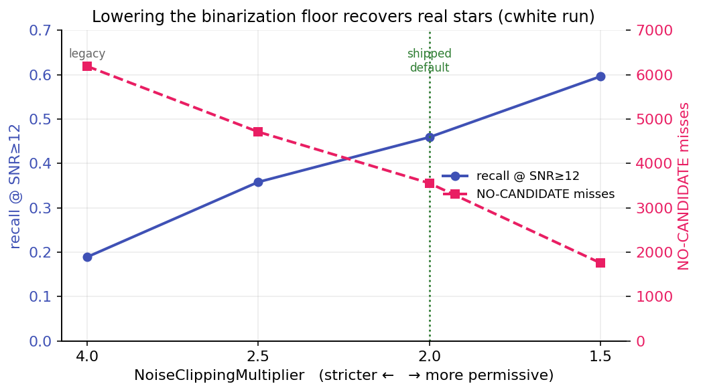
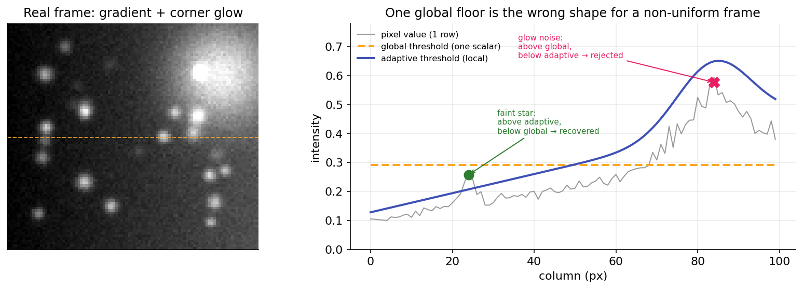
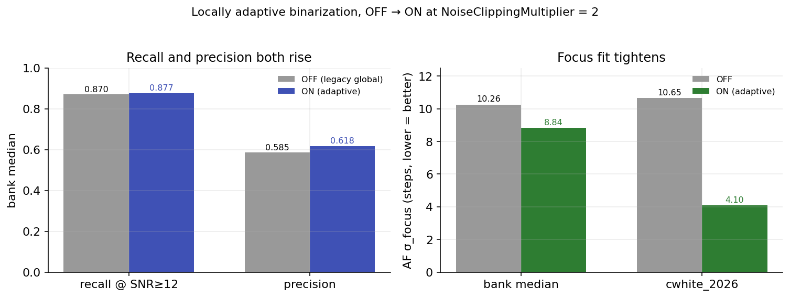

# Adaptive Binarization

Candidate formation begins by binarizing the structure map at a noise floor: a pixel must rise a set number of
noise sigmas above the background to survive as part of a star candidate. That floor is the single biggest lever
on [recall](precision-recall.md), because a star that never clears it never becomes a candidate. This page
explains how the floor's default was lowered, and then made to vary across the frame.

## The settings

The floor is controlled by three options, all documented in full on [Preprocessing](preprocessing.md):

| Setting | Default | Reference |
|---|---|---|
| Noise Clipping Multiplier | 2.0 | [Preprocessing](preprocessing.md#noise-clipping-multiplier) |
| Locally Adaptive Binarization | On | [Preprocessing](preprocessing.md#locally-adaptive-binarization) |
| Adaptive Noise Block Size | 128 px | [Preprocessing](preprocessing.md#adaptive-noise-block-size) |

## From 4 to 2

Candidate formation binarizes the structure map at a floor of
\(\text{median} + \text{NoiseClippingMultiplier} \times \sigma_{\text{noise}}\). A lower multiplier pulls the
floor down, so fainter structure survives to become a candidate. The multiplier had been **4 ever since Hocus
Focus was first released**, an inherited default that was never revisited until a golden-set audit measured what
it was costing. Sweeping it directly against a [golden set](precision-recall.md) isolates its effect:

| NoiseClippingMultiplier | recall @ SNR≥12 | `NO CANDIDATE` | precision |
|---|---|---|---|
| 4.0 (legacy) | 0.189 | 6191 | 0.85 |
| 2.5 | 0.358 | 4712 | 0.82 |
| **2.0 (default)** | **0.459** | **3556** | **0.81** |
| 1.5 | 0.596 | 1757 | 0.80 |

{ width=620 }

*Lowering the floor from 4 to 1.5 triples recall @ SNR≥12 and collapses the `NO CANDIDATE` misses, at a small
precision cost. The two other candidate-formation knobs, Structure Layers and Min Bounding Box Size, did not
help recall in isolation.*

A lower floor admits fainter stars, and fainter stars can carry noisier HFR, so the next question was whether
this hurts the focus curve. It does not. The per-region HFR-versus-focuser curve was rebuilt at each multiplier
(NC) and parabola-fit for best-focus position and goodness of fit:

| Region | NC = 4 (legacy) | NC = 2 (default) |
|---|---|---|
| Global | 119 stars, R² 0.96 | 327 stars, R² 0.93 |
| Center | 18 stars, R² 0.93 | 55 stars, R² 0.98 |
| Corners | 3–6 stars (one would not fit at all) | 11–21 stars, R² 0.87–0.99 |

Best-focus position stayed put (global 2719 → 2718, center 2706 → 2706), goodness of fit stayed high, and
near-focus HFR scatter rose only about 0.1 px. The corners, which are the most star-starved and which give the
tilt fit its leverage, went from too few stars to fit to a usable 11–21. A multiplier of 1.5 adds still more
stars but with slightly more corner scatter, so the setpoint landed at **2.0**.

Why 2 and not 1.5? Three checks ran independently and agreed across a 17-run bank of saved focus runs:

- Recall @ SNR≥12 rose bank-wide as the multiplier fell, with the median going from 0.797 at NC = 4 to 0.870 at
  NC = 2.
- On the run with the most complete golden (so its precision is trustworthy), dropping to 2 roughly doubled
  recall (0.189 → 0.459) for a negligible precision cost (0.849 → 0.811).
- The per-run optimizer, which minimizes focus scatter and is therefore immune to the precision-measurement
  artifact, converged to a median multiplier of exactly 2.0 (10 of 17 runs), and where it deviated it went
  *lower*, never back toward 4.

So the default changed from **4 to 2**.

## A single global floor is the wrong shape

A single global multiplier still leaves recall on the table. Recall was still climbing at NC = 2 on the cleanest
frames, yet a lower global value floods the noisy corners with false candidates. The reason is that the floor is
one scalar applied to a frame that is not uniform. Vignetting, sky gradients, amp glow, and field-edge falloff
make the local background and local noise vary by two to four times across a single frame. A global floor is
then too high in the clean center, where real faint stars fall below it, and too low in the noisy corners, where
noise clears it. Lowering the multiplier trades one failure for the other. It cannot fix both, because the
*shape* of the floor is wrong, not just its level.

{ width=720 }

*One global floor cannot fit a non-uniform frame. It sits too high over the clean region (missing the faint star
on the left) and too low under the corner glow (passing the noise on the right). A floor that tracks the local
background and noise gets both right.*

## Locally adaptive binarization

The fix is the [Locally Adaptive Binarization](preprocessing.md#locally-adaptive-binarization) option. Instead
of one scalar, the floor becomes a smooth surface computed from robust per-block statistics,
\(\text{local-median}(x,y) + \text{NC} \times \sigma_{\text{local}}(x,y)\), estimated on a coarse grid (128 px
blocks by default) and upsampled to the full frame. The multiplier stays at 2, but it is now locally fair: low
where the background is clean, recovering faint stars, and high where it is noisy, rejecting noise. This is the
same local-statistics approach the reference detector uses to define the recall target in the first place.

Tested OFF against ON at NC = 2 across the 17-run bank, the surface improves recall and precision *together*,
which no single global value can do:

{ width=700 }

*OFF versus ON at NC = 2. Bank-median recall @ SNR≥12 and precision both rise, and the autofocus fit tightens. On
the run with the most complete golden, recall jumps from 0.459 to 0.862 and the focus scatter is more than
halved.*

Because it improves both axes with no autofocus or donut regression, locally adaptive binarization ships **on by
default**. The multiplier stays at 2; the surface is what makes that 2 fair everywhere.

## Reverting to legacy behavior

Two independent switches turn the change off:

- Turning **Locally Adaptive Binarization** off reverts the floor's *shape* to the legacy single global scalar.
  With it off, candidate formation is bit-for-bit identical to the pre-change detector.
- Setting **Noise Clipping Multiplier** back to **4.0** reverts the floor's *level* to the legacy default.

Setting both restores the full legacy behavior. The only reason to do that is to reproduce or compare against the
old detector. The validated defaults (NC = 2, adaptive on) beat the legacy settings on every rollout criterion
across the bank, so for real use, leave them as they are.
