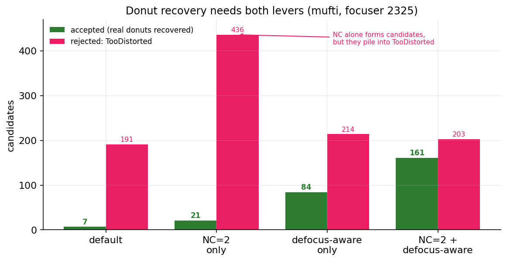

# Donut-Aware Settings

Far from focus, a star with a central obstruction (a Newtonian or an SCT) becomes a hollow **donut**. The
default detector drops most of them, which costs the stars at the ends of a wide autofocus sweep, exactly where
the V-curve fit needs them. The opt-in donut-aware features recover those stars. This page explains the settings
and the [measured](precision-recall.md) data behind adding them. The features are off by default; with the
master toggle off, detection is identical to having them absent.

## The settings

The whole group is gated by one master toggle. The numeric knobs and their full reference live on the
[Acceptance Gates](acceptance-gates.md#recover-out-of-focus-donut-stars) and
[Structure Detection](structure-detection.md#defocus-aware-structure) pages:

| Setting | Default | Reference |
|---|---|---|
| Defocus-Aware Donut Detection (master) | Off | [Acceptance Gates](acceptance-gates.md#recover-out-of-focus-donut-stars) |
| Defocus-Aware Gates | Off | [Acceptance Gates](acceptance-gates.md#defocus-aware-gates) |
| Defocus-Aware Structure + Structure Layer Boost | Off / 0 | [Structure Detection](structure-detection.md#defocus-aware-structure) |
| Donut morph close, annularity, streak, bloom | per knob | [Acceptance Gates](acceptance-gates.md#recover-out-of-focus-donut-stars) |

## The problem

On a heavily defocused frame from a central-obstruction scope, of 279 structure candidates only 43 were
accepted. The rejections were dominated by **TooSmall** (122, because the ring fragments into separate arcs that
are each too small) and **TooDistorted** (99, because a whole hollow ring fails the fill-ratio test). The
detector found almost nothing on a donut frame.

## What each knob fixes

Each donut knob targets one of those failure modes:

- a wavelet-layer boost so a big donut survives background removal,
- a morphological close that reconnects fragmented ring arcs into one candidate,
- an annularity test that lets a hollow ring pass the distortion gate like a filled disk,
- an integrated-flux sensitivity path so a faint donut is judged on its total ring flux, not its low per-pixel
  peak,
- distortion and centering relaxation for large candidates only,
- a clip cap so an aggressive per-pixel clip cannot strip a thin ring during measurement,
- optional diffraction-spike and saturation-bloom suppression for the bright stars that defocus alongside the
  donuts.

## The justification

In a controlled headless comparison against a dense by-eye golden set, turning the feature on lifted recall from
0.098 to 0.226 (about 2.3x) with precision essentially perfect (0.992 → 1.000), and per-frame accepted counts on
the worst frames rose roughly fourfold. The saturated star's core and diffraction spikes produced no spurious
detections.

The key result is that **donuts need both levers**, the low noise-clipping floor and the donut-aware gates:

{ width=620 }

*Lowering the floor alone forms more donut candidates, but they pile straight into TooDistorted (191 → 436): the
structure stage proposes the rings, then the strict distortion gate throws them out. The defocus-aware gates
alone relax that gate but cannot recover rings the strict floor never proposed. Only with both on are 161 stars
recovered, 22x the default, at 0.93 precision.*

So a donut run wants the [low, adaptive floor](adaptive-binarization.md) *and* the donut-aware gates together,
not either alone.

## Honest limit

Faint pure-ring donuts with no core stay noise-limited for everyone. Hocus Focus catches the brighter cored
donuts and misses the faint rings, and a naive matched filter over-detects them. When a star is that far out of
focus, its ring also carries little usable focus signal.
