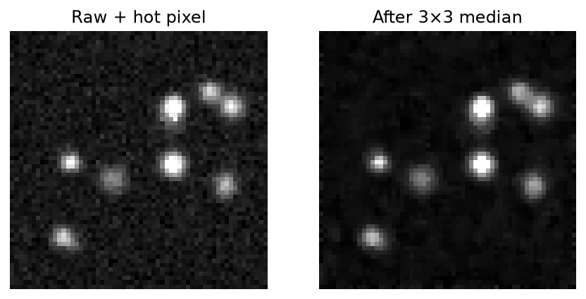
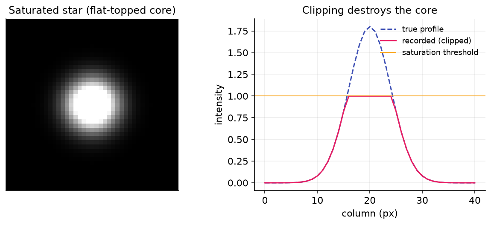

# Hot Pixel & Saturation

Two unrelated artifacts pollute star measurements: single bright **hot pixels** that masquerade as tiny stars, and **saturated** (clipped) cores that flatten the bright peak of an otherwise good star. Hocus Focus handles them up front in the detection pipeline — hot pixels are cleaned out of the source image before star structures are found, and saturated pixels are masked out of the PSF fit so they do not bias the fitted profile.

These options live in the **Advanced** star-detection settings. In Simple mode they are derived from the noise preset (see [Heuristic Defaults](../analysis/heuristic-defaults.md)).

## Settings at a glance

| Setting | Default | Range | Effect |
|---|---|---|---|
| Hotpixel Filtering | On | On / Off | Apply a 3×3 median filter to remove hot pixels before detection |
| Use Hotpixel Thresholding | On | On / Off | Replace only pixels that differ sharply from the median, instead of blurring everything |
| Hotpixel Threshold | 0.1% (0.001) | (0, 100%] | How far a pixel must sit from its 3×3 median (as a fraction of full well) to count as a hot pixel |
| Saturation Threshold | 99% (0.99) | (0, 100%] | Pixels at or above this fraction of full well are treated as saturated and masked during PSF fitting |

---

## Hotpixel Filtering

**What it does:** runs a 3×3 box-median convolution over the source image to suppress isolated hot pixels before star structures are detected.

> "Uses a 3x3 box median convolution to filter out hotpixels. This should be on, unless you're working with a calibrated image with hotpixels removed"

- **Default:** On
- **Range:** On / Off

A hot pixel is a single sensor cell that reads anomalously high regardless of incoming light. Left in the image it forms a tiny, sharp, one-pixel "star" that survives structure detection and contaminates HFR and star-count statistics. A 3×3 median replaces each pixel with the median of its neighborhood, which removes a lone outlier while leaving genuine multi-pixel stars intact. The median filter radius is fixed at 1 (a 3×3 window) — only that size is supported.

When noise reduction is in play, hot-pixel filtering also runs first so the hot pixels are not smeared into their neighbors by the noise-reduction blur.

{ width=620 }
*A single hot pixel (left) reads far above its neighbors; the 3×3 median (right) replaces it with the local median while leaving the real star untouched.*

!!! tip "When this helps"
    Leave this **on** for raw or uncalibrated frames — almost every sensor has hot pixels, and they are the single most common source of spurious "stars." Turn it **off** only when you are feeding already-calibrated images whose hot pixels have been removed (e.g., by dark subtraction or a defect map), so you avoid a redundant filtering pass.

---

## Use Hotpixel Thresholding

**What it does:** restricts the median replacement to pixels that differ sharply from their local median, instead of replacing every pixel — which would blur the whole image.

> "A more sophisticated version of hotpixel filtering that limits pixel replacement to those where the median is far off of the pixel value. This prevents the whole image from being blurred, which can have a negative effect on HFR and PSF measurement accuracy"

- **Default:** On
- **Range:** On / Off

A plain 3×3 median replaces *every* pixel with its neighborhood median — effectively a light blur across the entire frame, which softens real stars and biases HFR and PSF measurements. Thresholded filtering compares each pixel against its 3×3 median and only swaps it when the difference exceeds **Hotpixel Threshold**. Pixels that match their surroundings are left exactly as-is, so only true outliers are touched and the rest of the image keeps its native sharpness. It is somewhat more compute-intensive than the unconditional median, but preserves measurement accuracy.

!!! tip "When this helps"
    Leave this **on** in almost all cases — it removes hot pixels without softening real stars, which protects HFR and PSF fit quality. Turning it **off** reverts to an unconditional median that blurs everything; Simple mode compensates for that blur by widening the noise-reduction radius, but in Advanced mode you would be giving up sharpness for no benefit.

!!! note
    When thresholding is **on**, the filter only replaces outlier pixels and does not blur, so Simple mode adds 1 to the noise-reduction radius (whenever hot-pixel filtering is on with thresholding enabled — the default) to compensate; with thresholding off, the plain median already blurs, so no extra radius is added.

---

## Hotpixel Threshold

**What it does:** sets how far a pixel must sit from its 3×3 median — as a fraction of full well — before it is replaced as a hot pixel.

> "A percentage representing the cutoff threshold for detecting a hotpixel. It's the percentage of full well difference between the 3x3 median blurred value and the pixel value"

- **Default:** 0.1% (0.001)
- **Range:** greater than 0% up to and including 100% (the editor accepts 0–100%; values must be within \((0, 1]\) as a fraction)

This setting only takes effect when **Use Hotpixel Thresholding** is on. A pixel is replaced when

\[
\left| \text{pixel} - \text{median}_{3\times 3} \right| \;\ge\; \text{HotpixelThreshold} \times (\text{full well})
\]

so at the 0.1% default a pixel must exceed its local median by one part in a thousand of the full ADU range to be treated as a defect. Lower values are more aggressive (more pixels replaced, risking real star cores); higher values are more permissive (only the most extreme outliers are touched).

!!! tip "When this helps"
    Leave the default unless you have a specific reason. **Lower** the threshold if obvious hot pixels are surviving and being detected as stars; **raise** it if the filter is clipping the bright cores of real, well-sampled stars. The 0.1% default was chosen from a dedicated analysis of full-well fractions — see [Heuristic Defaults](../analysis/heuristic-defaults.md) for the reasoning behind this value.

!!! warning
    The threshold is a fraction of full well, not an absolute ADU count. Setting it too low on a high-bit-depth sensor can replace the peak pixels of sharp, in-focus stars and bias HFR low.

---

## Saturation Threshold

**What it does:** marks pixels at or above this fraction of full well as saturated; star candidates containing them are still measured, but the saturated pixels are masked out of the PSF fit.

> "A percentage representing the cutoff threshold for detecting a saturated pixel. Star candidates containing saturated pixels are processed with those pixels masked during PSF fitting"

- **Default:** 99% (0.99)
- **Range:** greater than 0% up to and including 100% (the editor accepts 0–100%; values must be within \((0, 1]\) as a fraction)

When a star's core clips at the sensor's full-well limit, its peak flattens into a plateau — the true profile is lost in those pixels. Fitting a Gaussian or Moffat through a flat top would distort the amplitude, width, and therefore the reported FWHM and eccentricity. Hocus Focus does **not** reject a partially-saturated star outright; instead, during PSF fitting it discards every pixel whose raw value is at or above the saturation threshold and fits the model to the remaining, unclipped pixels. (A fit is only attempted if at least 10 unsaturated pixels survive the mask; otherwise the star gets no PSF model.) The bright but unclipped wings still carry enough shape information to recover a clean profile. The count of saturated pixels and saturated stars is tracked in the detection metrics.

{ width=620 }
*The saturated core (left) reads a flat plateau; its horizontal cut (right) clips at the threshold. Those plateau pixels are excluded from the PSF fit, which is anchored on the unclipped wings.*

!!! tip "When this helps"
    Leave the default (99%) for most setups. **Lower** it if your sensor or processing introduces non-linearity or blooming just below the full-well point, so those tainted near-saturation pixels are also excluded from fits. **Raise** it toward 100% only if you are confident your sensor stays linear right up to the clip point and want to keep as many pixels as possible in the fit. Setting it too low needlessly throws away good pixels and can leave too few for a reliable fit.

!!! note
    The same threshold gates two things: the per-image **saturated-pixel count** in the metrics, and the per-star mask applied during PSF fitting. It does not, by itself, reject stars from the accepted set.
