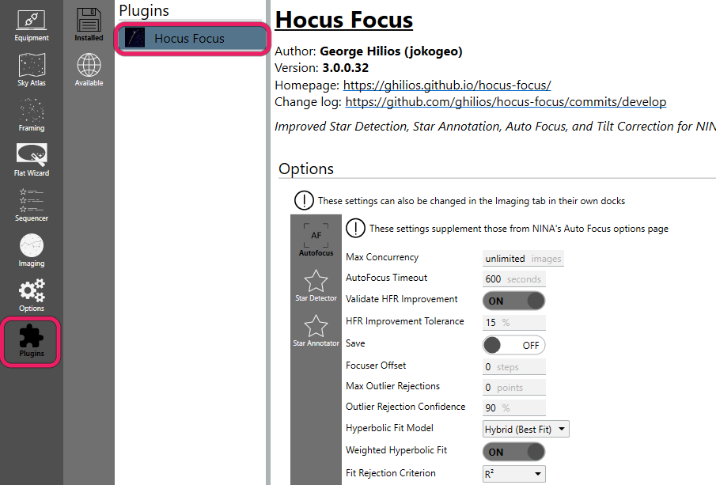
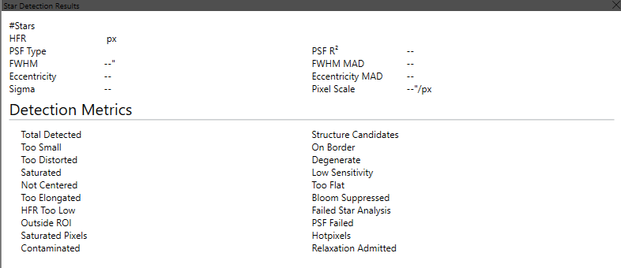

# Star Detection Settings

Hocus Focus's star detector turns a raw frame into a set of accepted stars with measured Half-Flux Radius (HFR), and optionally a fitted PSF for FWHM and eccentricity. Almost every tunable knob feeds a single parameter bundle (`StarDetectorParams`) built by one function, `BuildStarDetectorParams`, so what you set in NINA's plugin options is exactly what the detector runs, and exactly what the headless tooling reproduces.

This page is the entry point to the settings reference. It explains the two ways to drive the detector (**Simple mode** vs **Advanced mode**), where to find the options in NINA, the shape of the detection pipeline, and the EARLY-vs-LATE parameter distinction. Each pipeline stage links to its own sub-page where every setting is documented with its tooltip, default, range, and when to adjust it.

## Where to find these settings

Open NINA's options, go to the **Plugins** tab, and select **Hocus Focus**. The star-detection settings live in the **Star Detector** tab. Two top-level switches decide which controls you see:

{ width=620 }

*Find the plugin under Options, then Plugins, then Hocus Focus. The same controls also appear as docks in the Imaging tab.*

- **Advanced Mode** — exposes the full set of fine-grained parameters. Tooltip:

    > Enables advanced mode with fine-grained control over star detection parameters. Not recommended unless you're an expert

    Backed by the `UseAdvanced` option (default **off**).

- **Use Optimized Settings** — drives detection from a snapshot produced by the Optimization Wizard instead of the Simple-mode presets. Tooltip:

    > When enabled, the optimized star-detection settings produced by the optimization wizard drive detection instead of the Noise Level / Pixel Scale / Focus Range presets. Only available in Simple Mode after the wizard has produced and applied a result

    Backed by the `UseOptimizedSettings` option (default **off**). It only does anything once the wizard has produced and applied a result.

## Simple mode vs Advanced mode

Most users should stay in **Simple mode** (Advanced Mode off). In Simple mode you do not edit the low-level parameters directly. Instead, three plain-language presets are translated into a full parameter set every time you change one of them, the active profile changes, or you toggle the relevant switches. The translation lives in `DerivePresetSettings`, and it sets *all* the advanced knobs for you, so the advanced controls become outputs of the presets rather than independent inputs.

The three Simple-mode presets are:

| Preset | Default | What it controls |
|---|---|---|
| **Noise Level** | Typical | How much the source image is blurred/noise-handled before detection |
| **Pixel Scale** | Typical | Adjusts for apparent star size at your focal length |
| **Focus Range** | Typical | Whether heavily out-of-focus (donut) stars should still be found |

**Noise Level** — tooltip:

> Controls the amount of blurring done on the source image before beginning the star detection process. Increase this if you have a particularly noisy sensor or shoot at a very high focal ratio

Internally, this preset chooses the noise-reduction radius, whether measurement-time noise reduction is on, and whether hotpixel filtering runs. `None` disables noise reduction and hotpixel filtering entirely; `Low` and `Typical` currently derive the same values (a small blur, radius 3); `High` enables star-measurement noise reduction with a larger radius. See [Preprocessing & Noise](preprocessing.md).

**Pixel Scale** — tooltip:

> At high focal lengths, pixel scale decreases and apparent star size (in pixels) increases. Setting this to a higher focal length increases the number of layers considered for star detection, which could increase false positives due from nebulosity

`WideField` removes a structure layer and shrinks the minimum bounding box; `LongFocalLength` adds a layer, grows the minimum box, and increases sensitivity. See [Structure & Detection](structure-detection.md) and [Star Acceptance Gates](acceptance-gates.md).

This preset compensates for pixel scale by nudging a few knobs. [Detection Binning](detection-binning.md) attacks the same problem directly, by resampling the frame so star size lands back in the range the defaults were built for. It defaults to **1x1 (Off)** and applies in both Simple and Advanced mode.

**Focus Range** — tooltip:

> As you get further from critical focus, stars become large donuts. Star detection will typically consider them too large to be stars when you're far enough from focus. Enabling a wide range increases the number of layers considered for star detection

`WideRange` adds a structure layer and increases sensitivity so larger, more defocused stars survive. See [Structure & Detection](structure-detection.md).

!!! tip "When to leave Simple mode"

    Stay in Simple mode unless you have a specific reason not to. If the presets don't give you enough stars on your rig, the recommended next step is **not** to start hand-tuning advanced knobs. Instead, run the [Optimization Wizard](../optimization/index.md), which tunes detection against your own saved auto-focus runs and can apply the result as your Simple-mode settings. Advanced mode is for experts who want to set each parameter by hand.

### How the optimized snapshot interacts with the presets

When **Use Optimized Settings** is on and a wizard result exists, Simple mode first derives the preset baseline, then overlays the curated subset of parameters from the saved snapshot (sensitivity, clipping multipliers, peak response, distortion, min HFR, center tolerance, structure layers, noise-reduction radius, minimum bounding box, and the hotpixel knobs). Non-curated advanced knobs keep their preset defaults; the curated ones win. See [Labels, Recall & Precision](../optimization/labels-recall-precision.md) for how those values are chosen.

### Exporting and importing star-detection settings

Star-detection settings can move between machines. Two buttons at the bottom of the **Star Detector** tab, **Export** and **Import**, write and read a single `.json` file (named `HocusFocusStarDetection_<timestamp>.json`). This is how you tune on one computer and image on another: run the [Optimization Wizard](../optimization/index.md) on a fast desktop, **Export**, then **Import** on the imaging computer.

Only **star-detection** settings are written, not autofocus, inspector, or tilt settings. The wizard's optimized-settings snapshot is included too, so the imported profile can turn it on with **Use Optimized Settings**. A few values are deliberately left out because they belong to one computer: the intermediate-image path, the **Save Intermediate** flag, **Debug Mode**, and **PSF Parallel Size**. Those keep their local values on import.

With [per-filter star detection](#per-filter-star-detection) enabled, **Export** writes the set of the filter you are currently editing and records that filter's name in the file, and the import confirmation shows the name so you can tell which filter a file was tuned for. **Import** applies to whichever filter you are editing at the time, regardless of the name in the file.

Import never changes anything silently. After you pick a file, a confirmation dialog lists every setting that would change in a **Setting / Current / Imported** table, and the new values are applied only when you click **Apply**. If the file matches your current settings, it tells you there is nothing to change. A file that is not a Hocus Focus star-detection export, or that comes from a newer version's format, is rejected without touching your settings.

## Per-filter star detection

A single set of detection settings serves every filter by default. That is a compromise: narrowband frames carry fainter stars and darker backgrounds than broadband frames, so settings tuned for luminance can miss half the stars through Ha. **Per-filter star detection** gives every filter in the active profile's filter wheel its own complete settings set, tuned by hand or by the [Optimization Wizard](../optimization/index.md).

Enable it with the **Per-Filter Star Detection** checkbox at the top of the **Star Detector** tab (default **off**; with it off, nothing changes). On enable, every filter defined in the profile starts with a copy of your current settings, so behavior is identical until you change something for a specific filter. A filter added to the profile later starts from that same captured copy the first time it is used.

### Editing one filter's settings

With the feature on, an **Editing Filter** dropdown appears above the settings. Everything below it, including the Simple-mode presets, **Advanced Mode**, **Use Optimized Settings**, **Reset Defaults**, **Export**, and **Import**, now edits the selected filter's set. Pick another filter and the controls reload with that filter's values; changes are still written to the profile as you make them. The machine-local values (**Debug Mode**, the intermediate-image path and **Save Intermediate** flag, and **PSF Parallel Size**) stay global, since they describe the computer rather than the filter.

**Copy Settings From** copies another filter's set onto the filter you are editing: choose the source filter from the dropdown and click **Copy**. Like Import, it shows the confirmation dialog listing every setting that would change and applies nothing until you click **Apply**. A common workflow: tune one narrowband filter with the wizard, then copy the result to the other narrowband filters.

At detection time each image uses the settings of the filter it was captured with, read from the image metadata. Autofocus frames carry the filter that is physically in the light path, so a focus run through Ha is measured with your Ha settings automatically.

### Auto-focus sweep for one filter

Filters often want different sweeps as well as different detection: a narrowband filter's best step size is not a luminance filter's. Two boxes under **Auto-Focus Sweep for This Filter** override NINA's profile-wide sweep for the filter you are editing:

- **Step Size**: focuser steps between auto-focus points. Overrides **Auto Focus Step Size** in NINA's Options → Focuser.
- **Initial Offset Steps**: points on each side of the sweep's starting position. Overrides **Auto Focus Initial Offset Steps**.

Leave a box **blank** to use the profile value. A blank box shows that value dimmed, as `profile: 100`, so you can see what it resolves to; clear a box to go back to inheriting. The two resolve independently, so you can pin the step size for a filter and still inherit however many points the profile sweeps.

These are the numbers the [Optimization Wizard](../optimization/index.md) recommends. With per-filter star detection on, its **Apply these auto-focus settings** checkbox writes them here, into the target filter's set, rather than to the profile, so optimizing Ha and then L no longer overwrites Ha's sweep. **Copy Settings From** carries them along with the detection settings. **Export** and **Import** do not, since a step size describes a particular focuser rather than a filter.

Which filter's sweep applies is decided the same way detection decides: the filter the frames are actually taken through. Note that with NINA's **Use Filter Wheel Offsets** enabled, focus runs expose through your designated auto-focus filter, so it is *that* filter's sweep that applies, not the one you are imaging with.

### Filter wheel required

Per-filter sets are keyed by filter name, so detection must know which filter took each frame; that knowledge comes from the connected filter wheel. With the feature on and no wheel connected:

- Hocus Focus refuses to start its own operations up front: autofocus runs, aberration inspector runs and analyses, and the Optimization Wizard all stop with a message naming the feature, and the sequencer's **Run Aberration Inspector** instruction reports a validation issue.
- Any detection that still reaches a frame with no filter in its metadata (NINA's built-in autofocus using the Hocus Focus detector, for example) returns zero stars and shows a warning each time: *"Per-filter star detection is enabled but the active filter is unknown - connect a filter wheel."* It never fails the imaging pipeline with an error.
- The per-filter **sweep geometry** behaves differently on purpose: with no filter to key on it quietly falls back to the profile's step size and offset steps. Detection has nothing to fall back to, so it has to refuse. A sweep spacing does, and failing a focus run over one would be worse than using the profile's.

If you image without a filter wheel (an OSC rig, say), leave the feature off.

Renaming a filter starts the new name from the captured global copy; the old name's set is kept and reattaches if the name returns. Disabling the feature restores the single global set exactly as it was when you enabled per-filter mode, and the per-filter sets are kept for the next time you enable it.

Sweep-geometry overrides are the one thing enabling the feature does **not** seed: every filter starts out inheriting the profile. A copy taken at enable time would freeze, and would then silently ignore any later change you made in Options → Focuser.

## Reading the results: the Star Detection Results panel

Throughout these pages you are told to "watch the metrics panel." That panel is the **Star Detection
Results** readout that Hocus Focus shows after a detection (and in the autofocus report). It is the feedback
signal for every adjustment below. It reports:

{ width=620 }

*The Star Detection Results dock reports the last frame's metrics and how many candidates each gate rejected.*

- **Structure Candidates** — bright structures evaluated as potential stars before any gate.
- **Total Detected** — stars accepted after all gates.
- a **per-reason rejection count** for each gate: **Too Small**, **On Border**, **Too Distorted**, **Not
  Centered**, **Too Flat**, **Low Sensitivity**, **Saturated** (kept, not rejected: pixels masked during
  PSF fitting), **Degenerate**, and **Contaminated**.

When you change a setting, re-run detection and watch the count for the gate you are tuning. That number,
not a subjective look at the image, tells you whether the change helped.

## Tuning workflow (Advanced mode)

Advanced tuning is a short, repeatable loop, not a one-shot. Change **one** knob at a time and confirm the
effect in the [Star Detection Results panel](#reading-the-results-the-star-detection-results-panel) before
moving on:

1. Run star detection on a representative frame and open the Star Detection Results panel.
2. Identify the dominant problem: either real stars **missing entirely** (no marker at all) or stars
   **rejected with a reason** (a high per-reason count).
3. Route to the right page:
    - **Missing entirely** — the candidate was never formed: tune [Structure & Detection](structure-detection.md)
      (and [Preprocessing](preprocessing.md) / [Hot Pixels](hotpixel-saturation.md)).
    - **Rejected with a reason** — the candidate formed but a gate dropped it: go to
      [Acceptance Gates](acceptance-gates.md) (or [Contamination](contamination.md)) for that reason.
4. Change one setting in the direction that page recommends.
5. Re-detect and re-read the same count. Keep the change if the target count improved without hurting the
   others; otherwise revert and try the next candidate.

| Symptom in Star Detection Results | Page | Knob |
|---|---|---|
| Real stars with no marker at all | Structure & Detection | Structure Layers, Noise Clipping Multiplier, Dilation |
| High **Too Small** | Acceptance Gates | Min Star Bounding Box Size |
| High **Too Distorted** / **Not Centered** | Acceptance Gates | Max Distortion / Star Center Tolerance (or Defocus-Aware Gates if defocused) |
| High **Too Flat** | Acceptance Gates | Star Peak Response |
| High **Low Sensitivity** | Acceptance Gates | Brightness Sensitivity |
| High **Degenerate** | Preprocessing | Star Clipping Multiplier |
| High **Contaminated** | Contamination | Contamination Sensitivity / Reject Contaminated Stars |
| Hot pixels detected as stars | Hot Pixels & Saturation | Hotpixel Filtering / Hotpixel Threshold |

## The detection pipeline at a glance

A frame flows through the detector in roughly this order. The figure below shows the heart of it: a raw frame (with nebulosity) is reduced to a wavelet residual that suppresses large-scale structure, then binarized into a structure map of star candidates.

{ width=620 }

*The structure-detection core: large-scale structure (nebula) is removed by the à-trous wavelet residual, and the result is thresholded into a binary candidate map.*

| Stage | What happens | Settings page |
|---|---|---|
| **Preprocessing & noise** | Hotpixel filtering, optional Gaussian blur, two noise-σ estimates | [Preprocessing & Noise](preprocessing.md) |
| **Detection binning** | Optional integer resample so star size lands in the detector's calibrated range | [Detection Binning](detection-binning.md) |
| **Structure & detection** | Wavelet layers → noise-clipped binarization → dilation → candidate flood-fill | [Structure & Detection](structure-detection.md) |
| **Star acceptance gates** | Size, distortion, centering, sensitivity, flatness, min-HFR checks per candidate | [Star Acceptance Gates](acceptance-gates.md) |
| **Hot pixels & saturation** | Hotpixel threshold, saturation rejection threshold | [Hot Pixels & Saturation](hotpixel-saturation.md) |
| **PSF modeling** | Optional Gaussian/Moffat fit for FWHM, eccentricity, goodness-of-fit gate | [PSF Modeling](psf-modeling.md) |
| **Contamination rejection** | Gradient-robust test that flags/rejects stars with a one-sided neighbor | [Contamination Rejection](contamination.md) |
| **Advanced & debug** | Measurement averaging, defocus-aware gates, intermediate file output, debug mode | [Advanced & Debug](advanced-debug.md) |

Each accepted star contributes its HFR (and, with PSF modeling on, FWHM and eccentricity) to the frame's aggregate measurement; rejected candidates are tallied by reason and can be visualized in the annotation overlay.

## EARLY vs LATE parameters

Internally the detector splits into an **EARLY** phase (`BuildDetectionContext`) and a **LATE** phase (`GateAndMeasure`):

- **EARLY** parameters affect the prepared image, the candidate region set, and the noise estimates. Changing one forces a **full re-detect**. These are the hotpixel knobs (`HotpixelFiltering`, `HotpixelThresholdingEnabled`, `HotpixelThreshold`), noise reduction (`StarMeasurementNoiseReductionEnabled`, `NoiseReductionRadius`, `NoiseClippingMultiplier`, `LocallyAdaptiveBinarization`, `AdaptiveNoiseBlockSize`), the structure-map knobs (`StructureLayers`, `DefocusAwareStructure`, `StructureLayerBoost`, `StructureDilationSize`, `StructureDilationCount`), `SaturationThreshold`, `DetectionBinning`, and the detection `Region`.
- **LATE** parameters only re-gate or re-measure the candidates that already exist (sensitivity, distortion, centering, min-HFR, PSF settings, the defocus-aware *gate* relaxations, contamination). They are cheap to change.

You don't normally need to think about this when using NINA, where every detection runs the full pipeline anyway. The distinction matters because the [Optimization Wizard](../optimization/index.md) and the headless tooling exploit it: an expensive early context is cached and reused across many late-only candidate moves, which is what makes the optimizer fast. The safe failure mode of the cache is always a redundant recompute, never stale reuse.

!!! note "Profile-scoped and auto-saved"

    All star-detection settings are stored per NINA profile, and changes are written to the active profile as you make them — there is no separate save step. Switching profiles re-derives Simple-mode settings from that profile's presets. There is also a **Reset Defaults** action that restores every parameter to its shipped value (Simple mode, Typical presets, PSF modeling on with Moffat 4.0, and so on) and clears any optimized snapshot.

## Reference sub-pages

- [Precision & Recall](precision-recall.md) — how detection quality is measured against golden star sets, and the candidate-formation finding that drove the defaults below.
- [Adaptive Binarization](adaptive-binarization.md) — why the noise-clipping floor dropped from 4 to 2 and became spatially adaptive, with the data.
- [Donut-Aware Settings](donut-aware.md) — the opt-in donut-recovery features and the measurements that justified them.
- [Preprocessing & Noise](preprocessing.md) — hotpixel filtering, noise reduction radius, clipping multipliers, measurement noise reduction, pixel sample size.
- [Structure & Detection](structure-detection.md) — structure layers, dilation, brightness sensitivity, defocus-aware structure.
- [Star Acceptance Gates](acceptance-gates.md) — distortion, centering, peak response, min bounding box, min HFR, defocus-aware gates.
- [Hot Pixels & Saturation](hotpixel-saturation.md) — hotpixel threshold and saturation rejection threshold.
- [PSF Modeling](psf-modeling.md) — fit type, resolution, goodness-of-fit threshold, pixel integration.
- [Contamination Rejection](contamination.md) — contamination sensitivity and reject-vs-flag behavior.
- [Advanced & Debug](advanced-debug.md) — measurement averaging, intermediate files, debug mode.
