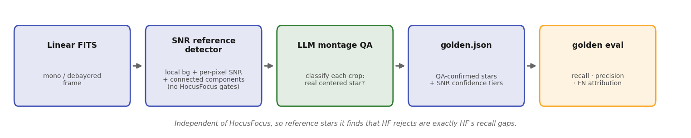
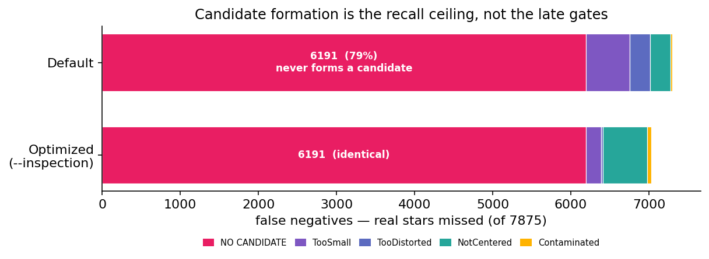

# Precision & Recall

Two numbers describe how well the star detector does its job. **Recall** is the fraction of the real stars in a
frame that it finds. **Precision** is the fraction of its detections that are real. Hocus Focus is deliberately
tuned for high precision, because a clean, well-measured set of stars makes a trustworthy focus signal. That
leaves recall as the harder question: how many real stars does the detector miss, and why?

Answering it needs ground truth that is independent of the detector and covers every real star in a frame, not a
chosen few. That is a **golden star set**: a per-image catalog of the real stars, built without using Hocus
Focus and then scored against the detector's output. This page explains how a golden set is collected, how
recall and precision are measured against it, and what that measurement revealed.

!!! note "This is a developer measurement, not an in-app feature"
    The golden tooling is a maintainer harness: the `TestApp` command-line program plus a few Python scripts
    (`tools/golden/`). You never need it to use the plugin. It is documented here because it is the evidence
    behind the [Adaptive Binarization](adaptive-binarization.md) and [Donut-Aware](donut-aware.md) defaults.

The [Labels](../optimization/labels-recall-precision.md) page covers a lighter, interactive form of the same
idea: a handful of boxes you draw by hand, scored live inside the optimizer. Golden sets are the heavyweight
version used to settle a shipped default across many runs.

## What makes ground truth trustworthy

Two properties matter, and they are in tension with the obvious shortcuts:

- **It must be independent of the detector.** If the reference is built from Hocus Focus's own output, it can
  only confirm what the detector already does. It can never reveal the stars the detector *misses*, which is the
  entire point of measuring recall.
- **It must be objective about faint stars.** Recall is won or lost on the faint end, so the reference cannot
  lean on a subjective "looks like a star" judgement that drifts frame to frame.

## Why hand-marking every star does not scale

The first attempt had a vision model mark every star directly on stretched image tiles. It failed on faint subs.
Each tile reaches the model downscaled to roughly a 256-pixel thumbnail, so the model guesses a position and
scales it back up. Localization came out to 15–170
pixels of error and was inconsistent from tile to tile. At a stretch aggressive enough to reveal real faint
stars the model over-marked background noise, and at a gentle stretch it missed obvious bright stars. The result
was essentially uncorrelated with the real stars: only about 5 of 145 detector stars had any mark within 25
pixels. Stronger models and tiered-confidence prompts did not fix it, because it is an intake-resolution limit,
not a prompt problem.

The lesson shaped the whole method: use a vision model for **classification** (is this small crop a real star?),
never for **localization** (where exactly is it?). Precise positions come from code.

## The method that works

{ width=720 }

*An independent SNR reference detector proposes precise candidates from the linear frame; a vision model confirms
each one by classification; the confirmed stars, tiered by measured SNR, become the per-image golden set that
`golden eval` scores against.*

**1. An independent SNR reference detector.** A plain local-background, per-pixel signal-to-noise, and
connected-components detector runs on the **linear** (unstretched) frame. It has none of Hocus Focus's stages:
no wavelet structure detection, and no distortion, centering, sensitivity, contamination, or PSF gates. Because
it shares no logic with the detector under test, a star it finds that Hocus Focus rejects is a genuine recall
gap rather than a disagreement between two copies of the same code. It was validated as a precise *superset* of
the detector: every accepted Hocus Focus star matches a reference candidate within 10 pixels, and a component at
SNR ≥ 8 spread over a few pixels cannot arise from noise. Each candidate keeps its measured SNR.

**2. Montage QA for classification.** The reference also picks up hot pixels, saturation fragments, and edge
artifacts. Small crops centered on each candidate are tiled into montages, and a vision model confirms or
rejects each cell as a real centered star. This is the narrow classification task the model is reliable at, even
at thumbnail resolution, because it only needs to answer whether a concentrated source sits under the reticle.
On the audited run it confirmed about 79% of the SNR ≥ 5 candidates as real and discarded the rest.

**3. The golden set.** The confirmed candidates become the golden stars. Each is tagged with a confidence tier
taken from its **measured SNR**, which is objective rather than a subjective model rating: SNR ≥ 12 is *high*,
8–12 is *medium*, and 5–8 is *low*.

## The `golden.json` format

A golden set is stored as one sidecar file per image, named `<image>.golden.json` and kept beside the frame. It
records the focuser position and a list of star boxes, each a top-left `{x, y, w, h}` in full-frame pixels plus
a confidence tier:

```json
{
  "imageFile": "05_..._Focuser2701.fits",
  "focuserPosition": 2701,
  "schemaVersion": 1,
  "stars": [
    { "x": 4192, "y": 1188, "w": 14, "h": 14, "confidence": "high" },
    { "x": 5031, "y": 2402, "w": 11, "h": 12, "confidence": "medium" }
  ]
}
```

The boxes use the same geometry as the review labels, so one scoring path reads both.

## Scoring: recall, precision, and where the misses go

Scoring runs with `golden eval` for a single run, or `bank-verify` across a saved bank of runs. A detected star
matches a golden star when their centers fall within a match radius (about 12 pixels, which absorbs the
few-pixel offset between the reference centroid and the detector centroid). From the matches:

- **Recall** is the fraction of golden stars that were matched, reported overall and broken out by SNR tier, by
  frame, and by sensor region. The per-region split matters for tilt work, where the corner ROIs carry the fit's
  leverage and are usually the most recall-starved.
- **Precision** is the fraction of detected stars that match a golden star.
- **False-negative attribution** labels every missed golden star by *why* it was missed: `NO CANDIDATE` means
  the structure stage never proposed it (a candidate-formation gap), `REJECTED: <gate>` means a candidate formed
  but a named acceptance gate dropped it, and accepted-elsewhere means a different golden box claimed the same
  detection. This split is what turns a recall number into a diagnosis, since a candidate-formation
  gap and a too-strict gate call for different fixes.

!!! tip "Read recall @ SNR≥12 as the headline"
    The high-SNR tier is the most trustworthy number. Those stars are unambiguous, so a missed one is a real
    miss. Precision on deep, star-rich frames reads low for a measurement reason, not a detector one: confirming
    every faint candidate by montage QA is infeasible on a frame with tens of thousands of them, so some of the
    detector's real faint detections have no golden match and are counted as false positives. Treat precision on
    those runs as a lower bound, and trust recall @ SNR≥12.

!!! note "Heavily defocused donuts need a matched filter"
    A per-pixel SNR reference under-counts heavily defocused donuts, whose light is spread thin enough to sink
    below the per-pixel threshold, so reference counts fall at the focus-sweep extremes. A matched-filter pass
    (convolving the noise-normalized frame with a disk or annulus kernel) recovers them for donut-specific
    audits. Near-focus and moderately defocused frames are reliable without it.

## What the audit found

On a real ZWO ASI6200MM Pro train, Hocus Focus had excellent precision (about 0.85) but found only about 19% of the
real SNR ≥ 12 stars. The decisive part was *where* the misses went: about 79% of all the real stars never formed
a candidate at all. They were `NO CANDIDATE`, dropped by the wavelet structure stage before any acceptance gate
could see them, and that count did not move when the optimizer tuned the late gates. Candidate formation, not
the gates, was the recall ceiling.

{ width=620 }

*Most missed stars never form a candidate. The `NO CANDIDATE` bucket (6191 of 7875) dwarfs every late-gate
rejection and is identical whether the late gates run at their defaults or at the optimizer's best settings.
Recall is set at candidate formation, not at the gates.*

That single finding drove the two changes documented on the next two pages:

- [Adaptive Binarization](adaptive-binarization.md) lowered the noise-clipping floor that decides candidate
  formation, and made it adapt to each region of the frame. This is the single biggest recall lever.
- [Donut-Aware Settings](donut-aware.md) recover the heavily defocused donut stars that the strict defaults drop
  entirely.
