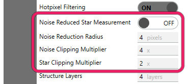
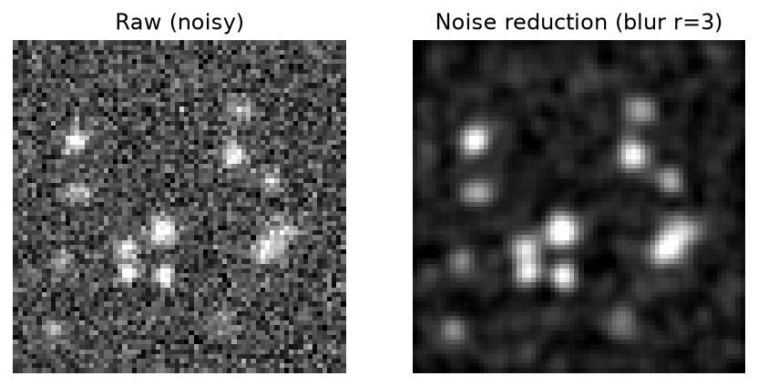
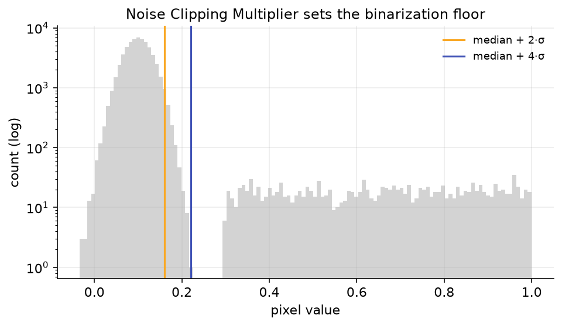
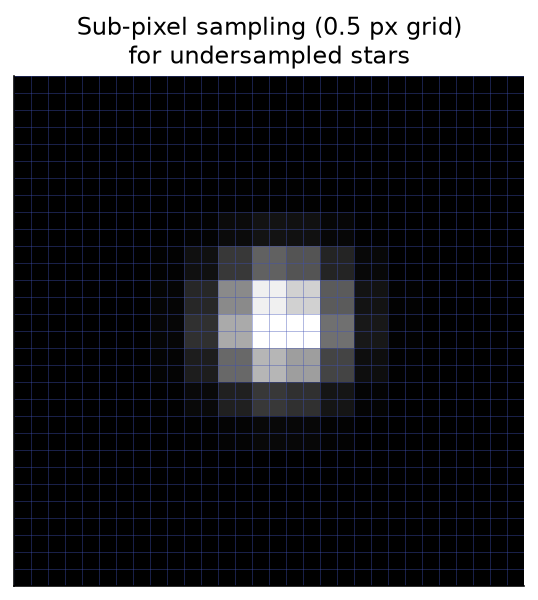

# Preprocessing & Noise Handling

Before Hocus Focus can find and measure stars, it has to decide what is *signal* and what is *noise*. The settings on this page control that decision in three places:

1. **Smoothing** — how much the image is blurred to suppress per-pixel noise (`NoiseReductionRadius`), and whether that blur is also applied to the pixels used for measurement (`StarMeasurementNoiseReductionEnabled`).
2. **Thresholding** — how far above the noise floor a pixel must sit to count as a star candidate (`NoiseClippingMultiplier`) or to be included in a star's flux/HFR measurement (`StarClippingMultiplier`).
3. **Sub-pixel sampling** — how finely star centers and HFR are sampled between whole pixels (`PixelSampleSize`).

A key idea runs through all of these: Hocus Focus keeps **two images**. A *structure-detection image* is used to find where the candidate stars are, and a *measurement image* is used to measure each star's centroid, flux, HFR, and PSF. By default the noise reduction is applied **only** to the structure-detection image, so candidate-finding is robust to noise while the measurements stay on the sharp, unblurred pixels.

{ width=375 }

*The preprocessing controls: noise-reduced measurement, noise reduction radius, and the noise and star clipping multipliers.*

!!! note
    These are **Advanced** settings. In Simple mode they are derived for you from the **Noise Level**, **Pixel Scale**, and **Focus Range** presets, so you normally never touch them directly. Switch on Advanced mode to expose them.

## Summary

| Setting | Default | Range | Effect |
|---|---|---|---|
| Noise Reduced Star Measurement (`StarMeasurementNoiseReductionEnabled`) | Off | On / Off | Also blur the *measurement* image, not just the structure-detection image |
| Noise Reduction Radius (`NoiseReductionRadius`) | 3 | ≥ 0 (UI requires > 0) | Half-size of the Gaussian blur applied for noise reduction |
| Noise Clipping Multiplier (`NoiseClippingMultiplier`) | 4.0 | ≥ 0 (UI requires > 0) | σ multiplier for the structure-map binarization floor (candidate finding) |
| Star Clipping Multiplier (`StarClippingMultiplier`) | 2.0 | ≥ 0 (UI requires > 0) | σ multiplier for the per-star measurement-pixel inclusion gate |
| Pixel Sample Size (`PixelSampleSize`) | 1.0 (100%) | setter (0, 1]; UI floor 25% (25%–100%) | Sub-pixel sampling granularity for center/HFR measurement |

{ width=620 }
*Noise reduction blurs the image so that per-pixel noise does not fragment a star or produce spurious candidates. By default this blur is applied only to the structure-detection image.*

---

## Noise Reduction Radius

**What it does:** sets the size of the Gaussian blur used to suppress per-pixel noise before star candidates are found.

> Blurs the image with a NxN gaussian convolution and a sigma automatically chosen to match this radius. Larger values blur the image further. If this is enabled, hotpixel filtering is automatically performed before to prevent the hotpixels from bleeding into the surrounding pixels

**Default:** `3` &nbsp;•&nbsp; **Range:** must be non-negative; `0` disables noise reduction. The Advanced UI field requires a value greater than zero.

The radius is a *half-size*: the convolution kernel spans roughly twice the radius, with the Gaussian σ chosen automatically to match. A larger radius merges more neighboring pixels, which smooths away noise but also softens faint, closely-spaced, or small stars. Because a blur would smear hot pixels into their neighbors, enabling noise reduction implies hot-pixel filtering runs first (see [Hot Pixels & Saturation](hotpixel-saturation.md)).

!!! tip "When this helps"
    Raise it for **low-SNR** subframes (short exposures, fast focus sweeps, or a noisy sensor) where single-pixel noise is fragmenting stars or producing spurious candidates. Leave it at the default for typical data. It can hurt when the field is tightly packed or the rig is undersampled, because over-blurring merges adjacent stars and erases the smallest ones. **Feedback:** in the [Star Detection Results panel](index.md#reading-the-results-the-star-detection-results-panel), a good move raises **Total detected** while the **Structure candidates** count falls toward it (fewer spurious candidates are formed only to be rejected).

## Noise Reduced Star Measurement

**What it does:** decides whether the noise-reduction blur is applied to the *measurement* image as well as the structure-detection image.

> Apply noise detection settings to the pixels used during star measurement. By default, it is applied only to the structure detection image.

**Default:** `Off` &nbsp;•&nbsp; **Range:** On / Off.

This is the switch that controls Hocus Focus's two-image design. With it **off** (default), candidate *finding* runs on the blurred structure-detection image, but every measurement (centroid, flux, HFR, PSF) is taken from the sharp, unblurred image, so the blur cannot bias the numbers. With it **on**, the same blurred pixels feed both stages.

Turning it on changes what the noise σ is measured against. Hocus Focus tracks two noise estimates: a structure σ (on the noise-reduced structure source, used only by the binarize threshold) and a measurement σ (on the image actually sampled). The brightness and star clipping multipliers are honest multiples of that **measurement** σ, so they keep their meaning regardless of this switch.

!!! tip "When this helps"
    Enable it only for **very noisy** data where the unblurred pixels are too noisy to measure HFR reliably. The High noise preset turns it on for you and also raises the radius. It can hurt in normal conditions: blurring the measurement pixels inflates measured HFR and softens the PSF, biasing the autofocus curve. Leave it off unless you have a specific noise problem.

---

## Noise Clipping Multiplier

**What it does:** sets how far above the background a pixel must rise to be kept as part of a star *candidate*: the binarization floor for the structure map.

> Structure map generation binarizes pixels above the noise floor after noise detection and before star detection. This floor is calculated based on the background (median of the whole image) + this multiplier times the noise standard deviation, as calculated using the Kappa-Sigma algorithm. Increasing this value more aggressively clips the background, which can be useful if star bounding boxes include too much background data.

**Default:** `4.0` &nbsp;•&nbsp; **Range:** must be non-negative. The Advanced UI field requires a value greater than zero.

This multiplier governs **candidate finding only**. After noise reduction and wavelet structure detection, the structure map is binarized at a threshold of

\[
\text{threshold} = \text{median} + (\text{NoiseClippingMultiplier} \times \sigma_{\text{structure}})
\]

where the median is the whole-image background and \(\sigma_{\text{structure}}\) is the Kappa-Sigma noise estimate on the structure source. Pixels above the threshold become foreground; everything else is background. A higher value pulls the floor up, so only brighter pixels survive: bounding boxes shrink and tighten around star cores, but the faintest stars drop out.

{ width=620 }
*The structure map is binarized at median + k·σ. Raising the Noise Clipping Multiplier moves the floor right, keeping only brighter structure.*

!!! tip "When this helps"
    Raise it when star bounding boxes are swallowing too much background (loose, bloated boxes), or when faint noise structure is being detected as junk candidates, especially after adding light noise reduction. **Lower it** to recover faint stars on clean data. It does **not** affect the measured HFR of an accepted star; that is the job of the Star Clipping Multiplier below.

## Star Clipping Multiplier

**What it does:** sets the per-star pixel-inclusion gate, controlling how far above the local background a pixel must be to count toward that star's flux and HFR.

> Number of noise standard deviations above the local background median to filter star candidate pixels out from star consideration and HFR analysis. The noise level is measured on the image actually used for star measurement, so this value means the same thing regardless of noise-reduction settings. Decrease this if there are a large number of stars excluded for being degenerate and you can see many clear dim stars that are not detected.

**Default:** `2.0` &nbsp;•&nbsp; **Range:** must be non-negative. The Advanced UI field requires a value greater than zero.

Where the Noise Clipping Multiplier decides *which structures become candidates*, the Star Clipping Multiplier decides *which pixels within an accepted candidate get measured*. For each star a clip level of

\[
\tau = \text{StarClippingMultiplier} \times \sigma_{\text{measurement}}
\]

above the local background is used as an **inclusion gate**: pixels at or below \(b + \tau\) are excluded from the centroid, flux, and HFR sum. Because \(\sigma_{\text{measurement}}\) is measured on the image actually sampled, the multiplier is an honest multiple of the real noise. The same value means the same thing whether or not noise reduction is on.

!!! tip "When this helps"
    **Lower it** when many obviously-real dim stars are being thrown out as degenerate (their wings sink below the gate, leaving too few pixels to measure). **Raise it** if faint star measurements look noise-inflated and you want a stricter, cleaner pixel set. Setting it too low lets background noise leak into the flux sum and biases HFR; too high starves faint stars of pixels. **Feedback:** watch the **Degenerate** rejection count in the [Star Detection Results panel](index.md#reading-the-results-the-star-detection-results-panel). Lowering this should bring it down as starved stars recover enough pixels to measure.

!!! note
    The two multipliers are independent knobs for two different stages. If faint stars are missing entirely, the Noise Clipping Multiplier (candidate finding) and [Brightness Sensitivity](structure-detection.md) are usually the levers; if faint stars are *found* but rejected as degenerate, the Star Clipping Multiplier is the one to relax.

---

## Pixel Sample Size

**What it does:** sets the sub-pixel granularity used when sampling a star to compute its center and HFR.

> When calculating star centers and HFR, we sample values between pixels using bilinear interpolation to improve accuracy. The optimal sample size depends on whether and how much your optical system is undersampling. Increase to 1 if you are perfectly- or over-sampled, and consider lowering it below 0.5 if you are more than 2x undersampled. This value must be between 25 and 100, inclusive

**Default:** `1.0` (shown as 100% in the UI) &nbsp;•&nbsp; **Range:** greater than 0 and at most 1.0. The Advanced UI accepts 25%–100% (i.e. 0.25–1.0).

This value is the spacing of the sampling grid, in pixels, that Hocus Focus walks across each star's bounding box. At `1.0` it samples one point per pixel; at `0.5` it samples on a half-pixel grid (four sample points per pixel), reading intermediate values via bilinear interpolation. Finer sampling recovers a more accurate centroid and HFR when a star's profile is only a couple of pixels wide and a whole-pixel grid would alias the measurement.

{ width=620 }
*With an undersampled star, a whole-pixel grid (1.0) coarsely samples the profile. Lowering the sample size adds interpolated points between pixels for a smoother center and HFR.*

!!! tip "When this helps"
    Leave it at **1.0** if you are correctly sampled or oversampled: finer sampling buys nothing there and only costs time. Lower it (toward **0.5** or below) for **undersampled** rigs (wide-field setups with large pixels and short focal lengths) where stars span only a few pixels; the Wide-field pixel-scale preset sets it to 0.5 for you. Going below the default on a well-sampled rig wastes computation without improving accuracy.

!!! tip "Starting point"
    From your rig's FWHM in pixels (\(\text{FWHM}_{px} = \text{FWHM}_{arcsec} / \text{pixelScale}\)): use **1.0** if \(\text{FWHM}_{px} \gtrsim 3\), ramp toward **0.5** as \(\text{FWHM}_{px} \to 1.5\), and go below 0.5 if \(\text{FWHM}_{px} < 1\). This is just a starting point the optimizer and Simple presets refine.

!!! warning
    Finer sub-pixel sampling improves accuracy but does not create resolution that the optics did not capture. For a severely undersampled rig, also consider enabling [PSF pixel integration](psf-modeling.md), which reduces PSF bias at very small FWHM.
