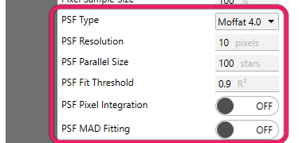
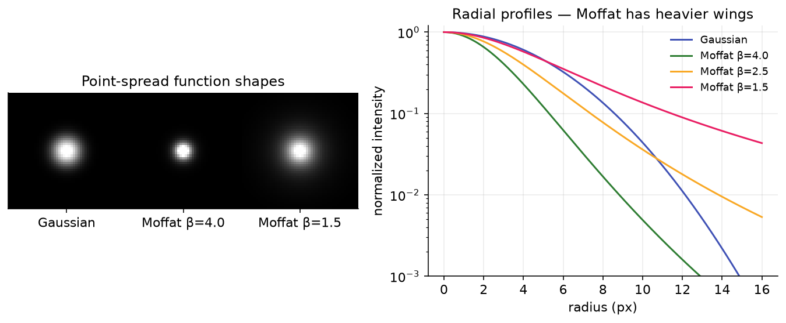
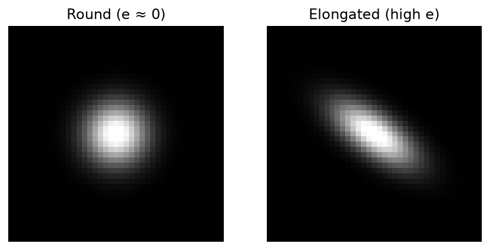

# PSF Modeling

After a star is detected and its HFR measured, Hocus Focus can fit an analytic **Point Spread Function (PSF)** to the star's pixels. The PSF fit is what produces a star's **FWHM** (full width at half maximum) and **eccentricity**; without it those metrics are unavailable. This page covers the settings that control whether PSF fitting runs, which model is used, how finely it samples, and the goodness-of-fit gate that decides whether a fit is trusted.

{ width=375 }

*The PSF modeling block: model type, resolution, parallel batch size, and fit threshold.*

These settings live under the **Advanced** star-detection options. They do not affect star *acceptance* (which stars pass the [acceptance gates](acceptance-gates.md)). They only shape the per-star *shape measurement* that PSF fitting produces.

## What PSF modeling does

Star detection first finds candidates, measures each star's centroid and **HFR**, and applies the acceptance gates. If PSF modeling is enabled, every accepted star then gets an analytic profile fit on top of that. The fit is solved per star, optionally across parallel batches, and is accepted only if its goodness of fit (R²) clears a threshold. A star whose PSF fit fails the threshold keeps its HFR but reports no FWHM/eccentricity (and increments the `PSFFitFailed` metric).

!!! note "HFR is always measured; FWHM is not"
    HFR (Half-Flux Radius) is the flux-weighted mean radius over a circular aperture, an empirical flux sum that the detector always computes for every accepted star, independent of PSF modeling. See [Half-Flux Radius](#half-flux-radius-hfr) below. FWHM and eccentricity come *only* from the PSF fit, so they are blank when `ModelPSF` is off or when the fit is rejected by the R² gate.

## Settings at a glance

| Setting | Default | Range | Effect |
|---|---|---|---|
| Fit PSF | On | On / Off | Master switch for fitting PSFs; required for FWHM and eccentricity |
| PSF Type | Moffat 4.0 | Gaussian, Moffat 4.0 / 2.5 / 1.5, Moffat (β fittable) | Which analytic profile is fit to each star |
| PSF Resolution | 10 | integer > 0 (pixels) | Sampling-grid width across the star box; accuracy vs. speed |
| PSF Fit Threshold | 0.9 | (0, 1] (R²) | Minimum R² for a fit to be accepted |
| PSF Pixel Integration | Off | On / Off | Integrate the model over each pixel instead of point-sampling |
| PSF MAD Fitting (`UsePSFAbsoluteDeviation`) | Off | On / Off | Experimental absolute-deviation fit, more robust to noise/outliers |
| PSF Parallel Size | 100 | integer ≥ 0 (stars) | Batch size for parallel fitting; 0 disables parallelism |

{ width=620 }
*Gaussian (light wings) versus Moffat (heavier wings) profiles. Real stars carry more flux in the wings than a Gaussian predicts, which is why a Moffat model is the default.*

---

## Fit PSF

**Fit PSF** (property `ModelPSF`) is the master switch that turns PSF fitting on or off for detected stars.

> Whether to fit PSF models to detected stars. This is required for FWHM and Eccentricity

**Default:** On &nbsp;·&nbsp; **Range:** On / Off

When this is on, each accepted star is fit and the results populate the star's FWHM and eccentricity. When off, the detector skips fitting entirely and those metrics are unavailable; HFR is still measured.

{ width=520 }
*Eccentricity measures how elongated a star is: a round star (left) has eccentricity near 0, while an elongated one (right), from tilt, trailing, or astigmatism, has high eccentricity. This shape comes only from the fitted PSF.*

!!! tip "When this helps"
    Leave it **on** for aberration inspection, tilt analysis, eccentricity maps, and any workflow that reads FWHM/eccentricity. Turn it **off** only when you need the lightest, fastest detection and care solely about star counts and HFR (the cost is per-star fit time, which grows on dense fields). (Auto-focus runs already disable PSF modeling internally for speed, so this switch primarily affects detection-driven analysis panels.)

## PSF Type

**PSF Type** (property `PSFFitType`) — selects which analytic profile is fit to each star.

> What type of PSF model to fit. Moffat 0.4 more closely resembles real stars and is the default used by PixInsight

**Default:** Moffat 4.0 &nbsp;·&nbsp; **Range:** Gaussian, Moffat 4.0, Moffat 2.5, Moffat 1.5, Moffat (β fittable)

A **Gaussian** falls off quickly and underestimates the light in a star's wings. A **Moffat** profile adds heavier wings governed by a power-law exponent \( \beta \), which is why it tracks real stellar profiles more faithfully. The numeric labels are fixed \( \beta \) values:

\[
I(r) = I_0 \left( 1 + \frac{r^2}{\alpha^2} \right)^{-\beta}
\]

- **Moffat 4.0** — moderate wings; the default and PixInsight's default.
- **Moffat 2.5 / 1.5** — progressively heavier wings (smaller \( \beta \) = more flux far from the core).
- **Moffat (β fittable)** — lets the solver fit \( \beta \) per star instead of fixing it.
- **Gaussian** — the limiting light-wing case; fastest but least faithful to real PSFs.

!!! tip "When this helps"
    Leave it at **Moffat 4.0** for general use. Try a heavier-wing Moffat or the fittable-β variant if your optics produce pronounced wings or halos and fixed-β fits are clearing the R² gate poorly. **Gaussian** is mainly useful as a fast baseline or for comparison.

## PSF Resolution

How finely each star's bounding box is sampled when fitting the model.

> The number of pixels of the width of a nominal square to sample star bounding boxes for the purposes of PSF model fitting. Higher resolution may be more accurate, but takes longer to calculate

**Default:** 10 (pixels) &nbsp;·&nbsp; **Range:** integer > 0 (the field validates greater-than-zero; the backing property rejects negatives)

Higher resolution gives the solver more samples per star (potentially a more accurate fit) at the cost of compute time per star.

!!! tip "When this helps"
    The default of **10** is a good balance. Raise it if FWHM/eccentricity look noisy on large, well-sampled stars and you can spare the time; lower it to speed up fitting when you have many stars and accuracy is non-critical. It does not change which stars are accepted.

## PSF Fit Threshold

The R² goodness-of-fit gate that decides whether a PSF fit is trustworthy.

> The minimum goodness of fit (R²) required for a PSF

**Default:** 0.9 (R²) &nbsp;·&nbsp; **Range:** (0, 1]. The field validates `0 ≤ value ≤ 1.0`; the backing property rejects values outside the open-low, closed-high interval \((0, 1]\)

After a star is fit, its coefficient of determination \( R^2 \) is compared against this threshold. A fit with \( R^2 \ge \) threshold is kept; otherwise the fit is discarded (the star keeps its HFR but reports no FWHM/eccentricity, and the `PSFFitFailed` count increases). \( R^2 = 1 \) is a perfect fit; lower values mean the model explains less of the star's pixel variance.

!!! tip "When this helps"
    Keep **0.9** for clean, well-fit metrics. **Lower** it (e.g. toward 0.8) if too many real stars are getting no FWHM because their fits fall just short, common for noisy frames or unusual profiles. **Raise** it toward 1.0 to admit only near-perfect fits when you want the cleanest possible shape statistics and can afford fewer measured stars.

!!! warning
    Setting the threshold to 0 is not allowed (the valid range is open at zero). A very low threshold lets poorly-fit stars through with unreliable FWHM/eccentricity; a very high threshold can leave most stars with no shape metrics at all.

## PSF Pixel Integration

Computes the model value for each pixel as the integral over the pixel's area rather than a single point sample at the pixel center.

> When enabled, PSF model values are computed as the integral over the pixel area rather than sampled at the pixel centre. Reduces sigma error on undersampled rigs (FWHM ≈ 1.5 px) from ~8% to less than 5%. Leave off for well-sampled rigs.

**Default:** Off &nbsp;·&nbsp; **Range:** On / Off

Point-sampling the model at \( (i, j) \) ignores how the profile varies across a pixel. On **undersampled** rigs (where a star spans only a couple of pixels) that approximation biases the fitted sigma. Integrating the model over each pixel area \([i-0.5, i+0.5]\times[j-0.5, j+0.5]\) removes most of that bias.

!!! tip "When this helps"
    Turn it **on** for undersampled setups (short focal length / large pixels, FWHM around 1.5 px), where it cuts sigma error from roughly 8% to under 5%. **Leave it off** for well-sampled rigs. The extra cost buys nothing there. To judge it, compare reported FWHM/σ stability before and after, and watch the **PSFFitFailed** count in the [Star Detection Results panel](index.md#reading-the-results-the-star-detection-results-panel) for any change in fit rejections.

## PSF MAD Fitting

Experimental fitting mode that minimizes absolute deviation instead of squared residuals.

> Enables an experimental PSF fitting approach that is more robust to noise and outlier pixels. This should more closely mimic PixInsight PSF fitting logic

**Default:** Off &nbsp;·&nbsp; **Range:** On / Off (property name `UsePSFAbsoluteDeviation`)

Fitting to minimize absolute deviation downweights outlier pixels (a hot pixel, a cosmic-ray hit, a nearby star's flux) relative to a least-squares fit, at a modest extra computational cost. The internal note describes it as "more robust to noise and outlier pixels."

!!! tip "When this helps"
    Try it on **noisy frames** or fields with frequent outlier pixels where ordinary fits are being pulled around, and when you want behavior closer to PixInsight's PSF logic. To gauge the effect, compare reported FWHM/σ stability before and after and watch the **PSFFitFailed** count in the [Star Detection Results panel](index.md#reading-the-results-the-star-detection-results-panel) for any shift in fit rejections. Because it is experimental and slower, **leave it off** by default and enable it deliberately when robustness matters more than speed.

## PSF Parallel Size

Batches stars for parallel PSF fitting.

> Enables parallel processing of PSF modeling by partitioning the detected stars into batches of this size. Set to 0 to disable parallelism

**Default:** 100 (stars) &nbsp;·&nbsp; **Range:** integer ≥ 0 (the backing property rejects negatives)

Stars are partitioned into batches of this size and each batch is fit on its own task, which speeds up frames with many stars on multi-core machines. A value of **0** disables parallelism and fits every star sequentially.

!!! tip "When this helps"
    Leave it at **100**. Set it to **0** only when debugging or when you need strictly sequential, deterministic ordering. It is a pure performance knob. It does not change which stars are accepted or the fitted values.

---

## Half-Flux Radius (HFR)

HFR is the workhorse focus metric and is measured for every accepted star regardless of the PSF settings above. It is the **flux-weighted mean radius** of a star's light over a circular aperture, computed with per-pixel local-background subtraction. Equivalently, it is the radius at which half of the star's enclosed flux lies inside and half outside, so a tighter, better-focused star has a smaller HFR and a bloated, defocused star a larger one.

\[
\mathrm{HFR} = \frac{\sum_i f_i \, r_i}{\sum_i f_i}
\]

where \( f_i \) is the background-subtracted flux of pixel \( i \) and \( r_i \) is its distance from the centroid.

{ width=620 }
*The Half-Flux Radius is the aperture radius that encloses half of a star's total flux.*

!!! note
    HFR is the value auto-focus minimizes to find best focus, and the per-star metric the detector reports even when `ModelPSF` is off. FWHM (from the PSF fit) is a related but distinct measurement of profile width; the two are not interchangeable. For how HFR feeds the focus curve, see [Auto-Focus](../overview/autofocus.md).
