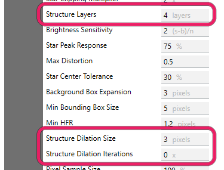
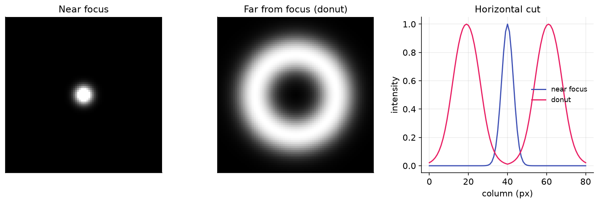

# Structure Detection

Before Hocus Focus measures a single star it has to *find* the stars. It does this by building a **structure map**: a binarized mask that marks the pixels likely to belong to a star, which are then flood-filled into candidate bounding boxes. The settings on this page control how that map is built: how much large-scale background (nebulae, gradients, the Milky Way) is removed, how big a structure is still treated as a star, and how aggressively the candidate blobs are grown before binarization.

These knobs live in the **Advanced** star-detection panel. They run *upstream* of the acceptance gates: if a star never makes it into the structure map, no gate can rescue it. That makes structure detection the right place to look when stars are missing *entirely* (no marker at all) rather than being rejected with a reason.

{ width=375 }

*Structure detection is driven by Structure Layers and the Structure Dilation size and iterations.*

## How the structure map is built

The detector removes large-scale structure with an **à-trous (dyadic) B3-spline wavelet**. It computes the wavelet *residual* (the coarse, large-scale content) at a chosen number of layers and subtracts it from the image, leaving only fine structure on the scale of stars. Because the layers are dyadic (powers of two), keeping \(L\) layers removes structure larger than roughly \(2^{L}\) pixels: anything bigger than that scale is treated as background and erased. After subtraction the map is lightly blurred, a binarization threshold is set from the background median plus a noise multiple, the map is optionally dilated, and finally it is binarized into the candidate mask.

{ width=620 }
*From a raw frame (with nebulosity) to the wavelet residual to the binarized structure map: only star-scale structure survives.*

!!! note
    The binarization noise threshold itself is governed by **Noise Clipping Multiplier** (applied as a per-region surface when **Locally Adaptive Binarization** is on, which is the default), and the upstream noise reduction by **Noise Reduction Radius**. All three are covered on the [Preprocessing](preprocessing.md) page. This page covers the geometric/scale knobs: which structures are kept and how candidate blobs are grown.

## Settings at a glance

| Setting | Default | Range | Effect |
|---|---|---|---|
| Structure Layers | 4 | integer > 0 | Wavelet layers kept; structures larger than ~\(2^{\text{layers}}\) px are removed as background. More layers keep larger (e.g. defocused) stars. |
| Defocus-Aware Structure | Off | On / Off | When on, removes background more coarsely so heavily-defocused donut stars survive and form candidates. Off ⇒ detection unchanged. |
| Structure Layer Boost | 0 | 0–6 | Extra wavelet layers added *only* while Defocus-Aware Structure is on. Higher ⇒ coarser removal ⇒ bigger donuts survive. |
| Structure Dilation Size | 3 | 3–30 px | Diameter of the morphological filter that grows candidate blobs in the structure map. |
| Structure Dilation Iterations | 0 | ≥ 0 | How many times the dilation is applied. 0 disables dilation. |

## Structure Layers

Sets how much large-scale structure the wavelet removes, and therefore the largest size a "star" can be before it is erased as background.

> The number of dyadic (power of 2) layers to include in structure detection. At the default of 5 (2⁵=32), structures larger than 32 pixels in size are excluded from structure detection

**Default:** 4 (the tooltip's "5/32 px" wording describes the scaling relationship; the shipped default is 4, i.e. structures larger than \(2^{4}=16\) px). **Range:** any positive integer (validated as greater than zero).

In `BuildStarDetectorParams` this maps straight to `StarDetectorParams.StructureLayers`, which is also the layer count used for the post-subtraction blur, so it has a second, smaller effect on how holes in large stars are smoothed over.

!!! tip "When to adjust"
    **Raise it** when real stars are missing entirely because they are large on the sensor: long focal lengths, big pixels, or frames taken well away from focus, where stars spread over many pixels and get swept up with the background. The Simple-mode presets already do this for you: *Wide Range* focus and *Long Focal Length* each add a layer, while *Wide Field* pixel scale removes one. **Leave it at the default** for typical sampling near focus. Lowering it can hurt by erasing genuine large stars; raising it too far lets nebulosity and gradients leak in as false candidates, since less background is removed. As you adjust, watch the **Total detected** count in the [Star Detection Results panel](index.md#reading-the-results-the-star-detection-results-panel) and confirm real stars stop being missing entirely.

!!! tip "Starting point"
    Pick \(L\) so \(2^{L}\) is a few × your star size in pixels: \(L \approx \mathrm{clamp}(\mathrm{round}(\log_2(3\text{–}4 \times \mathrm{FWHM\_px})),\ 1,\ 8)\), where \(\mathrm{FWHM\_px} = \mathrm{FWHM\_arcsec} / \mathrm{pixelScale}\) is known from your rig. This is just a starting point the optimizer and Simple presets refine.

## Defocus-Aware Structure

A targeted fix for the case where a heavily out-of-focus star is wiped out by background removal before it can even become a candidate.

> When enabled, large/donut (heavily defocused) stars are kept during structure detection so they form candidates instead of being erased. The wavelet step that removes large-scale background structure (nebulae, gradients) can also erase a big out-of-focus donut entirely, so it never even becomes a candidate to evaluate. This option makes that removal coarser (by Structure Layer Boost extra layers) so large stars survive. Off by default (detection is unchanged); enable it together with a Structure Layer Boost above 0 if heavily-defocused stars are missing entirely (not just rejected). EARLY-stage setting.

**Default:** Off. **Range:** On / Off.

When this is **off**, the effective layer count is exactly `StructureLayers`, so candidate formation is **bit-identical** to having the feature absent. When **on**, the wavelet residual is computed at `StructureLayers + StructureLayerBoost` layers (a coarser residual removes less star-scale structure), while the post-subtraction blur stays keyed to the unboosted `StructureLayers`.

{ width=620 }
*A heavily defocused star becomes a large hollow donut, exactly the structure that aggressive background removal can erase before it is ever evaluated.*

!!! tip "When to adjust"
    **Enable it** only when collecting autofocus frames far from focus *and* you observe donut stars missing entirely (no candidate at all), not merely rejected by a gate. Pair it with a **Structure Layer Boost above 0**. On its own, with boost at 0, it changes nothing. If the donuts are present but rejected with a reason (TooDistorted / NotCentered), the fix is the **Defocus-Aware Gates** on the [Acceptance Gates](acceptance-gates.md) page, not this; if the donuts fragment into small arcs (rejected as **Too Small**), reach for the [Recover Out-of-Focus Donut Stars](acceptance-gates.md#recover-out-of-focus-donut-stars) group, which reconnects the ring. **Leave it off** for normal near-focus imaging; it adds nothing there and only widens what counts as a star.

## Structure Layer Boost

The strength knob for Defocus-Aware Structure: how many extra wavelet layers to add when removing background.

> Only used while Defocus-Aware Structure is enabled. The number of extra wavelet layers added when removing large-scale structure, making the removal coarser so larger defocused donuts survive and form candidates. 0 means no change (identical to the feature being off). Raise it (1–6) if very out-of-focus stars never appear; raising it too far can let nebulosity/background structure leak in as false candidates. Default 0.

**Default:** 0. **Range:** 0–6 (validated).

Each extra layer roughly doubles the size scale that is preserved rather than erased, so a boost of \(n\) keeps structures up to about \(2^{(\text{StructureLayers}+n)}\) px.

!!! tip "When to adjust"
    **Raise it 1–6** when very out-of-focus stars never appear, increasing it gradually until they do. **Leave it at 0** unless Defocus-Aware Structure is enabled. It is ignored while that toggle is off. It can hurt when pushed too high: a coarser residual leaves more large-scale structure behind, so nebulosity and background gradients start registering as false candidates.

## Structure Dilation Size

The diameter of the morphological filter used to grow candidate blobs in the structure map.

> During star detection a structure map is generated containing potential star pixels that are above the background noise threshold. This parameter defines the size of gaussian morphology filter used to dilate the structure map. Consider increasing this value if bounding boxes are not large enough around stars, which may be more likely at very high focal lengths.

**Default:** 3. **Range:** 3–30 px (validated; the setter also enforces a minimum of 3).

Internally this is the diameter of an elliptical structuring element passed to OpenCV's morphological dilation. It has **no effect** unless **Structure Dilation Iterations** is at least 1; dilation only runs when the iteration count is positive.

!!! tip "When to adjust"
    **Increase it** (together with at least one iteration) when bounding boxes are clipping the outsides of stars, most likely at very high focal lengths where a star's wings extend beyond the binarized core. **Leave it at the default** otherwise. It can hurt in crowded fields: larger dilation merges nearby stars into a single blob, producing oversized boxes or lost separations. Watch for the **Total detected** count in the [Star Detection Results panel](index.md#reading-the-results-the-star-detection-results-panel) dropping as neighbors merge.

## Structure Dilation Iterations

How many times the dilation is applied, and the on/off switch for dilation as a whole.

> This parameter is related to Structure Dilation Size. It specifies the number of times the morphological dilation is performed. Consider increasing this value if bounding boxes are not large enough around stars, which may be more likely at very high focal lengths.

**Default:** 0 (dilation disabled). **Range:** ≥ 0 (validated as non-negative).

At the default of 0 the dilation step is skipped entirely, so **Structure Dilation Size** is inert. Set this to 1 or more to actually grow the candidate blobs; each iteration applies the structuring element once more, so the total growth scales with both this count and the size above.

!!! tip "When to adjust"
    **Raise it to 1+** when bounding boxes are too tight around stars at high focal length and a single dilation pass is not enough. **Leave it at 0** for typical sampling; most rigs never need dilation. It can hurt the same way as Structure Dilation Size, only faster: extra iterations compound the blob growth, so in dense star fields neighbors merge and small structures balloon.

!!! warning
    Structure Layers, Defocus-Aware Structure, and Structure Layer Boost are **early-stage** parameters: they change which candidates are formed in the first place. Structure Dilation Size and Iterations also reshape candidate geometry. Change these only when stars are missing or boxed wrong at the *structure* level. If a star is being **rejected with a reason** (too distorted, low sensitivity, too flat, not centered), the fix belongs on the [Acceptance Gates](acceptance-gates.md) page instead.
